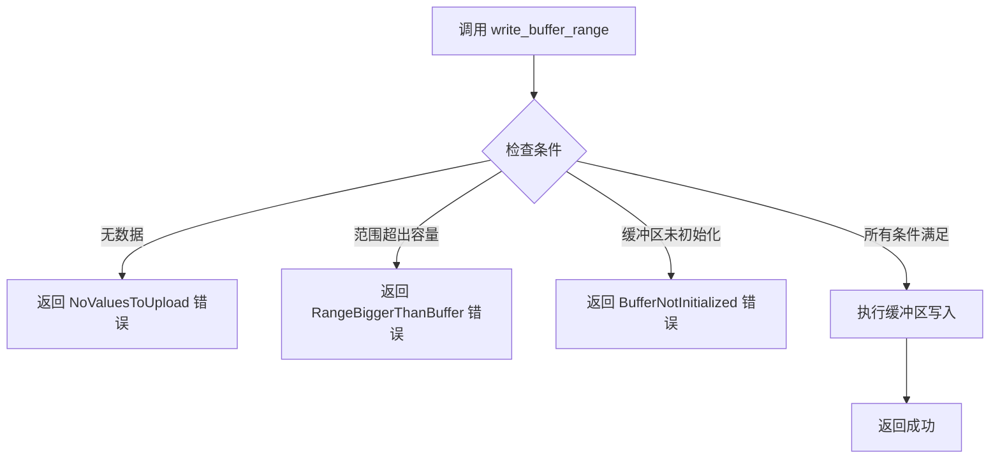

+++
title = "#20687 PR #20687 - Don't reserve in write_buffer_range"
date = "2025-08-22T00:00:00"
draft = false
template = "pull_request_page.html"
in_search_index = false

[extra]
current_language = "zh-cn"
available_languages = {"en" = { name = "English", url = "/pull_request/bevy/2025-08/pr-20687-en-20250822" }, "zh-cn" = { name = "中文", url = "/pull_request/bevy/2025-08/pr-20687-zh-cn-20250822" }}
labels = ["A-Rendering", "C-Usability", "D-Straightforward"]
+++

# Title: PR #20687 - Don't reserve in write_buffer_range

## Basic Information
- **Title**: Don't reserve in write_buffer_range
- **PR Link**: https://github.com/bevyengine/bevy/pull/20687
- **Author**: IceSentry
- **Status**: MERGED
- **Labels**: A-Rendering, C-Usability, S-Ready-For-Final-Review, D-Straightforward
- **Created**: 2025-08-21T03:59:39Z
- **Merged**: 2025-08-22T23:09:03Z
- **Merged By**: james7132

## Description Translation
# 目标 (Objective)

- 当你向CPU端缓冲区推送新数据并且数据量超过GPU缓冲区大小时，调用reserve会清除旧数据。对于write_buffer来说这是可接受的行为，但如果你只是写入一个范围(range)，突然所有其他数据在没有警告的情况下消失会令人意外。

# 解决方案 (Solution)

- 不调用reserve并返回错误，让用户决定如何处理。

# 测试 (Testing)

未测试，不确定如何轻松测试此功能。

关闭 https://github.com/bevyengine/bevy/issues/20686

## The Story of This Pull Request

这个PR解决了一个在Bevy渲染系统中关于缓冲区管理的具体问题。问题出现在`write_buffer_range`方法中，当开发者尝试只更新GPU缓冲区的一部分数据时，如果数据量超过了当前缓冲区的容量，系统会自动调用`reserve`操作，这会导致整个缓冲区的数据被清除。

问题的核心在于`reserve`方法的副作用：当需要扩展缓冲区容量时，它会创建一个新的GPU缓冲区并丢弃旧的数据。对于完整的缓冲区写入操作(`write_buffer`)来说，这是合理的行为，因为整个缓冲区都会被新数据覆盖。但对于范围写入操作(`write_buffer_range`)来说，这种行为就存在问题，因为开发者只期望更新部分数据，而不是丢失整个缓冲区的现有内容。

解决方案采用了更明确和安全的错误处理模式。修改后的`write_buffer_range`方法现在会检查三种可能的错误条件：
1. 没有数据需要上传
2. 请求的范围超过了缓冲区容量
3. GPU缓冲区未初始化

当遇到这些情况时，方法会返回相应的错误而不是静默执行潜在的危险操作。这种设计让调用方能够明确知道操作失败的原因，并根据具体场景决定如何处理——是分配新的缓冲区，还是执行数据拷贝，或是采取其他恢复策略。

从工程角度来看，这个修改体现了良好的API设计原则：显式优于隐式。通过返回错误而不是自动执行可能具有副作用的操作，API给了调用方更多的控制权，同时也提高了代码的可预测性和可调试性。

## Visual Representation



## Key Files Changed

### `crates/bevy_render/src/render_resource/buffer_vec.rs` (+36/-12)

这个文件包含了主要的修改，涉及两个结构体的`write_buffer_range`方法：`RawBufferVec`和`BufferVec`。

**主要修改内容：**

1. **移除了自动reserve逻辑**：不再在写入前自动调用reserve
2. **添加了错误检查**：增加了三种错误条件的验证
3. **引入了错误类型**：新增了`WriteBufferRangeError`枚举
4. **修改了方法签名**：从返回`()`改为返回`Result<(), WriteBufferRangeError>`

**代码变更示例：**

```rust
// 修改前：
pub fn write_buffer_range(
    &mut self,
    device: &RenderDevice,
    render_queue: &RenderQueue,
    range: core::ops::Range<usize>,
) {
    if self.values.is_empty() {
        return;
    }
    self.reserve(self.values.len(), device);
    if let Some(buffer) = &self.buffer {
        let bytes: &[u8] = must_cast_slice(&self.values[range.start..range.end]);
        render_queue.write_buffer(buffer, (range.start * self.item_size) as u64, bytes);
    }
}

// 修改后：
pub fn write_buffer_range(
    &mut self,
    render_queue: &RenderQueue,
    range: core::ops::Range<usize>,
) -> Result<(), WriteBufferRangeError> {
    if self.values.is_empty() {
        return Err(WriteBufferRangeError::NoValuesToUpload);
    }
    if range.end > self.item_size * self.capacity {
        return Err(WriteBufferRangeError::RangeBiggerThanBuffer);
    }
    if let Some(buffer) = &self.buffer {
        let bytes: &[u8] = must_cast_slice(&self.values[range.start..range.end]);
        render_queue.write_buffer(buffer, (range.start * self.item_size) as u64, bytes);
        Ok(())
    } else {
        Err(WriteBufferRangeError::BufferNotInitialized)
    }
}
```

**新增的错误类型定义：**

```rust
#[derive(Debug, Eq, PartialEq, Copy, Clone, Error)]
pub enum WriteBufferRangeError {
    #[error("the range is bigger than the capacity of the buffer")]
    RangeBiggerThanBuffer,
    #[error("the gpu buffer is not initialized")]
    BufferNotInitialized,
    #[error("there are no values to upload")]
    NoValuesToUpload,
}
```

这些修改确保了缓冲区范围写入操作的安全性和可预测性，防止了意外的数据丢失。

## Further Reading

- [Bevy Render Resources Documentation](https://docs.rs/bevy_render/latest/bevy_render/render_resource/index.html)
- [wgpu Buffer Operations](https://docs.rs/wgpu/latest/wgpu/struct.Queue.html#method.write_buffer)
- [Error Handling in Rust](https://doc.rust-lang.org/book/ch09-00-error-handling.html)
- [Encase Library for GPU Data Handling](https://docs.rs/encase/latest/encase/)