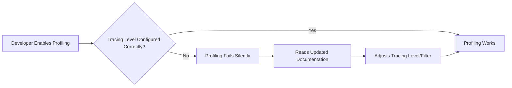

+++
title = "#20692 Improve tracing level docs in profiling.md"
date = "2025-08-26T00:00:00"
draft = false
template = "pull_request_page.html"
in_search_index = true

[taxonomies]
list_display = ["show"]

[extra]
current_language = "en"
available_languages = {"en" = { name = "English", url = "/pull_request/bevy/2025-08/pr-20692-en-20250826" }, "zh-cn" = { name = "中文", url = "/pull_request/bevy/2025-08/pr-20692-zh-cn-20250826" }}
labels = ["C-Docs", "C-Testing", "D-Straightforward"]
+++

# Improve tracing level docs in profiling.md

## Basic Information
- **Title**: Improve tracing level docs in profiling.md
- **PR Link**: https://github.com/bevyengine/bevy/pull/20692
- **Author**: Weihnachtsbaum
- **Status**: MERGED
- **Labels**: C-Docs, S-Ready-For-Final-Review, C-Testing, D-Straightforward
- **Created**: 2025-08-21T12:37:29Z
- **Merged**: 2025-08-26T21:16:14Z
- **Merged By**: alice-i-cecile

## Description Translation
# Objective

- If you have `tracing`'s `max_level(_release)_[warn/error]` features enabled, it can be confusing that profiling doesn't work properly (or at least it confused me for a bit...)
- The `LogSettings` resource [doesn't exist anymore](https://bevy.org/learn/migration-guides/0-8-to-0-9/#use-plugin-setup-for-resource-only-used-at-setup-time), but is still mentioned in the docs

## Solution

- Update profiling.md to be as clear as possible

## The Story of This Pull Request

This PR addresses a documentation issue that was causing confusion for developers trying to use Bevy's profiling capabilities. The problem stemmed from two specific areas in the existing documentation that were either outdated or unclear.

The core issue was that when developers enabled certain `tracing` crate features like `max_level_warn` or `max_level_error`, their profiling spans wouldn't work as expected. This created a confusing debugging experience where developers might think their profiling setup was broken, when in reality it was just being filtered out by the tracing level configuration.

Additionally, the documentation still referenced the `LogSettings` resource, which had been removed in the Bevy 0.8 to 0.9 migration. The resource was replaced by the `LogPlugin`'s `filter` member, but the documentation hadn't been updated to reflect this change.

The solution approach was straightforward but important: update the documentation to provide clear, accurate guidance. The developer replaced the outdated information with comprehensive instructions that cover both the tracing level requirements and the proper way to configure logging filters in the current Bevy version.

The implementation involved replacing a single paragraph in `docs/profiling.md` with more detailed and accurate information. The new documentation explains that:
1. The tracing level needs to be at least `info` for profiling to work
2. Developers should avoid using the `max_level(_release)_[warn/error]` features of the tracing crate
3. They shouldn't filter out profiling spans using `LogPlugin`'s `filter` member
4. `wgpu` and `naga` spans are filtered out by default, but can be included by adjusting the filter or using `RUST_LOG=info`

This change is particularly valuable because it addresses a pain point that the author themselves experienced - the confusion when profiling doesn't work due to tracing level configuration. By documenting this clearly, future developers will save time debugging what would otherwise be a non-obvious configuration issue.

The technical insight here is that documentation quality directly impacts developer productivity. Clear, accurate documentation about configuration requirements and potential pitfalls helps developers avoid common mistakes and reduces support burden on the project maintainers.

## Visual Representation



## Key Files Changed

**File: `docs/profiling.md`**

This file received a single but significant change to improve clarity around tracing level requirements for profiling.

**Before:**
```markdown
If you also want to include `wgpu` tracing spans when profiling, they are emitted at the `tracing` `info` level so you will need to make sure they are not filtered out by the `LogSettings` resource's `filter` member which defaults to `wgpu=error`. You can do this by setting the `RUST_LOG=info` environment variable when running your application.
```

**After:**
```markdown
Your tracing level needs to be at least `info` for this to work, so make sure that you don't set the `max_level(_release)_[warn/error]` features of the `tracing` crate nor filter it out using `LogPlugin`'s `filter` member. Note that `wgpu` and `naga` spans are filtered out by default. If you want to include them, you can either change your `LogPlugin`'s `filter` member or override it by setting the `RUST_LOG=info` environment variable when running your application.
```

The changes address both issues mentioned in the PR:
1. Replaced the outdated reference to `LogSettings` with the correct `LogPlugin`
2. Added explicit warning about the `max_level` features that can silently disable profiling
3. Made the instructions more comprehensive by covering both `wgpu` and `naga` spans
4. Provided clear alternatives for including these spans when needed

## Further Reading

- [Bevy Tracing Documentation](https://github.com/bevyengine/bevy/blob/main/docs/profiling.md)
- [Tracing Crate Documentation](https://docs.rs/tracing/latest/tracing/)
- [Bevy 0.8 to 0.9 Migration Guide](https://bevy.org/learn/migration-guides/0-8-to-0-9/#use-plugin-setup-for-resource-only-used-at-setup-time)
- [Rust Logging and Tracing Best Practices](https://rust-lang-nursery.github.io/rust-cookbook/development_tools/debugging/config_log.html)