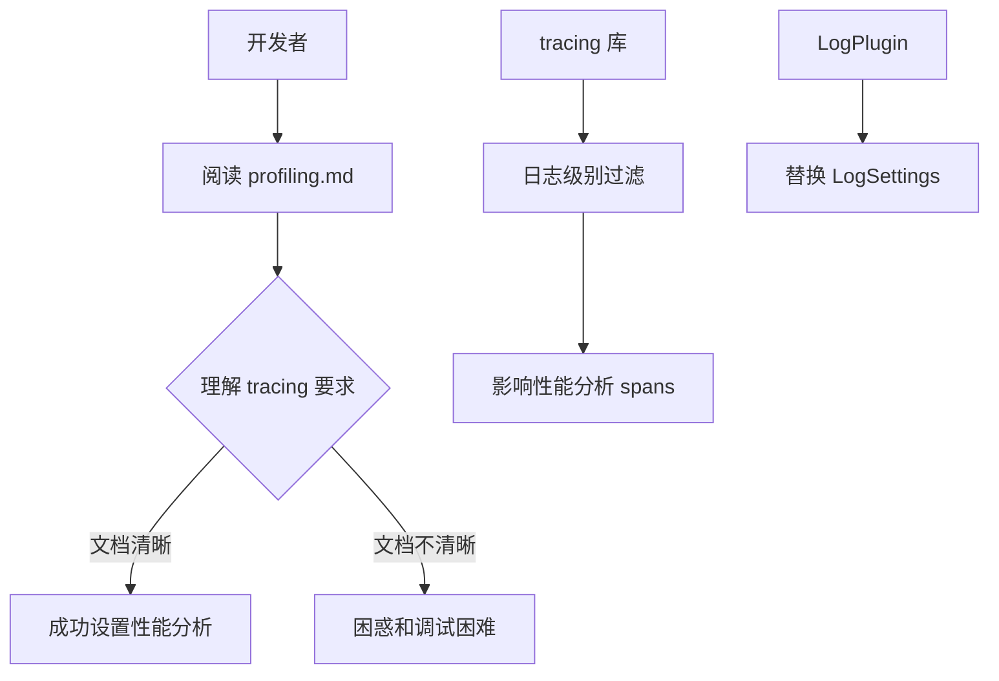

+++
title = "#20692 Improve tracing level docs in profiling.md"
date = "2025-08-26T00:00:00"
draft = false
template = "pull_request_page.html"
in_search_index = false

[extra]
current_language = "zh-cn"
available_languages = {"en" = { name = "English", url = "/pull_request/bevy/2025-08/pr-20692-en-20250826" }, "zh-cn" = { name = "中文", url = "/pull_request/bevy/2025-08/pr-20692-zh-cn-20250826" }}
+++

# Improve tracing level docs in profiling.md

## 基本信息
- **标题**: Improve tracing level docs in profiling.md
- **PR链接**: https://github.com/bevyengine/bevy/pull/20692
- **作者**: Weihnachtsbaum
- **状态**: 已合并
- **标签**: C-Docs, S-Ready-For-Final-Review, C-Testing, D-Straightforward
- **创建时间**: 2025-08-21T12:37:29Z
- **合并时间**: 2025-08-26T21:16:14Z
- **合并人**: alice-i-cecile

## 描述翻译
### 目标
- 如果启用了 `tracing` 的 `max_level(_release)_[warn/error]` 功能，可能会导致性能分析无法正常工作（至少让我困惑了一段时间...）
- `LogSettings` 资源[已经不存在了](https://bevy.org/learn/migration-guides/0-8-to-0-9/#use-plugin-setup-for-resource-only-used-at-setup-time)，但文档中仍然提到它

### 解决方案
- 更新 profiling.md 文档，使其尽可能清晰

## 本次PR的故事

这个PR解决了一个看似简单但实际上很重要的文档问题。当开发者尝试使用Bevy的性能分析功能时，如果启用了tracing库的特定日志级别限制功能，可能会导致性能分析无法正常工作，这会造成困惑和调试困难。

问题的核心在于Bevy使用tracing spans进行性能分析，但这些spans需要至少`info`级别的日志记录才能正常工作。如果开发者通过`max_level_warn`、`max_level_error`或相应的release版本特性限制了日志级别，性能分析的spans就会被过滤掉，导致无法收集到性能数据。

此外，文档中还提到了一个已经废弃的`LogSettings`资源，这在Bevy 0.9版本中已经被`LogPlugin`取代。这种过时的信息会给开发者，特别是那些从旧版本升级的开发者，带来不必要的困惑。

解决方案是重写文档中的相关段落，使其更加清晰和准确。新的文档明确说明了：
1. tracing级别需要至少为`info`才能正常工作
2. 提醒开发者不要设置`max_level(_release)_[warn/error]`特性
3. 更新了对日志过滤机制的说明，使用正确的`LogPlugin`而不是过时的`LogSettings`
4. 说明了`wgpu`和`naga` spans默认被过滤的情况以及如何包含它们

这个修改虽然只是文档更新，但对开发者体验有重要影响。清晰的文档可以减少调试时间，帮助开发者更快地设置正确的性能分析环境。

## 视觉表示



## 关键文件更改

### docs/profiling.md
**修改内容**: 更新了关于tracing级别要求的说明，移除了过时的LogSettings引用，提供了更清晰的配置指导

**代码变更**:
```markdown
# 修改前:
If you also want to include `wgpu` tracing spans when profiling, they are emitted at the `tracing` `info` level so you will need to make sure they are not filtered out by the `LogSettings` resource's `filter` member which defaults to `wgpu=error`. You can do this by setting the `RUST_LOG=info` environment variable when running your application.

# 修改后:
Your tracing level needs to be at least `info` for this to work, so make sure that you don't set the `max_level(_release)_[warn/error]` features of the `tracing` crate nor filter it out using `LogPlugin`'s `filter` member. Note that `wgpu` and `naga` spans are filtered out by default. If you want to include them, you can either change your `LogPlugin`'s `filter` member or override it by setting the `RUST_LOG=info` environment variable when running your application.
```

**影响**: 这个修改确保了文档的准确性和清晰度，帮助开发者正确配置性能分析环境，避免了因日志级别设置不当导致的性能分析失效问题。

## 扩展阅读

- [Bevy官方文档 - 性能分析](https://bevyengine.org/learn/book/getting-started/profiling/)
- [tracing库文档 - 日志级别控制](https://docs.rs/tracing/latest/tracing/struct.Level.html)
- [Bevy迁移指南 - 0.8到0.9版本](https://bevy.org/learn/migration-guides/0-8-to-0-9/#use-plugin-setup-for-resource-only-used-at-setup-time)
- [Rust日志实践指南](https://rust-lang-nursery.github.io/rust-cookbook/development_tools/debugging/config_log.html)