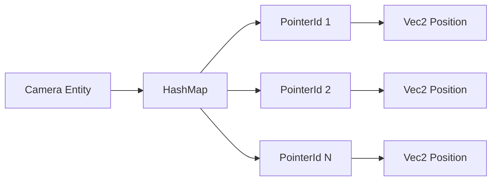

+++
title = "#20696 `ui_picking` comment fix"
date = "2025-08-22T00:00:00"
draft = false
template = "pull_request_page.html"
in_search_index = true

[taxonomies]
list_display = ["show"]

[extra]
current_language = "en"
available_languages = {"en" = { name = "English", url = "/pull_request/bevy/2025-08/pr-20696-en-20250822" }, "zh-cn" = { name = "中文", url = "/pull_request/bevy/2025-08/pr-20696-zh-cn-20250822" }}
labels = ["C-Docs", "D-Trivial", "A-UI", "A-Picking"]
+++

# ui_picking Comment Fix

## Basic Information
- **Title**: `ui_picking` comment fix
- **PR Link**: https://github.com/bevyengine/bevy/pull/20696
- **Author**: ickshonpe
- **Status**: MERGED
- **Labels**: C-Docs, D-Trivial, A-UI, A-Picking
- **Created**: 2025-08-21T18:41:04Z
- **Merged**: 2025-08-22T21:53:48Z
- **Merged By**: james7132

## Description Translation
# Objective
This comment in `ui_picking`:
```
    // For each camera, the pointer and its position
```
implies each camera has a single unique pointer, when they can have many.

## Solution

Change it to:
```
    // Map from each camera to its active pointers and their positions in viewport space
```

## The Story of This Pull Request

This PR addresses a documentation issue in Bevy's UI picking system. The problem was straightforward: a comment in the `ui_picking` function incorrectly suggested a one-to-one relationship between cameras and pointers, when in reality, cameras can have multiple pointers associated with them (such as multiple touch points or mouse cursors in certain configurations).

The author identified that the comment:
```rust
// For each camera, the pointer and its position
```
was misleading because it used singular terms ("the pointer") when the actual data structure (`HashMap<Entity, HashMap<PointerId, Vec2>>`) clearly supports multiple pointers per camera.

The solution was a precise one-line change that better describes the actual data structure and its purpose:
```rust
// Map from each camera to its active pointers and their positions in viewport space
```

This change improves code clarity by accurately documenting:
1. The mapping relationship (camera Entity to pointers)
2. The plural nature of pointers (multiple can exist)
3. The coordinate space of the positions (viewport space)

While this is a minor documentation change, it's important for maintaining accurate mental models of the codebase. Incorrect comments can lead to misunderstandings and potential bugs when developers make assumptions based on misleading documentation.

The change was reviewed and merged quickly, indicating consensus on the importance of accurate documentation even for small details.

## Visual Representation



## Key Files Changed

**File**: `crates/bevy_ui/src/picking_backend.rs`

**Change**: Updated a comment to accurately describe the relationship between cameras and pointers in the UI picking system.

**Before**:
```rust
// For each camera, the pointer and its position
```

**After**:
```rust
// Map from each camera to its active pointers and their positions in viewport space
```

This change aligns the comment with the actual data structure `HashMap<Entity, HashMap<PointerId, Vec2>>`, which maps each camera entity to multiple pointers (each with their own position) rather than a single pointer.

## Further Reading

- [Bevy UI System Documentation](https://bevyengine.org/learn/books/introduction/7-ui/)
- [Rust HashMap Documentation](https://doc.rust-lang.org/std/collections/struct.HashMap.html)
- [Bevy ECS Guide](https://bevyengine.org/learn/books/introduction/5-ecs/)

# Full Code Diff
```diff
diff --git a/crates/bevy_ui/src/picking_backend.rs b/crates/bevy_ui/src/picking_backend.rs
index 30edd56a4ee79..bd94b9d82bed5 100644
--- a/crates/bevy_ui/src/picking_backend.rs
+++ b/crates/bevy_ui/src/picking_backend.rs
@@ -110,7 +110,7 @@ pub fn ui_picking(
     clipping_query: Query<(&ComputedNode, &UiGlobalTransform, &Node)>,
     child_of_query: Query<&ChildOf, Without<OverrideClip>>,
 ) {
-    // For each camera, the pointer and its position
+    // Map from each camera to its active pointers and their positions in viewport space
     let mut pointer_pos_by_camera = HashMap::<Entity, HashMap<PointerId, Vec2>>::default();
 
     for (pointer_id, pointer_location) in
```