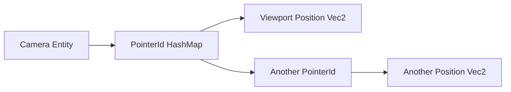

+++
title = "#20696 ui_picking` comment fix"
date = "2025-08-22T00:00:00"
draft = false
template = "pull_request_page.html"
in_search_index = false

[extra]
current_language = "zh-cn"
available_languages = {"en" = { name = "English", url = "/pull_request/bevy/2025-08/pr-20696-en-20250822" }, "zh-cn" = { name = "中文", url = "/pull_request/bevy/2025-08/pr-20696-zh-cn-20250822" }}
+++

# ui_picking 注释修复

## 基本信息
- **标题**: `ui_picking` comment fix
- **PR 链接**: https://github.com/bevyengine/bevy/pull/20696
- **作者**: ickshonpe
- **状态**: 已合并
- **标签**: C-Docs, D-Trivial, A-UI, A-Picking
- **创建时间**: 2025-08-21T18:41:04Z
- **合并时间**: 2025-08-22T21:53:48Z
- **合并者**: james7132

## 描述翻译
### Objective（目标）
`ui_picking` 中的这个注释：
```
    // For each camera, the pointer and its position
```
暗示每个相机有唯一的一个指针，但实际上它们可以有多个。

### Solution（解决方案）
将其改为：
```
    // Map from each camera to its active pointers and their positions in viewport space
```

## 本次 PR 的故事

这个 PR 解决了一个看似微小但重要的文档准确性问题。在 Bevy 引擎的 UI 拾取系统中，存在一个注释误导开发者对系统行为的理解。

问题的核心在于 `crates/bevy_ui/src/picking_backend.rs` 文件中的一个注释。原始注释声明 "For each camera, the pointer and its position"，这暗示了每个相机只能关联一个指针。然而在实际实现中，通过代码分析可以看到：

```rust
let mut pointer_pos_by_camera = HashMap::<Entity, HashMap<PointerId, Vec2>>::default();
```

这里使用了嵌套的 HashMap 结构：外层以相机实体（Entity）为键，内层以指针 ID（PointerId）为键，存储视口空间中的位置（Vec2）。这种数据结构明确支持每个相机对应多个指针。

这种误解可能对开发者产生负面影响。如果开发者基于错误注释理解代码，可能会错误地假设 UI 拾取系统只支持单指针交互，而实际上系统已经设计为支持多指针场景（如触摸屏上的多点触控）。

修复方案直接而精确：将注释改为 "Map from each camera to its active pointers and their positions in viewport space"，准确描述了数据结构的实际用途和功能。

从工程角度看，这个修改体现了良好的代码维护实践：
1. **准确性**：注释与代码实现保持一致
2. **清晰性**：明确表达了多指针支持的能力
3. **可发现性**：帮助开发者快速理解系统功能

虽然这是一个简单的文档修改，但它提升了代码的可读性和可维护性，减少了未来开发者误解系统行为的可能性。

## 视觉表示



## 关键文件变更

### `crates/bevy_ui/src/picking_backend.rs` (+1/-1)

**变更描述**：修复了关于相机与指针关系的误导性注释，准确描述数据结构支持多指针的特性。

**代码变更**：
```rust
// 修改前：
// For each camera, the pointer and its position

// 修改后：
// Map from each camera to its active pointers and their positions in viewport space
```

这个变更直接对应 PR 的目标，确保代码注释准确反映实际实现，帮助开发者正确理解 UI 拾取系统的多指针支持能力。

## 进一步阅读

- [Bevy UI 系统文档](https://bevyengine.org/learn/books/introduction/ui/)
- [Bevy 输入处理指南](https://bevyengine.org/learn/books/introduction/input/)
- [Rust HashMap 文档](https://doc.rust-lang.org/std/collections/struct.HashMap.html)

## 完整代码差异
```
diff --git a/crates/bevy_ui/src/picking_backend.rs b/crates/bevy_ui/src/picking_backend.rs
index 30edd56a4ee79..bd94b9d82bed5 100644
--- a/crates/bevy_ui/src/picking_backend.rs
+++ b/crates/bevy_ui/src/picking_backend.rs
@@ -110,7 +110,7 @@ pub fn ui_picking(
     clipping_query: Query<(&ComputedNode, &UiGlobalTransform, &Node)>,
     child_of_query: Query<&ChildOf, Without<OverrideClip>>,
 ) {
-    // For each camera, the pointer and its position
+    // Map from each camera to its active pointers and their positions in viewport space
     let mut pointer_pos_by_camera = HashMap::<Entity, HashMap<PointerId, Vec2>>::default();
 
     for (pointer_id, pointer_location) in
```