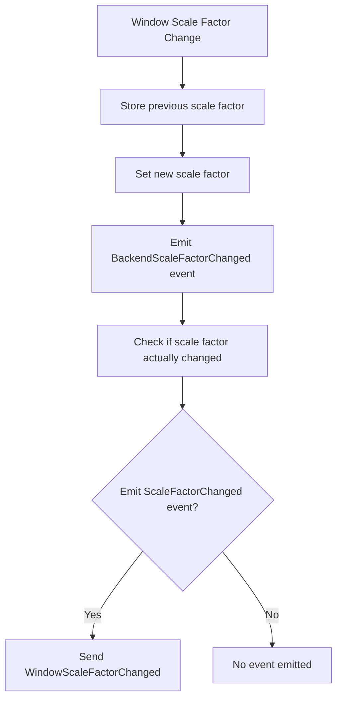

+++
title = "#20698 Fixing Window Scale Factor Event Emission in Bevy"
date = "2025-08-24T00:00:00"
draft = false
template = "pull_request_page.html"
in_search_index = true

[taxonomies]
list_display = ["show"]

[extra]
current_language = "en"
available_languages = {"en" = { name = "English", url = "/pull_request/bevy/2025-08/pr-20698-en-20250824" }, "zh-cn" = { name = "中文", url = "/pull_request/bevy/2025-08/pr-20698-zh-cn-20250824" }}
labels = ["C-Bug", "A-Windowing", "D-Straightforward"]
+++

# Title: Fixing Window Scale Factor Event Emission in Bevy

## Basic Information
- **Title**: Emit the `WindowScaleFactorChanged` event
- **PR Link**: https://github.com/bevyengine/bevy/pull/20698
- **Author**: ickshonpe
- **Status**: MERGED
- **Labels**: C-Bug, A-Windowing, S-Ready-For-Final-Review, D-Straightforward
- **Created**: 2025-08-21T23:31:39Z
- **Merged**: 2025-08-24T21:40:50Z
- **Merged By**: alice-i-cecile

## Description Translation
# Objective

Obvious bug here in `react_to_scale_factor_change`:

```rust
pub(crate) fn react_to_scale_factor_change(
    window_entity: Entity,
    window: &mut Mut<'_, Window>,
    scale_factor: f64,
    window_backend_scale_factor_changed: &mut EventWriter<WindowBackendScaleFactorChanged>,
    window_scale_factor_changed: &mut EventWriter<WindowScaleFactorChanged>,
) {
    window.resolution.set_scale_factor(scale_factor as f32);

    window_backend_scale_factor_changed.write(WindowBackendScaleFactorChanged {
        window: window_entity,
        scale_factor,
    });

    let prior_factor = window.resolution.scale_factor();
    let scale_factor_override = window.resolution.scale_factor_override();

    if scale_factor_override.is_none() && !relative_eq!(scale_factor as f32, prior_factor) {
        window_scale_factor_changed.write(WindowScaleFactorChanged {
            window: window_entity,
            scale_factor,
        });
    }
}
```

The previous scale factor is meant to be stored in `prior_factor` but it's overwritten in the first line of the function so `WindowScaleFactorChanged` events are only emitted when `!relative_eq!(scale_factor, scale_factor)`, which is never true.

Fixes #20670

## Solution

Store the previous scale factor in `prior_factor` at the start of the function, before setting the new value.

#

These scale factor events seem a bit confusing, I think probably it would make more intuitive sense if `WindowScaleFactorChanged` was also emitted when the window's scale factor override is changed. I want to fix any existing bugs before considering any other changes though.

## Testing

Can add this system to check it works now: 
```rust
fn print_scale_factor_changes(
    mut events: EventReader<WindowScaleFactorChanged>,
) {
    for e in events.read() {
        println!("scale factor changed: {}", e.scale_factor);
    }
}
```

## The Story of This Pull Request

This PR addresses a straightforward but critical bug in Bevy's window scaling system. The issue was in the `react_to_scale_factor_change` function where the `WindowScaleFactorChanged` event wasn't being emitted when it should have been.

The problem occurred because the function was trying to compare the new scale factor against the previous scale factor, but it was retrieving the previous value after already setting the new value. This meant the comparison was always between the new value and itself, which would never trigger the event emission.

The fix was simple but important: move the retrieval of the previous scale factor to before the window's scale factor is updated. This ensures the comparison works correctly and the event is emitted when appropriate.

The implementation change is minimal but crucial for systems that depend on scale factor change events. Without this fix, any functionality relying on `WindowScaleFactorChanged` events would break, particularly for high-DPI displays where scale factors frequently change.

The author also noted that the scale factor event system could benefit from further improvements, such as emitting events when scale factor overrides change, but correctly opted to fix the existing bug first before considering additional enhancements.

## Visual Representation



## Key Files Changed

**File: `crates/bevy_winit/src/state.rs`**
- **Change**: Fixed scale factor comparison logic in `react_to_scale_factor_change` function
- **Impact**: Ensures `WindowScaleFactorChanged` events are properly emitted when scale factors change

**Code Changes:**
```rust
// Before:
pub(crate) fn react_to_scale_factor_change(
    window_entity: Entity,
    window: &mut Mut<'_, Window>,
    scale_factor: f64,
    window_backend_scale_factor_changed: &mut EventWriter<WindowBackendScaleFactorChanged>,
    window_scale_factor_changed: &mut EventWriter<WindowScaleFactorChanged>,
) {
    window.resolution.set_scale_factor(scale_factor as f32);
    // ... other code ...
    let prior_factor = window.resolution.scale_factor(); // Wrong: gets NEW value
}

// After:
pub(crate) fn react_to_scale_factor_change(
    window_entity: Entity,
    window: &mut Mut<'_, Window>,
    scale_factor: f64,
    window_backend_scale_factor_changed: &mut EventWriter<WindowBackendScaleFactorChanged>,
    window_scale_factor_changed: &mut EventWriter<WindowScaleFactorChanged>,
) {
    let prior_factor = window.resolution.scale_factor(); // Correct: gets OLD value
    window.resolution.set_scale_factor(scale_factor as f32);
    // ... other code ...
}
```

## Further Reading

- [Bevy Window Documentation](https://docs.rs/bevy/latest/bevy/window/struct.Window.html)
- [Winit Scale Factor Handling](https://docs.rs/winit/latest/winit/window/struct.Window.html#method.scale_factor)
- [Bevy Events System](https://bevy-cheatbook.github.io/programming/events.html)