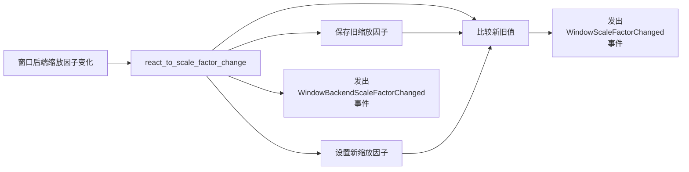

+++
title = "#20698 Emit the `WindowScaleFactorChanged` event"
date = "2025-08-24T00:00:00"
draft = false
template = "pull_request_page.html"
in_search_index = false

[extra]
current_language = "zh-cn"
available_languages = {"en" = { name = "English", url = "/pull_request/bevy/2025-08/pr-20698-en-20250824" }, "zh-cn" = { name = "中文", url = "/pull_request/bevy/2025-08/pr-20698-zh-cn-20250824" }}
+++

# Emit the `WindowScaleFactorChanged` event

## 基本信息
- **标题**: Emit the `WindowScaleFactorChanged` event
- **PR链接**: https://github.com/bevyengine/bevy/pull/20698
- **作者**: ickshonpe
- **状态**: 已合并
- **标签**: C-Bug, A-Windowing, S-Ready-For-Final-Review, D-Straightforward
- **创建时间**: 2025-08-21T23:31:39Z
- **合并时间**: 2025-08-24T21:40:50Z
- **合并者**: alice-i-cecile

## 描述翻译

# Objective（目标）

在 `react_to_scale_factor_change` 函数中存在一个明显的 bug：

```rust
pub(crate) fn react_to_scale_factor_change(
    window_entity: Entity,
    window: &mut Mut<'_, Window>,
    scale_factor: f64,
    window_backend_scale_factor_changed: &mut EventWriter<WindowBackendScaleFactorChanged>,
    window_scale_factor_changed: &mut EventWriter<WindowScaleFactorChanged>,
) {
    window.resolution.set_scale_factor(scale_factor as f32);

    window_backend_scale_factor_changed.write(WindowBackendScaleFactorChanged {
        window: window_entity,
        scale_factor,
    });

    let prior_factor = window.resolution.scale_factor();
    let scale_factor_override = window.resolution.scale_factor_override();

    if scale_factor_override.is_none() && !relative_eq!(scale_factor as f32, prior_factor) {
        window_scale_factor_changed.write(WindowScaleFactorChanged {
            window: window_entity,
            scale_factor,
        });
    }
}
```

本应存储在 `prior_factor` 中的先前缩放因子在函数的第一行就被覆盖了，因此 `WindowScaleFactorChanged` 事件只在 `!relative_eq!(scale_factor, scale_factor)` 时发出，这永远不会为真。

修复 #20670

## Solution（解决方案）

在函数开始时，设置新值之前，将先前的缩放因子存储在 `prior_factor` 中。

#

这些缩放因子事件似乎有点令人困惑，我认为如果窗口的缩放因子覆盖被更改时也发出 `WindowScaleFactorChanged` 事件，可能会更直观。不过，在考虑任何其他更改之前，我想先修复现有的 bug。

## Testing（测试）

可以添加这个系统来检查它现在是否工作：
```rust
fn print_scale_factor_changes(
    mut events: EventReader<WindowScaleFactorChanged>,
) {
    for e in events.read() {
        println!("scale factor changed: {}", e.scale_factor);
    }
}
```

## 本次PR的故事

这个PR解决了一个在Bevy引擎窗口缩放因子处理中的逻辑错误。问题出现在 `react_to_scale_factor_change` 函数中，该函数负责处理窗口缩放因子变化并发出相应的事件。

**问题和背景**

在窗口系统中，当检测到缩放因子变化时，需要发出两种事件：
- `WindowBackendScaleFactorChanged`: 表示后端报告的缩放因子发生了变化
- `WindowScaleFactorChanged`: 表示窗口的实际缩放因子发生了变化（考虑覆盖设置）

原来的代码存在一个顺序错误：在获取先前缩放因子之前就先设置了新的缩放因子值。这意味着 `prior_factor` 实际上获取的是新设置的值，而不是真正的先前值。结果导致条件判断 `!relative_eq!(scale_factor as f32, prior_factor)` 总是比较新值和新值，永远不会为真，因此 `WindowScaleFactorChanged` 事件永远不会被发出。

**解决方案方法**

修复方法很直接：在修改缩放因子之前，先保存先前的值。这样后续的比较就能正确判断缩放因子是否真正发生了变化。

**实现细节**

关键的修改只有两行代码的顺序调整：

```rust
// 修改前：
window.resolution.set_scale_factor(scale_factor as f32);
// ... 其他代码 ...
let prior_factor = window.resolution.scale_factor(); // 这里获取的是新设置的值

// 修改后：
let prior_factor = window.resolution.scale_factor(); // 先获取旧值
window.resolution.set_scale_factor(scale_factor as f32); // 再设置新值
```

这个简单的顺序调整确保了：
1. `prior_factor` 正确保存了设置前的缩放因子值
2. 条件判断能够正确检测到缩放因子的实际变化
3. `WindowScaleFactorChanged` 事件能够在适当的时候被正确发出

**技术见解**

这个修复展示了事件系统中一个常见的问题模式：状态更新和事件触发的顺序问题。在需要基于旧值和新值比较来触发事件的场景中，必须确保在修改状态之前先保存旧值。

代码中还体现了Bevy的事件系统设计模式：使用 `EventWriter` 来发出事件，这些事件可以被其他系统通过 `EventReader` 消费。

**影响**

这个修复确保了：
1. `WindowScaleFactorChanged` 事件能够正确发出
2. 依赖这些事件的系统能够正常工作
3. 窗口缩放因子变化的响应行为符合预期

作者还提到，当前的缩放因子事件系统设计可能不够直观，特别是当缩放因子覆盖被更改时不会发出 `WindowScaleFactorChanged` 事件。这个修复为后续可能的架构改进奠定了基础。

## 可视化表示



## 关键文件更改

- `crates/bevy_winit/src/state.rs` (+1/-1)

这个文件包含了窗口状态管理的核心逻辑。修改的部分是 `react_to_scale_factor_change` 函数，该函数负责处理窗口缩放因子的变化。

**修改前：**
```rust
pub(crate) fn react_to_scale_factor_change(
    window_entity: Entity,
    window: &mut Mut<'_, Window>,
    scale_factor: f64,
    window_backend_scale_factor_changed: &mut EventWriter<WindowBackendScaleFactorChanged>,
    window_scale_factor_changed: &mut EventWriter<WindowScaleFactorChanged>,
) {
    window.resolution.set_scale_factor(scale_factor as f32);

    window_backend_scale_factor_changed.write(WindowBackendScaleFactorChanged {
        window: window_entity,
        scale_factor,
    });

    let prior_factor = window.resolution.scale_factor(); // 错误：这里获取的是新值
    let scale_factor_override = window.resolution.scale_factor_override();

    if scale_factor_override.is_none() && !relative_eq!(scale_factor as f32, prior_factor) {
        window_scale_factor_changed.write(WindowScaleFactorChanged {
            window: window_entity,
            scale_factor,
        });
    }
}
```

**修改后：**
```rust
pub(crate) fn react_to_scale_factor_change(
    window_entity: Entity,
    window: &mut Mut<'_, Window>,
    scale_factor: f64,
    window_backend_scale_factor_changed: &mut EventWriter<WindowBackendScaleFactorChanged>,
    window_scale_factor_changed: &mut EventWriter<WindowScaleFactorChanged>,
) {
    let prior_factor = window.resolution.scale_factor(); // 修复：先获取旧值
    window.resolution.set_scale_factor(scale_factor as f32);

    window_backend_scale_factor_changed.write(WindowBackendScaleFactorChanged {
        window: window_entity,
        scale_factor,
    });

    let scale_factor_override = window.resolution.scale_factor_override();

    if scale_factor_override.is_none() && !relative_eq!(scale_factor as f32, prior_factor) {
        window_scale_factor_changed.write(WindowScaleFactorChanged {
            window: window_entity,
            scale_factor,
        });
    }
}
```

这个修改确保了在设置新缩放因子之前先保存旧值，使得后续的比较逻辑能够正确工作。

## 扩展阅读

- [Bevy事件系统文档](https://docs.rs/bevy/latest/bevy/ecs/event/index.html)
- [Bevy窗口管理](https://docs.rs/bevy/latest/bevy/window/index.html)
- [PR #20670 - 原始问题报告](https://github.com/bevyengine/bevy/issues/20670)

## 完整代码差异

```diff
diff --git a/crates/bevy_winit/src/state.rs b/crates/bevy_winit/src/state.rs
index 6c1ed3dd446f0..a5b949f0e7cab 100644
--- a/crates/bevy_winit/src/state.rs
+++ b/crates/bevy_winit/src/state.rs
@@ -895,6 +895,7 @@ pub(crate) fn react_to_scale_factor_change(
     window_backend_scale_factor_changed: &mut EventWriter<WindowBackendScaleFactorChanged>,
     window_scale_factor_changed: &mut EventWriter<WindowScaleFactorChanged>,
 ) {
+    let prior_factor = window.resolution.scale_factor();
     window.resolution.set_scale_factor(scale_factor as f32);
 
     window_backend_scale_factor_changed.write(WindowBackendScaleFactorChanged {
@@ -902,7 +903,6 @@ pub(crate) fn react_to_scale_factor_change(
         scale_factor,
     });
 
-    let prior_factor = window.resolution.scale_factor();
     let scale_factor_override = window.resolution.scale_factor_override();
 
     if scale_factor_override.is_none() && !relative_eq!(scale_factor as f32, prior_factor) {
```