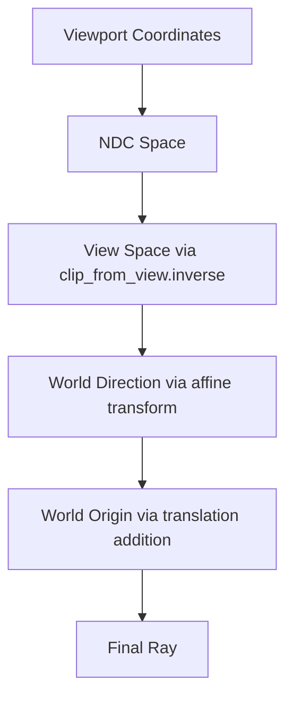

+++
title = "#20700 improve precision of viewport_to_world"
date = "2025-08-26T00:00:00"
draft = false
template = "pull_request_page.html"
in_search_index = true

[taxonomies]
list_display = ["show"]

[extra]
current_language = "en"
available_languages = {"en" = { name = "English", url = "/pull_request/bevy/2025-08/pr-20700-en-20250826" }, "zh-cn" = { name = "中文", url = "/pull_request/bevy/2025-08/pr-20700-zh-cn-20250826" }}
labels = ["C-Bug", "A-Rendering"]
+++

# Title
Improving Precision in Viewport-to-World Coordinate Transformation

## Basic Information
- **Title**: improve precision of viewport_to_world
- **PR Link**: https://github.com/bevyengine/bevy/pull/20700
- **Author**: atlv24
- **Status**: MERGED
- **Labels**: C-Bug, A-Rendering, S-Ready-For-Final-Review
- **Created**: 2025-08-22T06:05:48Z
- **Merged**: 2025-08-26T03:25:46Z
- **Merged By**: alice-i-cecile

## Description Translation
The original description is in English, so it is preserved exactly as-is:

# Objective

- Avoid a "catastrophic cancellation" from subtracting two world space positions
- Avoid a mat4 x mat4 matmul which loses a lot of precision
- Only add translation to the origin, so direction is always precise

## Solution

- this pr

## Testing

- irradiance volume example uses this

## The Story of This Pull Request

The `viewport_to_world` function in Bevy's camera system was experiencing precision issues due to two main problems. First, it was performing a matrix multiplication between two 4x4 matrices (`camera_transform.to_matrix()` and `clip_from_view.inverse()`), which can accumulate significant floating-point errors. Second, it was computing the ray direction by subtracting two world-space positions (`world_far_plane - world_near_plane`), which could lead to catastrophic cancellation when these positions were large but close together.

The solution involved reworking the transformation pipeline to maintain higher precision. Instead of pre-composing the matrices, the new implementation applies transformations sequentially: first converting from NDC to view space using the inverse clip matrix, then transforming the direction vector using only the affine part of the camera transform. This approach avoids the precision loss from matrix multiplication and ensures the direction vector remains accurate by separating translation from rotation/scaling.

The key insight was that the direction component should be computed without translation, as it represents a pure direction vector. The origin is then calculated by adding the camera's translation to the transformed direction vector, maintaining precision in both components.

```rust
// Before: Matrix multiplication and point subtraction
let ndc_to_world = camera_transform.to_matrix() * self.computed.clip_from_view.inverse();
let world_near_plane = ndc_to_world.project_point3(ndc.extend(1.));
let world_far_plane = ndc_to_world.project_point3(ndc.extend(f32::EPSILON));
let direction = world_far_plane - world_near_plane;

// After: Sequential transformations with separated translation
let view_point_near = self.computed.clip_from_view.inverse().project_point3a(ndc_point_near);
let world_dir_near = camera_transform.affine().transform_vector3a(view_point_near);
let origin = (world_dir_near + camera_transform.affine().translation).into();
```

This change improves both precision and performance by avoiding expensive matrix operations and catastrophic cancellation scenarios. The irradiance volume example, which relies on accurate ray casting, benefits directly from these improvements.

## Visual Representation



## Key Files Changed

### `crates/bevy_camera/src/camera.rs` (+18/-11)

**What changed**: The `viewport_to_world` function was completely rewritten to improve numerical precision.

**Why it changed**: The previous implementation suffered from precision loss due to matrix multiplication and vector subtraction operations.

**Code changes**:
```rust
// Before:
let ndc = rect_relative * 2. - Vec2::ONE;
let ndc_to_world = camera_transform.to_matrix() * self.computed.clip_from_view.inverse();
let world_near_plane = ndc_to_world.project_point3(ndc.extend(1.));
let world_far_plane = ndc_to_world.project_point3(ndc.extend(f32::EPSILON));

Dir3::new(world_far_plane - world_near_plane)
    .map_err(|_| ViewportConversionError::InvalidData)
    .map(|direction| Ray3d {
        origin: world_near_plane,
        direction,
    })

// After:
let ndc_point_near = (rect_relative * 2. - Vec2::ONE).extend(1.0).into();
let view_point_near = self
    .computed
    .clip_from_view
    .inverse()
    .project_point3a(ndc_point_near);
let world_dir_near = camera_transform
    .affine()
    .transform_vector3a(view_point_near);
let origin: Vec3 = (world_dir_near + camera_transform.affine().translation).into();

Dir3::new(world_dir_near.into())
    .map_err(|_| ViewportConversionError::InvalidData)
    .map(|direction| Ray3d { origin, direction })
```

## Further Reading

1. [Catastrophic Cancellation](https://en.wikipedia.org/wiki/Catastrophic_cancellation) - Wikipedia article on the numerical precision issue addressed in this PR
2. [Floating Point Precision](https://randomascii.wordpress.com/2012/02/25/comparing-floating-point-numbers-2012-edition/) - Detailed guide to floating-point precision issues
3. [Affine Transformations](https://en.wikipedia.org/wiki/Affine_transformation) - Mathematical background on affine transforms used in the solution
4. [Bevy Camera System](https://bevyengine.org/learn/books/getting-started/camera/) - Official documentation on Bevy's camera system