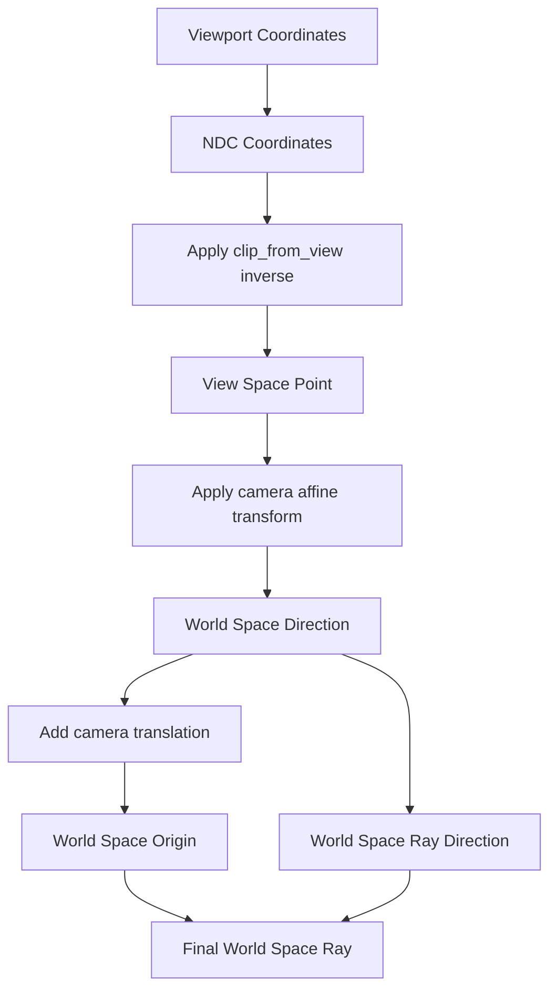

+++
title = "#20700 improve precision of viewport_to_world"
date = "2025-08-26T00:00:00"
draft = false
template = "pull_request_page.html"
in_search_index = false

[extra]
current_language = "zh-cn"
available_languages = {"en" = { name = "English", url = "/pull_request/bevy/2025-08/pr-20700-en-20250826" }, "zh-cn" = { name = "中文", url = "/pull_request/bevy/2025-08/pr-20700-zh-cn-20250826" }}
labels = ["C-Bug", "A-Rendering"]
+++

# Title
improve precision of viewport_to_world

## Basic Information
- **Title**: improve precision of viewport_to_world
- **PR Link**: https://github.com/bevyengine/bevy/pull/20700
- **Author**: atlv24
- **Status**: MERGED
- **Labels**: C-Bug, A-Rendering, S-Ready-For-Review
- **Created**: 2025-08-22T06:05:48Z
- **Merged**: 2025-08-26T03:25:46Z
- **Merged By**: alice-i-cecile

## Description Translation
# Objective

- 避免通过相减两个世界空间位置导致的"灾难性抵消" (catastrophic cancellation)
- 避免 mat4 x mat4 矩阵乘法导致的精度损失
- 只对原点添加平移，从而保持方向始终精确

## Solution

- 本 PR

## Testing

- 辐照度体积 (irradiance volume) 示例使用了此功能

## The Story of This Pull Request

这个 PR 解决了一个在 3D 渲染中常见的数值精度问题。当相机需要将视口坐标转换为世界空间中的射线时，原有的实现存在两个主要的数值精度缺陷。

首先，原有的代码通过将相机变换矩阵与投影矩阵的逆矩阵相乘来创建从 NDC (标准化设备坐标) 到世界空间的转换矩阵：

```rust
let ndc_to_world = camera_transform.to_matrix() * self.computed.clip_from_view.inverse();
```

这种矩阵组合操作（4x4 矩阵乘法）会导致显著的精度损失，特别是在使用单精度浮点数时。矩阵乘法会累积中间计算误差，使得最终结果不够精确。

其次，原有方法通过计算近平面和远平面上的两个点来确定射线方向：

```rust
let world_near_plane = ndc_to_world.project_point3(ndc.extend(1.));
let world_far_plane = ndc_to_world.project_point3(ndc.extend(f32::EPSILON));
let direction = world_far_plane - world_near_plane;
```

这种相减操作会产生"灾难性抵消"（catastrophic cancellation）——当两个相近的大数相减时，有效数字会大幅减少，导致方向向量的精度严重下降。

新的实现采用了更加数值稳定的方法。它分别应用两个变换而不是预先组合矩阵：

```rust
let view_point_near = self
    .computed
    .clip_from_view
    .inverse()
    .project_point3a(ndc_point_near);
let world_dir_near = camera_transform
    .affine()
    .transform_vector3a(view_point_near);
```

这种方法避免了矩阵组合的精度损失，并且通过只对方向向量应用仿射变换（不包含平移），保持了方向计算的高精度。平移部分只添加到原点计算中：

```rust
let origin: Vec3 = (world_dir_near + camera_transform.affine().translation).into();
```

这种分离处理的方式确保了方向向量始终保持高精度，而原点计算则包含了必要的平移变换。

从性能角度看，虽然新方法增加了两次变换操作，但避免了昂贵的 4x4 矩阵乘法，实际性能影响应该是中性的甚至可能有所改善，特别是在需要考虑精度的情况下。

这个改进特别重要对于辐照度体积（irradiance volume）这样的应用，它们对射线方向的精度非常敏感，微小的方向误差会导致光照计算的不准确。

## Visual Representation



## Key Files Changed

### `crates/bevy_camera/src/camera.rs` (+18/-11)

这个文件包含了相机系统的核心功能，特别是视口到世界坐标的转换逻辑。

**主要变更：**

修改了 `viewport_to_world` 方法中的坐标转换逻辑，从原来的矩阵组合方式改为分步变换方式。

**代码对比：**

```rust
// Before:
let ndc = rect_relative * 2. - Vec2::ONE;
let ndc_to_world = camera_transform.to_matrix() * self.computed.clip_from_view.inverse();
let world_near_plane = ndc_to_world.project_point3(ndc.extend(1.));
let world_far_plane = ndc_to_world.project_point3(ndc.extend(f32::EPSILON));

Dir3::new(world_far_plane - world_near_plane)
    .map_err(|_| ViewportConversionError::InvalidData)
    .map(|direction| Ray3d {
        origin: world_near_plane,
        direction,
    })

// After:
let ndc_point_near = (rect_relative * 2. - Vec2::ONE).extend(1.0).into();
let view_point_near = self
    .computed
    .clip_from_view
    .inverse()
    .project_point3a(ndc_point_near);
let world_dir_near = camera_transform
    .affine()
    .transform_vector3a(view_point_near);
let origin: Vec3 = (world_dir_near + camera_transform.affine().translation).into();

Dir3::new(world_dir_near.into())
    .map_err(|_| ViewportConversionError::InvalidData)
    .map(|direction| Ray3d { origin, direction })
```

这些变更直接解决了 PR 目标中提到的精度问题：
1. 避免了矩阵组合的精度损失
2. 避免了方向计算中的 catastrophic cancellation
3. 保持了方向向量的高精度

## Further Reading

- [Catastrophic Cancellation (数值分析中的灾难性抵消)](https://en.wikipedia.org/wiki/Catastrophic_cancellation)
- [Floating Point Precision and Robustness in Computer Graphics](https://developer.nvidia.com/content/floating-point-precision-and-robustness-computer-graphics)
- [Bevy Camera Projection Documentation](https://docs.rs/bevy/latest/bevy/camera/trait.CameraProjection.html)
- [Affine Transformations in Computer Graphics](https://en.wikipedia.org/wiki/Affine_transformation)