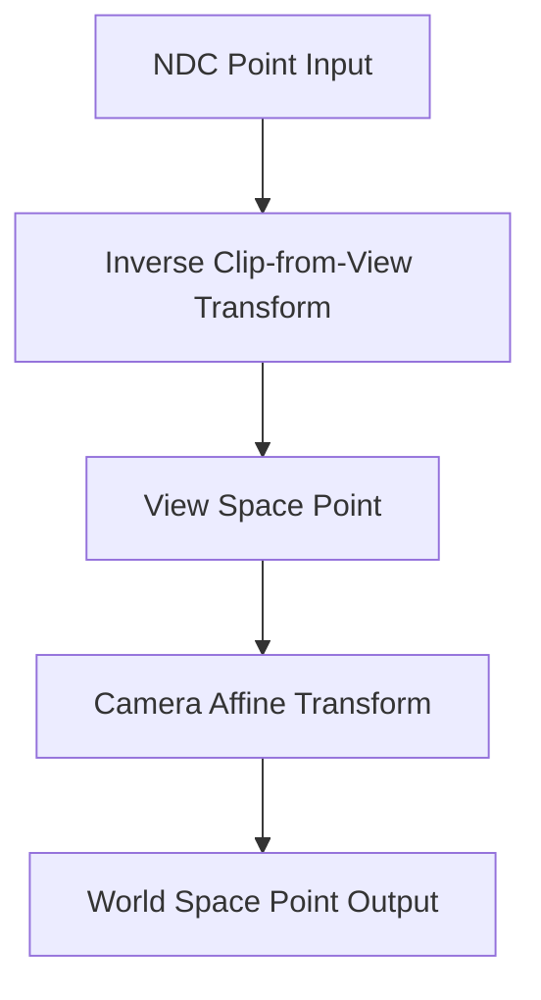

+++
title = "#20701 improve precision of ndc_to_world"
date = "2025-08-26T00:00:00"
draft = false
template = "pull_request_page.html"
in_search_index = true

[taxonomies]
list_display = ["show"]

[extra]
current_language = "en"
available_languages = {"en" = { name = "English", url = "/pull_request/bevy/2025-08/pr-20701-en-20250826" }, "zh-cn" = { name = "中文", url = "/pull_request/bevy/2025-08/pr-20701-zh-cn-20250826" }}
labels = ["A-Rendering"]
+++

# improve precision of ndc_to_world

## Basic Information
- **Title**: improve precision of ndc_to_world
- **PR Link**: https://github.com/bevyengine/bevy/pull/20701
- **Author**: atlv24
- **Status**: MERGED
- **Labels**: A-Rendering, S-Ready-For-Final-Review
- **Created**: 2025-08-22T06:14:15Z
- **Merged**: 2025-08-26T03:25:46Z
- **Merged By**: alice-i-cecile

## Description Translation
# Objective

- Avoid a mat4 x mat4 matmul which loses a lot of precision

## Solution

- mul by each one after the other

## Testing

- none of bevy uses this code, but its a pretty straightforward change. (untested)

## The Story of This Pull Request

The PR addresses a precision issue in the `ndc_to_world` function within Bevy's camera system. The core problem was that the original implementation performed a matrix multiplication between two 4x4 matrices (camera transform and inverse projection matrix) before transforming the NDC (Normalized Device Coordinates) point. This approach suffered from precision loss due to the nature of matrix multiplication operations, especially when combining affine and projective transformations.

The solution adopted was straightforward but effective: instead of pre-computing the combined transformation matrix, the implementation now applies the transformations sequentially. First, it converts the NDC point to view space using the inverse of the clip-from-view matrix, then transforms that result to world space using the camera's affine transformation. This approach maintains higher precision by avoiding the unnecessary matrix multiplication step.

The implementation also introduces generics to support both `Vec3` and `Vec3A` types transparently, allowing callers to use either precision level while maintaining type consistency between input and output. The use of `Vec3A` (SIMD-enabled vector type) for intermediate calculations provides additional precision benefits during the transformation steps.

From an engineering perspective, this change demonstrates good practice in numerical computation: avoiding unnecessary intermediate operations that can compound floating-point errors. The solution is minimal, focused, and maintains backward compatibility while improving precision characteristics.

## Visual Representation



## Key Files Changed

### `crates/bevy_camera/src/camera.rs` (+15/-7)

This file contains the core camera functionality in Bevy. The changes modify the `ndc_to_world` method to improve transformation precision.

**Before:**
```rust
pub fn ndc_to_world(&self, camera_transform: &GlobalTransform, ndc: Vec3) -> Option<Vec3> {
    // Build a transformation matrix to convert from NDC to world space using camera data
    let ndc_to_world = camera_transform.to_matrix() * self.computed.clip_from_view.inverse();

    let world_space_coords = ndc_to_world.project_point3(ndc);

    (!world_space_coords.is_nan()).then_some(world_space_coords)
}
```

**After:**
```rust
pub fn ndc_to_world<V: Into<Vec3A> + From<Vec3A>>(
    &self,
    camera_transform: &GlobalTransform,
    ndc_point: V,
) -> Option<V> {
    // We multiply the point by `view_from_clip` and then `world_from_view` in sequence to avoid the precision loss
    // (and performance penalty) incurred by pre-composing an affine transform with a projective transform.
    let view_point = self
        .computed
        .clip_from_view
        .inverse()
        .project_point3a(ndc_point.into());
    let world_point = camera_transform.affine().transform_point3a(view_point);

    (!world_point.is_nan()).then_some(world_point.into())
}
```

The key changes include:
1. Added generic type parameter `V` with `Into<Vec3A>` and `From<Vec3A>` bounds
2. Renamed parameter `ndc` to `ndc_point` for clarity
3. Replaced matrix multiplication with sequential transformations
4. Used `project_point3a` and `transform_point3a` methods for better precision
5. Maintained the same NaN-check behavior but with the new computation flow

## Further Reading

- [Bevy Camera Documentation](https://docs.rs/bevy_camera/latest/bevy_camera/)
- [Computer Graphics: Principles and Practice (Foley, van Dam, Feiner, Hughes)](https://www.amazon.com/Computer-Graphics-Principles-Practice-3rd/dp/0321399528) - For fundamentals of coordinate transformations
- [Floating Point Precision Considerations in Computer Graphics](https://developer.nvidia.com/content/floating-point-precision-considerations-computer-graphics) - NVIDIA technical article on precision issues
- [glam Library Documentation](https://docs.rs/glam/latest/glam/) - Bevy's math library for vector and matrix operations