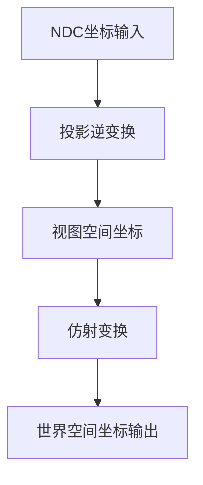

+++
title = "#20701 improve precision of ndc_to_world"
date = "2025-08-26T00:00:00"
draft = false
template = "pull_request_page.html"
in_search_index = false

[extra]
current_language = "zh-cn"
available_languages = {"en" = { name = "English", url = "/pull_request/bevy/2025-08/pr-20701-en-20250826" }, "zh-cn" = { name = "中文", url = "/pull_request/bevy/2025-08/pr-20701-zh-cn-20250826" }}
labels = ["A-Rendering"]
+++

# Title
improve precision of ndc_to_world

## Basic Information
- **Title**: improve precision of ndc_to_world
- **PR Link**: https://github.com/bevyengine/bevy/pull/20701
- **Author**: atlv24
- **Status**: MERGED
- **Labels**: A-Rendering, S-Ready-For-Final-Review
- **Created**: 2025-08-22T06:14:15Z
- **Merged**: 2025-08-26T03:25:46Z
- **Merged By**: alice-i-cecile

## Description Translation
# Objective

- 避免进行矩阵4x4乘以矩阵4x4的乘法运算，这种运算会损失大量精度

## Solution

- 依次逐个相乘

## Testing

- bevy中没有使用此代码，但这是一个相当简单的变更。（未经测试）

## The Story of This Pull Request

这个PR解决了一个在计算机图形学中常见但容易被忽视的问题：矩阵运算中的精度损失。在Bevy引擎的相机模块中，`ndc_to_world`函数负责将标准化设备坐标（NDC）转换到世界空间坐标。原来的实现存在一个精度问题，因为它先将两个4x4矩阵相乘，然后再用结果矩阵来变换点坐标。

问题的核心在于数学运算的顺序。当我们将一个仿射变换矩阵（affine transform）与一个投影变换矩阵（projective transform）预先组合时，会引入不必要的精度损失。这是因为4x4矩阵乘法涉及到大量的浮点运算，每一步都会累积误差。

开发者采取了直接而有效的解决方案：不再预先计算组合矩阵，而是将变换分解为两个独立的步骤。首先使用投影矩阵的逆将NDC坐标转换到视图空间，然后再应用相机变换将结果转换到世界空间。

从代码实现来看，这个变更涉及几个关键改进：

1. **函数签名泛化**：引入了泛型参数`V`，支持`Vec3`和`Vec3A`类型，提高了代码的灵活性和性能
2. **分步变换**：将原来的单步矩阵乘法分解为两个明确的变换步骤
3. **精度优化**：使用`Vec3A`类型进行中间计算，这种类型在SIMD优化下能提供更好的精度

技术细节上，原来的实现：
```rust
let ndc_to_world = camera_transform.to_matrix() * self.computed.clip_from_view.inverse();
let world_space_coords = ndc_to_world.project_point3(ndc);
```

被替换为：
```rust
let view_point = self.computed.clip_from_view.inverse().project_point3a(ndc_point.into());
let world_point = camera_transform.affine().transform_point3a(view_point);
```

这种改变不仅提高了数值精度，还可能带来性能提升，因为避免了昂贵的4x4矩阵乘法运算。

虽然PR描述中提到这个代码当前在Bevy中没有被使用，但修复这种底层数学运算的精度问题对于维护一个健壮的图形引擎至关重要。这种预防性的优化体现了良好的工程实践，确保当这个功能被使用时能够提供准确的结果。

## Visual Representation



## Key Files Changed

### `crates/bevy_camera/src/camera.rs` (+15/-7)

这个文件中的`ndc_to_world`方法进行了重大重构，主要改进包括：

1. **函数签名扩展**：添加了泛型支持，使函数能处理`Vec3`和`Vec3A`类型
2. **算法优化**：将单步矩阵乘法改为分步变换，提高精度
3. **类型转换优化**：使用`Into`和`From` trait进行高效的类型转换

**代码变更对比：**

```rust
// Before:
pub fn ndc_to_world(&self, camera_transform: &GlobalTransform, ndc: Vec3) -> Option<Vec3> {
    let ndc_to_world = camera_transform.to_matrix() * self.computed.clip_from_view.inverse();
    let world_space_coords = ndc_to_world.project_point3(ndc);
    (!world_space_coords.is_nan()).then_some(world_space_coords)
}

// After:
pub fn ndc_to_world<V: Into<Vec3A> + From<Vec3A>>(
    &self,
    camera_transform: &GlobalTransform,
    ndc_point: V,
) -> Option<V> {
    let view_point = self
        .computed
        .clip_from_view
        .inverse()
        .project_point3a(ndc_point.into());
    let world_point = camera_transform.affine().transform_point3a(view_point);
    (!world_point.is_nan()).then_some(world_point.into())
}
```

这些变更直接解决了PR中提到的精度问题，通过避免不必要的矩阵乘法和使用更精确的变换顺序来提升坐标转换的准确性。

## Further Reading

对于想深入了解这个PR中涉及概念的开发者，建议阅读以下资源：

1. **计算机图形学中的变换矩阵**：
   - 《Real-Time Rendering》第4章 - 变换相关内容
   - OpenGL Transformation matrices指南

2. **浮点数精度问题**：
   - Goldberg, D. (1991). "What Every Computer Scientist Should Know About Floating-Point Arithmetic"

3. **Bevy相机系统**：
   - Bevy官方文档中的Camera组件说明
   - 源代码中的camera模块注释

4. **仿射变换与投影变换**：
   - 计算机图形学教材中关于不同变换类型的数学基础
   - 矩阵组合运算的最佳实践

# Full Code Diff
diff --git a/crates/bevy_camera/src/camera.rs b/crates/bevy_camera/src/camera.rs
index 75d4637063d0f..94ac2e960ec20 100644
--- a/crates/bevy_camera/src/camera.rs
+++ b/crates/bevy_camera/src/camera.rs
@@ -725,13 +725,21 @@ impl Camera {
     /// # Panics
     ///
     /// Will panic if the projection matrix is invalid (has a determinant of 0) and `glam_assert` is enabled.
-    pub fn ndc_to_world(&self, camera_transform: &GlobalTransform, ndc: Vec3) -> Option<Vec3> {
-        // Build a transformation matrix to convert from NDC to world space using camera data
-        let ndc_to_world = camera_transform.to_matrix() * self.computed.clip_from_view.inverse();
-
-        let world_space_coords = ndc_to_world.project_point3(ndc);
-
-        (!world_space_coords.is_nan()).then_some(world_space_coords)
+    pub fn ndc_to_world<V: Into<Vec3A> + From<Vec3A>>(
+        &self,
+        camera_transform: &GlobalTransform,
+        ndc_point: V,
+    ) -> Option<V> {
+        // We multiply the point by `view_from_clip` and then `world_from_view` in sequence to avoid the precision loss
+        // (and performance penalty) incurred by pre-composing an affine transform with a projective transform.
+        let view_point = self
+            .computed
+            .clip_from_view
+            .inverse()
+            .project_point3a(ndc_point.into());
+        let world_point = camera_transform.affine().transform_point3a(view_point);
+
+        (!world_point.is_nan()).then_some(world_point.into())
     }
 
     /// Converts the depth in Normalized Device Coordinates