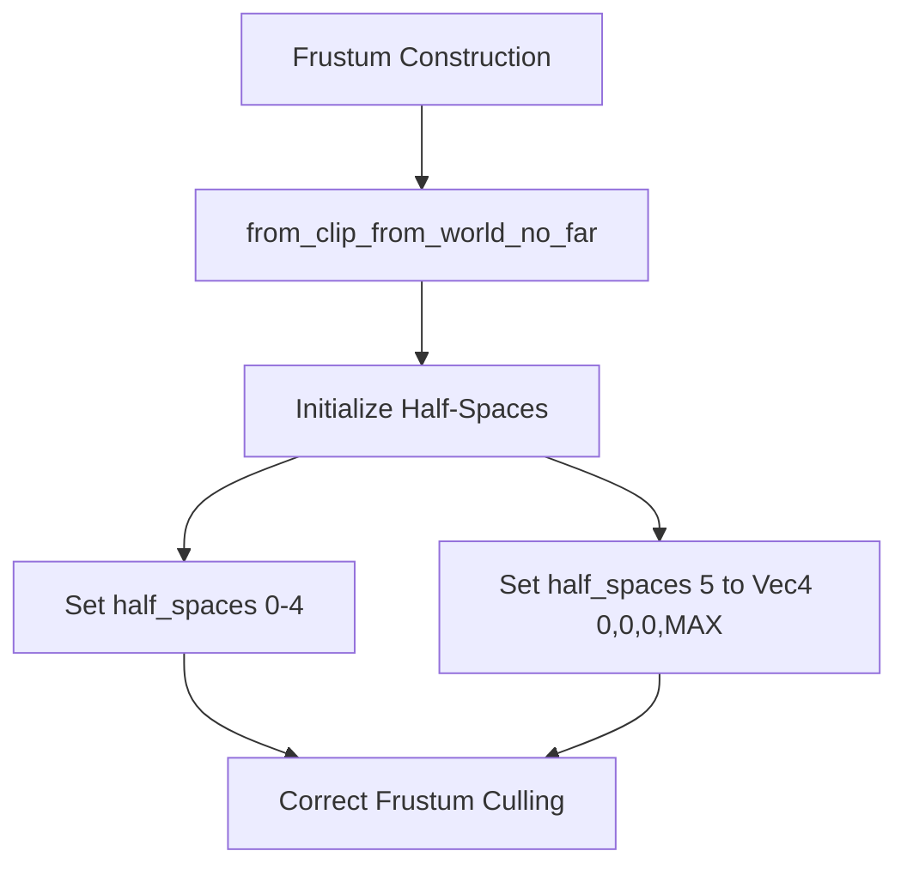

+++
title = "#20703 Use a correct default value for half space initialization in from_clip_from_world_no_far"
date = "2025-08-26T00:00:00"
draft = false
template = "pull_request_page.html"
in_search_index = true

[taxonomies]
list_display = ["show"]

[extra]
current_language = "en"
available_languages = {"en" = { name = "English", url = "/pull_request/bevy/2025-08/pr-20703-en-20250826" }, "zh-cn" = { name = "中文", url = "/pull_request/bevy/2025-08/pr-20703-zh-cn-20250826" }}
labels = ["C-Bug", "A-Rendering", "D-Straightforward"]
+++

# Use a correct default value for half space initialization in from_clip_from_world_no_far

## Basic Information
- **Title**: Use a correct default value for half space initialization in from_clip_from_world_no_far
- **PR Link**: https://github.com/bevyengine/bevy/pull/20703
- **Author**: atlv24
- **Status**: MERGED
- **Labels**: C-Bug, A-Rendering, S-Ready-For-Final-Review, D-Straightforward
- **Created**: 2025-08-22T07:28:23Z
- **Merged**: 2025-08-26T03:49:23Z
- **Merged By**: alice-i-cecile

## Description Translation
# Objective

- Fixes a bug where Frustums constructed by from_clip_from_world_no_far will consider all Aabbs and all zero-radius spheres to not be in the frustum if far plane culling is enabled

## Solution

- initialize to a correct default

## Testing

- bug has not been observed in the wild, only discovered by audit. example. from intersects_obb, in the halfspace loop:
```rs
let relative_radius = aabb.relative_radius(&p_normal, &world_from_local.matrix3);
if half_space.normal_d().dot(aabb_center_world) + relative_radius <= 0.0 {
    return false;
}
```
relative radius is a bunch of dot products with the frustum plane (which is 0) so it is 0.
normal dot aabb center again is 0, 0 + 0 is 0, which is <= 0. The if gets hit, and intersects returns false, wrongly.

Changing d to f32::MAX instead makes the normal_d dot center extended by 1 result in f32::MAX, which is not <= 0, and thus intersect can succeed

## The Story of This Pull Request

The issue was discovered during a code audit of Bevy's frustum culling system. The `from_clip_from_world_no_far` method in the `Frustum` struct was incorrectly initializing one of its half-spaces, specifically the far plane replacement. This caused a critical bug where all axis-aligned bounding boxes (AABBs) and zero-radius spheres would be incorrectly culled when far plane culling was enabled.

The problem originated in the half-space initialization logic. When constructing a frustum without a far plane, the method was leaving the sixth half-space uninitialized or with incorrect values. During intersection testing, this led to mathematical operations that always returned zero, causing the culling condition to incorrectly evaluate to true.

The solution was straightforward but critical: initialize the sixth half-space to a proper default value that wouldn't interfere with intersection calculations. By setting the half-space to `Vec4::new(0.0, 0.0, 0.0, f32::MAX)`, the intersection calculations now work correctly. The large distance value ensures that objects aren't incorrectly culled by what should be a disabled far plane.

This fix demonstrates the importance of proper initialization values in geometric computations. Even a single uninitialized value can cause cascading failures in rendering systems, leading to objects disappearing incorrectly. The change is minimal but has significant impact on the correctness of frustum culling operations.

## Visual Representation



## Key Files Changed

- `crates/bevy_camera/src/primitives.rs` (+1/-0)

The change was made to the `Frustum::from_clip_from_world_no_far` method to properly initialize the sixth half-space:

```rust
// File: crates/bevy_camera/src/primitives.rs
// After:
impl Frustum {
    pub fn from_clip_from_world_no_far(clip_from_world: &Mat4) -> Self {
        // ... existing half-space initialization code ...
        half_spaces[5] = HalfSpace::new(Vec4::new(0.0, 0.0, 0.0, f32::MAX));
        Self { half_spaces }
    }
}
```

This single line addition ensures that when frustums are created without far planes, the replacement half-space doesn't interfere with intersection testing logic. The choice of `f32::MAX` ensures that the plane is effectively at infinity, preventing incorrect culling of objects.

## Further Reading

- [Bevy Frustum Culling Documentation](https://bevyengine.org/learn/advanced-topics/frustum-culling/)
- [Learning OpenGL - Coordinate Systems](https://learnopengl.com/Getting-started/Coordinate-Systems)
- [Real-Time Rendering, Fourth Edition - Chapter 19.13](https://www.realtimerendering.com/)