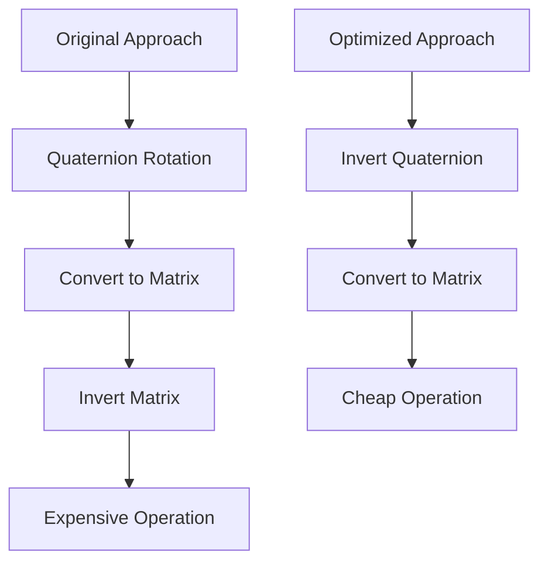

+++
title = "#20704 invert the quaternion not the mat4 in skybox"
date = "2025-08-22T00:00:00"
draft = false
template = "pull_request_page.html"
in_search_index = true

[taxonomies]
list_display = ["show"]

[extra]
current_language = "en"
available_languages = {"en" = { name = "English", url = "/pull_request/bevy/2025-08/pr-20704-en-20250822" }, "zh-cn" = { name = "中文", url = "/pull_request/bevy/2025-08/pr-20704-zh-cn-20250822" }}
labels = ["A-Rendering", "C-Performance", "A-Math"]
+++

# Title
invert the quaternion not the mat4 in skybox

## Basic Information
- **Title**: invert the quaternion not the mat4 in skybox
- **PR Link**: https://github.com/bevyengine/bevy/pull/20704
- **Author**: atlv24
- **Status**: MERGED
- **Labels**: A-Rendering, C-Performance, A-Math
- **Created**: 2025-08-22T07:38:21Z
- **Merged**: 2025-08-22T21:29:23Z
- **Merged By**: james7132

## Description Translation
# Objective

- mat4 inverse is way costlier and way less precise. quat inverse is just flipping a single bit

## Solution

- do

```rust
pub fn conjugate(self) -> Self {
    const SIGN: __m128 = m128_from_f32x4([-0.0, -0.0, -0.0, 0.0]);
    Self(unsafe { _mm_xor_ps(self.0, SIGN) })
}
```

instead of

```rust
pub fn inverse(&self) -> Self {
    unsafe {
        // Based on https://github.com/g-truc/glm `glm_mat4_inverse`
        let fac0 = {
            let swp0a = _mm_shuffle_ps(self.w_axis.0, self.z_axis.0, 0b11_11_11_11);
            let swp0b = _mm_shuffle_ps(self.w_axis.0, self.z_axis.0, 0b10_10_10_10);

            let swp00 = _mm_shuffle_ps(self.z_axis.0, self.y_axis.0, 0b10_10_10_10);
            let swp01 = _mm_shuffle_ps(swp0a, swp0a, 0b10_00_00_00);
            let swp02 = _mm_shuffle_ps(swp0b, swp0b, 0b10_00_00_00);
            let swp03 = _mm_shuffle_ps(self.z_axis.0, self.y_axis.0, 0b11_11_11_11);

            let mul00 = _mm_mul_ps(swp00, swp01);
            let mul01 = _mm_mul_ps(swp02, swp03);
            _mm_sub_ps(mul00, mul01)
        };
        let fac1 = {
            let swp0a = _mm_shuffle_ps(self.w_axis.0, self.z_axis.0, 0b11_11_11_11);
            let swp0b = _mm_shuffle_ps(self.w_axis.0, self.z_axis.0, 0b01_01_01_01);

            let swp00 = _mm_shuffle_ps(self.z_axis.0, self.y_axis.0, 0b01_01_01_01);
            let swp01 = _mm_shuffle_ps(swp0a, swp0a, 0b10_00_00_00);
            let swp02 = _mm_shuffle_ps(swp0b, swp0b, 0b10_00_00_00);
            let swp03 = _mm_shuffle_ps(self.z_axis.0, self.y_axis.0, 0b11_11_11_11);

            let mul00 = _mm_mul_ps(swp00, swp01);
            let mul01 = _mm_mul_ps(swp02, swp03);
            _mm_sub_ps(mul00, mul01)
        };
        let fac2 = {
            let swp0a = _mm_shuffle_ps(self.w_axis.0, self.z_axis.0, 0b10_10_10_10);
            let swp0b = _mm_shuffle_ps(self.w_axis.0, self.z_axis.0, 0b01_01_01_01);

            let swp00 = _mm_shuffle_ps(self.z_axis.0, self.y_axis.0, 0b01_01_01_01);
            let swp01 = _mm_shuffle_ps(swp0a, swp0a, 0b10_00_00_00);
            let swp02 = _mm_shuffle_ps(swp0b, swp0b, 0b10_00_00_00);
            let swp03 = _mm_shuffle_ps(self.z_axis.0, self.y_axis.0, 0b10_10_10_10);

            let mul00 = _mm_mul_ps(swp00, swp01);
            let mul01 = _mm_mul_ps(swp02, swp03);
            _mm_sub_ps(mul00, mul01)
        };
        let fac3 = {
            let swp0a = _mm_shuffle_ps(self.w_axis.0, self.z_axis.0, 0b11_11_11_11);
            let swp0b = _mm_shuffle_ps(self.w_axis.0, self.z_axis.0, 0b00_00_00_00);

            let swp00 = _mm_shuffle_ps(self.z_axis.0, self.y_axis.0, 0b00_00_00_00);
            let swp01 = _mm_shuffle_ps(swp0a, swp0a, 0b10_00_00_00);
            let swp02 = _mm_shuffle_ps(swp0b, swp0b, 0b10_00_00_00);
            let swp03 = _mm_shuffle_ps(self.z_axis.0, self.y_axis.0, 0b11_11_11_11);

            let mul00 = _mm_mul_ps(swp00, swp01);
            let mul01 = _mm_mul_ps(swp02, swp03);
            _mm_sub_ps(mul00, mul01)
        };
        let fac4 = {
            let swp0a = _mm_shuffle_ps(self.w_axis.0, self.z_axis.0, 0b10_10_10_10);
            let swp0b = _mm_shuffle_ps(self.w_axis.0, self.z_axis.0, 0b00_00_00_00);

            let swp00 = _mm_shuffle_ps(self.z_axis.0, self.y_axis.0, 0b00_00_00_00);
            let swp01 = _mm_shuffle_ps(swp0a, swp0a, 0b10_00_00_00);
            let swp02 = _mm_shuffle_ps(swp0b, swp0b, 0b10_00_00_00);
            let swp03 = _mm_shuffle_ps(self.z_axis.0, self.y_axis.0, 0b10_10_10_10);

            let mul00 = _mm_mul_ps(swp00, swp01);
            let mul01 = _mm_mul_ps(swp02, swp03);
            _mm_sub_ps(mul00, mul01)
        };
        let fac5 = {
            let swp0a = _mm_shuffle_ps(self.w_axis.0, self.z_axis.0, 0b01_01_01_01);
            let swp0b = _mm_shuffle_ps(self.w_axis.0, self.z_axis.0, 0b00_00_00_00);

            let swp00 = _mm_shuffle_ps(self.z_axis.0, self.y_axis.0, 0b00_00_00_00);
            let swp01 = _mm_shuffle_ps(swp0a, swp0a, 0b10_00_00_00);
            let swp02 = _mm_shuffle_ps(swp0b, swp0b, 0b10_00_00_00);
            let swp03 = _mm_shuffle_ps(self.z_axis.0, self.y_axis.0, 0b01_01_01_01);

            let mul00 = _mm_mul_ps(swp00, swp01);
            let mul01 = _mm_mul_ps(swp02, swp03);
            _mm_sub_ps(mul00, mul01)
        };
        let sign_a = _mm_set_ps(1.0, -1.0, 1.0, -1.0);
        let sign_b = _mm_set_ps(-1.0, 1.0, -1.0, 1.0);

        let temp0 = _mm_shuffle_ps(self.y_axis.0, self.x_axis.0, 0b00_00_00_00);
        let vec0 = _mm_shuffle_ps(temp0, temp0, 0b10_10_10_00);

        let temp1 = _mm_shuffle_ps(self.y_axis.0, self.x_axis.0, 0b01_01_01_01);
        let vec1 = _mm_shuffle_ps(temp1, temp1, 0b10_10_10_00);

        let temp2 = _mm_shuffle_ps(self.y_axis.0, self.x_axis.0, 0b10_10_10_10);
        let vec2 = _mm_shuffle_ps(temp2, temp2, 0b10_10_10_00);

        let temp3 = _mm_shuffle_ps(self.y_axis.0, self.x_axis.0, 0b11_11_11_11);
        let vec3 = _mm_shuffle_ps(temp3, temp3, 0b10_10_10_00);

        let mul00 = _mm_mul_ps(vec1, fac0);
        let mul01 = _mm_mul_ps(vec2, fac1);
        let mul02 = _mm_mul_ps(vec3, fac2);
        let sub00 = _mm_sub_ps(mul00, mul01);
        let add00 = _mm_add_ps(sub00, mul02);
        let inv0 = _mm_mul_ps(sign_b, add00);

        let mul03 = _mm_mul_ps(vec0, fac0);
        let mul04 = _mm_mul_ps(vec2, fac3);
        let mul05 = _mm_mul_ps(vec3, fac4);
        let sub01 = _mm_sub_ps(mul03, mul04);
        let add01 = _mm_add_ps(sub01, mul05);
        let inv1 = _mm_mul_ps(sign_a, add01);

        let mul06 = _mm_mul_ps(vec0, fac1);
        let mul07 = _mm_mul_ps(vec1, fac3);
        let mul08 = _mm_mul_ps(vec3, fac5);
        let sub02 = _mm_sub_ps(mul06, mul07);
        let add02 = _mm_add_ps(sub02, mul08);
        let inv2 = _mm_mul_ps(sign_b, add02);

        let mul09 = _mm_mul_ps(vec0, fac2);
        let mul10 = _mm_mul_ps(vec1, fac4);
        let mul11 = _mm_mul_ps(vec2, fac5);
        let sub03 = _mm_sub_ps(mul09, mul10);
        let add03 = _mm_add_ps(sub03, mul11);
        let inv3 = _mm_mul_ps(sign_a, add03);

        let row0 = _mm_shuffle_ps(inv0, inv1, 0b00_00_00_00);
        let row1 = _mm_shuffle_ps(inv2, inv3, 0b00_00_00_00);
        let row2 = _mm_shuffle_ps(row0, row1, 0b10_00_10_00);

        let dot0 = dot4(self.x_axis.0, row2);
        glam_assert!(dot0 != 0.0);

        let rcp0 = _mm_set1_ps(dot0.recip());

        Self {
            x_axis: Vec4(_mm_mul_ps(inv0, rcp0)),
            y_axis: Vec4(_mm_mul_ps(inv1, rcp0)),
            z_axis: Vec4(_mm_mul_ps(inv2, rcp0)),
            w_axis: Vec4(_mm_mul_ps(inv3, rcp0)),
        }
    }
}
```

## The Story of This Pull Request

This PR addresses a performance optimization in Bevy's skybox rendering system. The core issue was in how the skybox transformation matrix was being computed. Previously, the code was creating a rotation matrix from a quaternion and then inverting that 4x4 matrix, which is computationally expensive and introduces precision issues.

The problem stems from the mathematical properties of rotation matrices. For a pure rotation represented by a unit quaternion, the inverse of the rotation matrix is equal to its transpose. However, computing the inverse of a general 4x4 matrix requires significantly more operations and can introduce numerical instability compared to simply inverting the quaternion.

The solution leverages the mathematical identity that for a rotation matrix R constructed from a quaternion q, the inverse R⁻¹ equals the matrix constructed from the conjugate quaternion q*. Since quaternion conjugation is much cheaper than matrix inversion - essentially just flipping the sign bits of the vector components - this approach provides both performance and precision benefits.

The implementation changes are minimal but impactful. Instead of:
1. Creating a transform from the rotation quaternion
2. Converting to a matrix
3. Inverting the matrix

The new approach:
1. Inverts the quaternion (via conjugation)
2. Creates a transform from the inverted quaternion
3. Converts to a matrix

This change reduces the operation complexity from O(n³) for matrix inversion to O(1) for quaternion conjugation, providing both performance improvements and better numerical stability.

## Visual Representation



## Key Files Changed

**File: `crates/bevy_core_pipeline/src/skybox/mod.rs`**

Changes made to the skybox uniform extraction code:

```rust
// Before:
transform: Transform::from_rotation(skybox.rotation)
    .to_matrix()
    .inverse(),

// After:  
transform: Transform::from_rotation(skybox.rotation.inverse()).to_matrix(),
```

This change replaces the expensive matrix inversion operation with a much cheaper quaternion inversion, while maintaining the same mathematical result for pure rotation matrices.

## Further Reading

- [Quaternion mathematics](https://en.wikipedia.org/wiki/Quaternion)
- [Rotation matrix properties](https://en.wikipedia.org/wiki/Rotation_matrix)
- [Performance characteristics of matrix operations](https://www.cs.cornell.edu/~bindel/class/cs5220-f11/slides/lec03.pdf)
- [Bevy Transform documentation](https://docs.rs/bevy/latest/bevy/transform/components/struct.Transform.html)