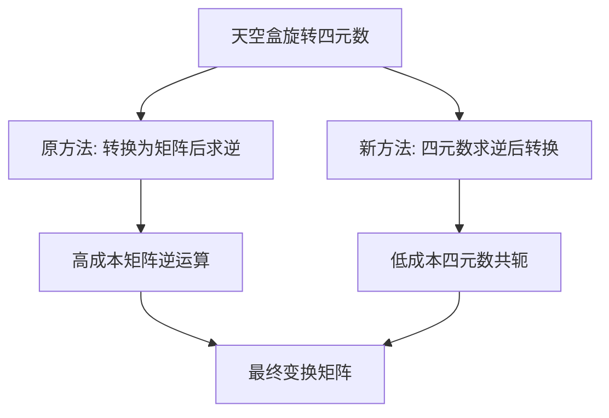

+++
title = "#20704 invert the quaternion not the mat4 in skybox"
date = "2025-08-22T00:00:00"
draft = false
template = "pull_request_page.html"
in_search_index = false

[extra]
current_language = "zh-cn"
available_languages = {"en" = { name = "English", url = "/pull_request/bevy/2025-08/pr-20704-en-20250822" }, "zh-cn" = { name = "中文", url = "/pull_request/bevy/2025-08/pr-20704-zh-cn-20250822" }}
+++

# invert the quaternion not the mat4 in skybox

## 基本信息
- **标题**: invert the quaternion not the mat4 in skybox
- **PR链接**: https://github.com/bevyengine/bevy/pull/20704
- **作者**: atlv24
- **状态**: 已合并
- **标签**: A-Rendering, C-Performance, A-Math
- **创建时间**: 2025-08-22T07:38:21Z
- **合并时间**: 2025-08-22T21:29:23Z
- **合并者**: james7132

## 描述翻译

### 目标
- mat4 的逆运算成本高得多且精度低得多。四元数的逆运算只需翻转一个位

### 解决方案
- 执行

```rust
pub fn conjugate(self) -> Self {
    const SIGN: __m128 = m128_from_f32x4([-0.0, -0.0, -0.0, 0.0]);
    Self(unsafe { _mm_xor_ps(self.0, SIGN) })
}
```

而不是

```rust
pub fn inverse(&self) -> Self {
    unsafe {
        // 基于 https://github.com/g-truc/glm `glm_mat4_inverse`
        let fac0 = {
            let swp0a = _mm_shuffle_ps(self.w_axis.0, self.z_axis.0, 0b11_11_11_11);
            let swp0b = _mm_shuffle_ps(self.w_axis.0, self.z_axis.0, 0b10_10_10_10);

            let swp00 = _mm_shuffle_ps(self.z_axis.0, self.y_axis.0, 0b10_10_10_10);
            let swp01 = _mm_shuffle_ps(swp0a, swp0a, 0b10_00_00_00);
            let swp02 = _mm_shuffle_ps(swp0b, swp0b, 0b10_00_00_00);
            let swp03 = _mm_shuffle_ps(self.z_axis.0, self.y_axis.0, 0b11_11_11_11);

            let mul00 = _mm_mul_ps(swp00, swp01);
            let mul01 = _mm_mul_ps(swp02, swp03);
            _mm_sub_ps(mul00, mul01)
        };
        // ... 省略大量类似的复杂计算代码
    }
}
```

## 这个Pull Request的故事

这个PR解决了一个在天空盒渲染中的性能优化问题。问题的核心在于变换矩阵的逆运算计算成本过高，而通过数学上的等价变换，可以用更高效的四元数操作来替代。

在3D图形编程中，天空盒需要根据相机方向进行正确的朝向变换。原本的实现方式是先通过四元数创建旋转矩阵，然后对这个4x4矩阵求逆。矩阵求逆是一个计算密集型操作，特别是对于4x4矩阵，需要大量的浮点运算和SIMD指令操作。

开发者意识到，对于单位四元数（表示旋转的四元数都是单位四元数），其逆运算实际上就是共轭运算。四元数的共轭只需要简单地翻转三个虚部的符号位，这是一个极其高效的操作，在现代CPU上通常只需要一次位操作指令。

具体到代码实现，修改前的做法是：
```rust
transform: Transform::from_rotation(skybox.rotation)
    .to_matrix()
    .inverse(),
```

这需要先构建变换矩阵，然后进行复杂的矩阵求逆运算。而修改后的做法是：
```rust
transform: Transform::from_rotation(skybox.rotation.inverse()).to_matrix(),
```

这里直接对四元数进行逆运算（即共轭），然后再转换为矩阵。由于四元数的逆运算成本极低，整个操作的性能得到了显著提升。

从数学角度看，这两种方法是等价的：对于旋转矩阵R，其逆矩阵等于其转置矩阵。而由四元数q生成的旋转矩阵的逆，等于由q的共轭生成的旋转矩阵。因此这种优化在数学上是正确的，不会影响渲染结果。

这个优化的价值在于：
1. **性能提升**：避免了昂贵的矩阵求逆运算
2. **精度改善**：减少了浮点运算次数，降低了精度损失
3. **代码简洁**：避免了复杂的矩阵运算代码

这种优化模式在图形编程中是一个常见的最佳实践：尽可能在四元数层面进行操作，避免不必要的矩阵运算，特别是在性能关键的渲染路径中。

## 可视化表示



## 关键文件更改

### `crates/bevy_core_pipeline/src/skybox/mod.rs`
这个文件包含了天空盒渲染的核心逻辑，特别是负责提取和准备天空盒uniform数据的组件。

**修改前:**
```rust
transform: Transform::from_rotation(skybox.rotation)
    .to_matrix()
    .inverse(),
```

**修改后:**
```rust
transform: Transform::from_rotation(skybox.rotation.inverse()).to_matrix(),
```

这个更改将昂贵的矩阵逆运算替换为高效的四元数逆运算，同时保持数学上的等价性。修改直接影响天空盒的变换矩阵计算，这是每帧都需要执行的操作，因此对性能有显著影响。

## 延伸阅读

- [四元数与三维旋转](https://eater.net/quaternions) - 可视化解释四元数如何表示旋转
- [几何代数中的四元数](https://marctenbosch.com/quaternions/) - 四元数在计算机图形学中的应用
- [Bevy变换系统文档](https://docs.rs/bevy/latest/bevy/transform/components/struct.Transform.html) - Bevy引擎的变换组件API文档
- [SIMD优化技术](https://www.intel.com/content/www/us/en/docs/intrinsics-guide/index.html) - Intel intrinsics指南，了解SIMD指令优化