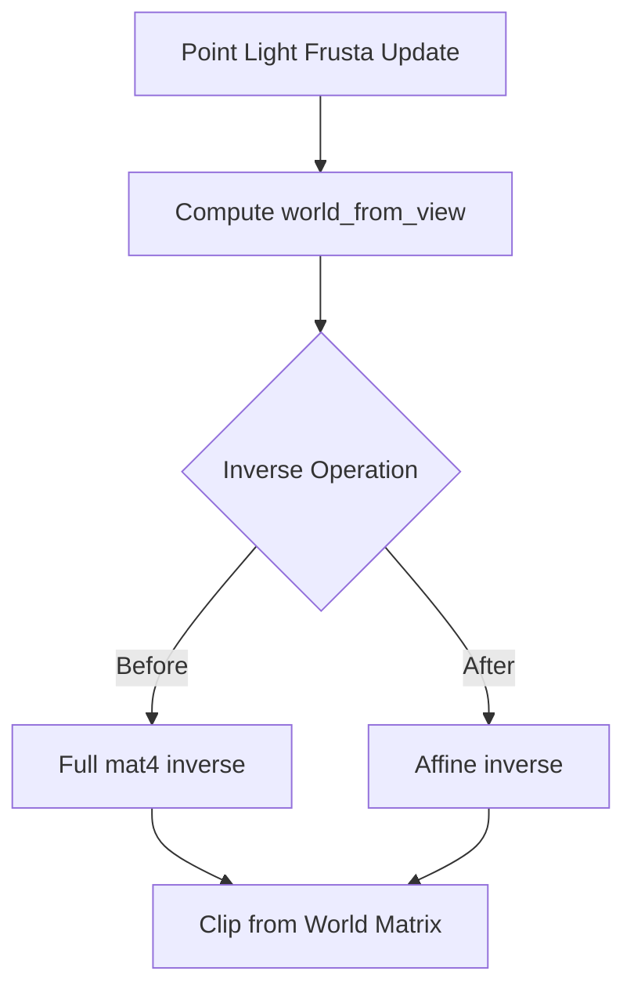

+++
title = "#20705 invert affine not mat4 in point_light"
date = "2025-08-22T00:00:00"
draft = false
template = "pull_request_page.html"
in_search_index = true

[taxonomies]
list_display = ["show"]

[extra]
current_language = "en"
available_languages = {"en" = { name = "English", url = "/pull_request/bevy/2025-08/pr-20705-en-20250822" }, "zh-cn" = { name = "中文", url = "/pull_request/bevy/2025-08/pr-20705-zh-cn-20250822" }}
labels = ["A-Rendering", "A-Math"]
+++

# invert affine not mat4 in point_light

## Basic Information
- **Title**: invert affine not mat4 in point_light
- **PR Link**: https://github.com/bevyengine/bevy/pull/20705
- **Author**: atlv24
- **Status**: MERGED
- **Labels**: A-Rendering, A-Math
- **Created**: 2025-08-22T07:47:11Z
- **Merged**: 2025-08-22T21:29:23Z
- **Merged By**: james7132

## Description Translation
# Objective

- Don't do a full mat4 inverse when you have an affine matrix

## Solution

- Do an affine inverse when you have an affine matrix

## Testing

- Lighting example

## The Story of This Pull Request

This PR addresses a performance optimization in Bevy's point light rendering system. The core issue was in the `update_point_light_frusta` function, where the code was performing a full 4x4 matrix inversion on what was known to be an affine transformation matrix. This was computationally expensive and unnecessary.

The transformation matrix `world_from_view` is constructed from a translation and rotation, which guarantees it's an affine transformation. Affine transformations have specific mathematical properties that allow for more efficient inversion compared to general 4x4 matrices. The original implementation used a general matrix inverse operation, which involves more complex calculations than needed for affine transformations.

The solution replaces the general matrix inversion with a specialized affine inversion. Instead of converting to a full 4x4 matrix and then inverting (`world_from_view.to_matrix().inverse()`), the code now uses the affine representation and its optimized inverse operation (`world_from_view.compute_affine().inverse()`).

This change maintains identical mathematical results while improving performance. The optimization is particularly valuable in rendering systems where this calculation occurs for each point light and each face of the cubemap, making even small performance gains multiply across the system.

The change was tested using the lighting example to ensure no visual regressions or functional changes occurred. The maintainers recognized this as a straightforward mathematical optimization that improves performance without altering behavior.

## Visual Representation



## Key Files Changed

**File:** `crates/bevy_light/src/point_light.rs`

**Change Description:** Replaced general matrix inversion with optimized affine inversion in point light frustum calculation.

**Code Change:**
```rust
// Before:
let clip_from_world = clip_from_view * world_from_view.to_matrix().inverse();

// After:
let clip_from_world = clip_from_view * world_from_view.compute_affine().inverse();
```

This change replaces the computationally expensive general matrix inverse with a more efficient affine-specific inverse operation. The transformation `world_from_view` is known to be affine (composed of translation and rotation), so using the affine inverse is mathematically equivalent but more performant.

## Further Reading

- [Affine Transformation - Wikipedia](https://en.wikipedia.org/wiki/Affine_transformation)
- [Matrix Inversion - Wikipedia](https://en.wikipedia.org/wiki/Invertible_matrix)
- [Bevy Math Documentation](https://docs.rs/bevy_math/latest/bevy_math/)
- [Computer Graphics: Principles and Practice - Foley, van Dam, Feiner, Hughes](https://en.wikipedia.org/wiki/Computer_Graphics:_Principles_and_Practice)