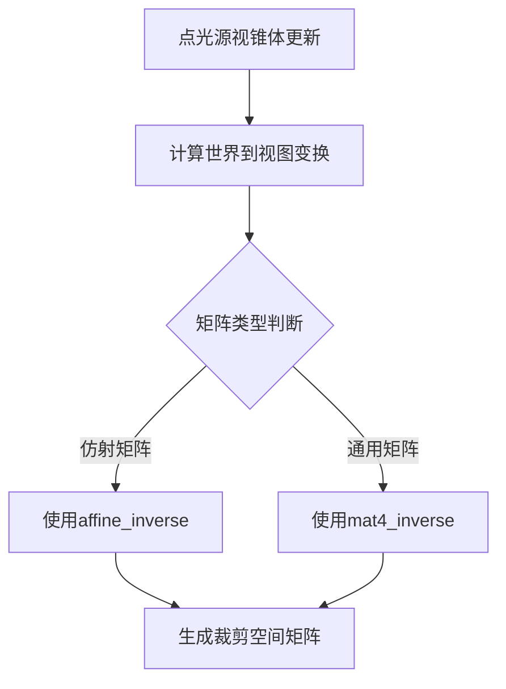

+++
title = "#20705 invert affine not mat4 in point_light"
date = "2025-08-22T00:00:00"
draft = false
template = "pull_request_page.html"
in_search_index = false

[extra]
current_language = "zh-cn"
available_languages = {"en" = { name = "English", url = "/pull_request/bevy/2025-08/pr-20705-en-20250822" }, "zh-cn" = { name = "中文", url = "/pull_request/bevy/2025-08/pr-20705-zh-cn-20250822" }}
+++

# invert affine not mat4 in point_light

## 基本信息
- **标题**: invert affine not mat4 in point_light
- **PR链接**: https://github.com/bevyengine/bevy/pull/20705
- **作者**: atlv24
- **状态**: 已合并
- **标签**: A-Rendering, A-Math
- **创建时间**: 2025-08-22T07:47:11Z
- **合并时间**: 2025-08-22T21:29:23Z
- **合并者**: james7132

## 描述翻译
# 目标

- 当存在仿射矩阵时，不执行完整的mat4逆运算

## 解决方案

- 当存在仿射矩阵时，执行仿射逆运算

## 测试

- 光照示例

## 本次PR的技术分析

这个PR解决了一个在Bevy渲染系统中关于点光源视锥体更新的性能优化问题。问题的核心在于矩阵求逆运算的效率优化。

在图形渲染中，点光源通常需要生成六个方向的视锥体（对应立方体贴图的六个面）来进行阴影计算。每个视锥体都需要计算从世界空间到裁剪空间的变换矩阵，这涉及到视图变换矩阵的逆运算。

原始代码使用了通用的4x4矩阵求逆方法：
```rust
let clip_from_world = clip_from_view * world_from_view.to_matrix().inverse();
```

问题在于`world_from_view`是一个仿射变换矩阵（affine matrix），包含平移、旋转和缩放，但不包含投影或剪切变换。对于仿射矩阵，可以使用更高效的专用求逆算法，而不是通用的4x4矩阵求逆。

修改后的代码：
```rust
let clip_from_world = clip_from_view * world_from_view.compute_affine().inverse();
```

这里的关键区别是使用了`compute_affine().inverse()`而不是`to_matrix().inverse()`。`compute_affine()`方法明确表示这是一个仿射变换，然后调用专门为仿射矩阵优化的逆运算方法。

从数学角度，仿射矩阵的逆运算复杂度是O(1)，而通用4x4矩阵的逆运算复杂度是O(n³)。在实际执行中，仿射逆运算可以避免不必要的计算步骤，特别是对于不需要处理投影分量的情况。

这种优化在需要频繁计算矩阵逆运算的渲染场景中特别有价值，比如每帧需要为多个点光源计算多个视锥体变换的情况下。虽然单次优化的幅度可能不大，但在大规模场景中累积起来会有明显的性能提升。

## 可视化表示



## 关键文件变更

- `crates/bevy_light/src/point_light.rs` (+1/-1)

这个文件中的`update_point_light_frusta`函数负责更新点光源的视锥体。修改的内容很精确，只改变了一行代码中的矩阵求逆方法：

```rust
// 修改前:
let clip_from_world = clip_from_view * world_from_view.to_matrix().inverse();

// 修改后:
let clip_from_world = clip_from_view * world_from_view.compute_affine().inverse();
```

这个变化直接体现了PR的目标：针对仿射矩阵使用更高效的专用逆运算方法，而不是通用的4x4矩阵逆运算。

## 延伸阅读

- [仿射变换与矩阵求逆](https://en.wikipedia.org/wiki/Affine_transformation)
- [计算机图形学中的矩阵优化](https://scicomp.stackexchange.com/questions/10084/how-to-efficiently-invert-a-matrix)
- [Bevy引擎的数学库设计](https://bevyengine.org/learn/architecture/math/)

# 完整代码差异
```diff
diff --git a/crates/bevy_light/src/point_light.rs b/crates/bevy_light/src/point_light.rs
index 39f98d448aeee..714920c09e70f 100644
--- a/crates/bevy_light/src/point_light.rs
+++ b/crates/bevy_light/src/point_light.rs
@@ -232,7 +232,7 @@ pub fn update_point_light_frusta(
 
         for (view_rotation, frustum) in view_rotations.iter().zip(cubemap_frusta.iter_mut()) {
             let world_from_view = view_translation * *view_rotation;
-            let clip_from_world = clip_from_view * world_from_view.to_matrix().inverse();
+            let clip_from_world = clip_from_view * world_from_view.compute_affine().inverse();
 
             *frustum = Frustum::from_clip_from_world_custom_far(
                 &clip_from_world,
```