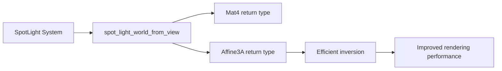

+++
title = "#20706 invert affine not mat4 in spotlight"
date = "2025-08-22T00:00:00"
draft = false
template = "pull_request_page.html"
in_search_index = true

[taxonomies]
list_display = ["show"]

[extra]
current_language = "en"
available_languages = {"en" = { name = "English", url = "/pull_request/bevy/2025-08/pr-20706-en-20250822" }, "zh-cn" = { name = "中文", url = "/pull_request/bevy/2025-08/pr-20706-zh-cn-20250822" }}
labels = ["A-Rendering"]
+++

# invert affine not mat4 in spotlight

## Basic Information
- **Title**: invert affine not mat4 in spotlight
- **PR Link**: https://github.com/bevyengine/bevy/pull/20706
- **Author**: atlv24
- **Status**: MERGED
- **Labels**: A-Rendering
- **Created**: 2025-08-22T07:52:46Z
- **Merged**: 2025-08-22T21:30:21Z
- **Merged By**: james7132

## Description Translation
# Objective

- yet again, invert affine matrix not mat4

## Solution

- 

## Testing

- lighting example

## The Story of This Pull Request

This PR addresses a performance optimization in Bevy's spotlight rendering system. The core issue was that the `spot_light_world_from_view` function was returning a full 4x4 matrix (`Mat4`) when it was actually constructing an affine transformation. Since affine transformations have specific mathematical properties, using the specialized `Affine3A` type allows for more efficient matrix inversion operations.

The problem stemmed from the fact that in computer graphics, affine transformations (which include translation, rotation, and scaling) can be represented more efficiently than general 4x4 matrices. When these matrices need to be inverted (a common operation in rendering), inverting a full 4x4 matrix is computationally more expensive than inverting an affine transformation.

The solution approach was straightforward: replace the `Mat4` return type with `Affine3A` and use the appropriate constructor method. The `Affine3A::from_mat3_translation` method perfectly matches what the original code was doing - creating an affine transformation from a 3x3 rotation matrix and a translation vector.

The implementation change is minimal but impactful. By using `Affine3A` instead of `Mat4`, the rendering system can now perform more efficient matrix inversions when working with spotlights. This optimization is particularly valuable in scenes with multiple spotlights where these matrix operations occur frequently.

The technical insight here is recognizing when to use specialized mathematical types instead of general-purpose ones. While `Mat4` can represent any 4x4 matrix, `Affine3A` is specifically designed for affine transformations and provides optimized operations for this common use case in computer graphics.

This change follows the same pattern established in previous optimizations throughout the Bevy codebase ("yet again, invert affine matrix not mat4"), indicating this is a established performance optimization pattern in the engine.

## Visual Representation



## Key Files Changed

**File: `crates/bevy_light/src/spot_light.rs`**

Changes: Modified the `spot_light_world_from_view` function to return `Affine3A` instead of `Mat4` and use the appropriate constructor.

```rust
// Before:
pub fn spot_light_world_from_view(transform: &GlobalTransform) -> Mat4 {
    let fwd_dir = transform.back();
    let basis = orthonormalize(fwd_dir);
    let mut mat = Mat4::from_mat3(basis);
    mat.w_axis = transform.translation().extend(1.0);
    mat
}

// After:
pub fn spot_light_world_from_view(transform: &GlobalTransform) -> Affine3A {
    let fwd_dir = transform.back();
    let basis = orthonormalize(fwd_dir);
    Affine3A::from_mat3_translation(basis, transform.translation())
}
```

The key changes are:
1. Changed return type from `Mat4` to `Affine3A`
2. Replaced manual matrix construction with `Affine3A::from_mat3_translation`
3. Added `Affine3A` to the import statement

These changes allow for more efficient matrix inversion operations in the spotlight rendering pipeline while maintaining the same mathematical transformation.

## Further Reading

- [Affine transformations in computer graphics](https://en.wikipedia.org/wiki/Affine_transformation)
- [Bevy Math crate documentation](https://docs.rs/bevy_math/latest/bevy_math/)
- [Matrix inversion algorithms and performance considerations](https://www.scratchapixel.com/lessons/mathematics-physics-for-computer-graphics/geometry)

# Full Code Diff
```diff
diff --git a/crates/bevy_light/src/spot_light.rs b/crates/bevy_light/src/spot_light.rs
index 4b7481629a162..e4bc5696ac809 100644
--- a/crates/bevy_light/src/spot_light.rs
+++ b/crates/bevy_light/src/spot_light.rs
@@ -6,7 +6,7 @@ use bevy_camera::{
 use bevy_color::Color;
 use bevy_ecs::prelude::*;
 use bevy_image::Image;
-use bevy_math::{Dir3, Mat3, Mat4, Vec3};
+use bevy_math::{Affine3A, Dir3, Mat3, Mat4, Vec3};
 use bevy_reflect::prelude::*;
 use bevy_transform::components::{GlobalTransform, Transform};
 
@@ -176,14 +176,12 @@ pub fn orthonormalize(z_basis: Dir3) -> Mat3 {
 /// Constructs a right-handed orthonormal basis with translation, using only the forward direction and translation of a given [`GlobalTransform`].
 ///
 /// This is a version of [`orthonormalize`] which also includes translation.
-pub fn spot_light_world_from_view(transform: &GlobalTransform) -> Mat4 {
+pub fn spot_light_world_from_view(transform: &GlobalTransform) -> Affine3A {
     // the matrix z_local (opposite of transform.forward())
     let fwd_dir = transform.back();
 
     let basis = orthonormalize(fwd_dir);
-    let mut mat = Mat4::from_mat3(basis);
-    mat.w_axis = transform.translation().extend(1.0);
-    mat
+    Affine3A::from_mat3_translation(basis, transform.translation())
 }
 
 pub fn spot_light_clip_from_view(angle: f32, near_z: f32) -> Mat4 {
```