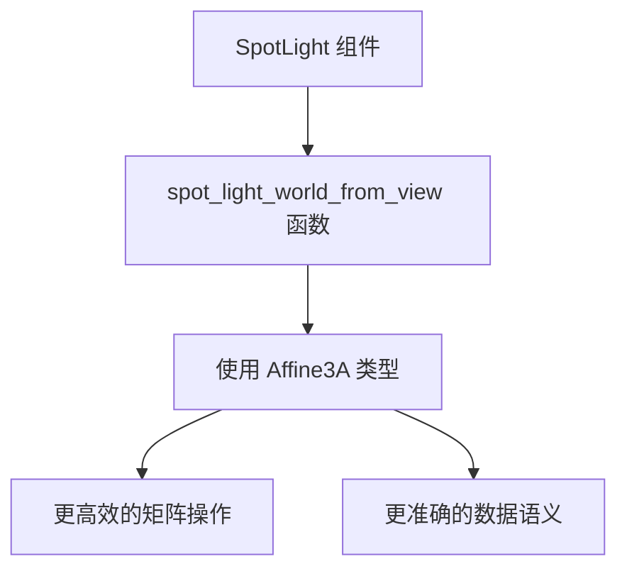

+++
title = "#20706 invert affine not mat4 in spotlight"
date = "2025-08-22T00:00:00"
draft = false
template = "pull_request_page.html"
in_search_index = false

[extra]
current_language = "zh-cn"
available_languages = {"en" = { name = "English", url = "/pull_request/bevy/2025-08/pr-20706-en-20250822" }, "zh-cn" = { name = "中文", url = "/pull_request/bevy/2025-08/pr-20706-zh-cn-20250822" }}
+++

# invert affine not mat4 in spotlight

## 基本信息
- **标题**: invert affine not mat4 in spotlight
- **PR链接**: https://github.com/bevyengine/bevy/pull/20706
- **作者**: atlv24
- **状态**: 已合并
- **标签**: A-Rendering
- **创建时间**: 2025-08-22T07:52:46Z
- **合并时间**: 2025-08-22T21:30:21Z
- **合并者**: james7132

## 描述翻译
### 目标
- 再次使用仿射矩阵（affine matrix）而非 mat4 进行矩阵求逆

### 解决方案
- 

### 测试
- 光照示例

## PR 技术分析

这个 PR 解决了一个在聚光灯（spotlight）实现中的矩阵处理问题。问题出现在 `spot_light_world_from_view` 函数中，该函数原本返回一个 4x4 矩阵（Mat4），但实际上只需要一个仿射变换（Affine3A）。

问题的核心在于代码使用了不适当的数据结构来表示变换。原来的实现使用 Mat4 来表示一个本质上属于仿射变换的操作，这带来了两个问题：
1. 内存使用效率低下（16个浮点数 vs 12个浮点数）
2. 语义不准确，可能在某些操作中引入不必要的计算开销

修改前的代码使用 Mat4 来构建变换矩阵：
```rust
pub fn spot_light_world_from_view(transform: &GlobalTransform) -> Mat4 {
    let fwd_dir = transform.back();
    let basis = orthonormalize(fwd_dir);
    let mut mat = Mat4::from_mat3(basis);
    mat.w_axis = transform.translation().extend(1.0);
    mat
}
```

修改后的实现使用了更合适的 Affine3A 类型：
```rust
pub fn spot_light_world_from_view(transform: &GlobalTransform) -> Affine3A {
    let fwd_dir = transform.back();
    let basis = orthonormalize(fwd_dir);
    Affine3A::from_mat3_translation(basis, transform.translation())
}
```

这个改动体现了 Bevy 引擎中一个重要的设计原则：使用最合适的数学类型来表示特定的变换。Affine3A 专门用于表示仿射变换，它包含旋转、缩放和平移，但不包含投影变换。在聚光灯的视图变换中，我们正好需要这样的变换。

从技术角度来看，这个修改：
1. 提高了内存使用效率（减少了4个浮点数的存储）
2. 使代码意图更加清晰
3. 为后续可能的优化奠定了基础（Affine3A 的求逆等操作比完整的 Mat4 更高效）

这个修改是 Bevy 引擎中持续进行的数学类型优化的一部分，旨在确保在图形渲染管线中使用最合适的数学表示。虽然这个特定修改的影响可能不大，但它保持了代码库的一致性和正确性。

## 可视化表示



## 关键文件变更

### `crates/bevy_light/src/spot_light.rs` (+3/-5)

主要修改了 `spot_light_world_from_view` 函数的返回类型和实现：

**修改前:**
```rust
use bevy_math::{Dir3, Mat3, Mat4, Vec3};

pub fn spot_light_world_from_view(transform: &GlobalTransform) -> Mat4 {
    let fwd_dir = transform.back();
    let basis = orthonormalize(fwd_dir);
    let mut mat = Mat4::from_mat3(basis);
    mat.w_axis = transform.translation().extend(1.0);
    mat
}
```

**修改后:**
```rust
use bevy_math::{Affine3A, Dir3, Mat3, Mat4, Vec3};

pub fn spot_light_world_from_view(transform: &GlobalTransform) -> Affine3A {
    let fwd_dir = transform.back();
    let basis = orthonormalize(fwd_dir);
    Affine3A::from_mat3_translation(basis, transform.translation())
}
```

这些修改确保了:
1. 使用正确的数学类型表示仿射变换
2. 代码更加简洁和高效
3. 与其他使用 Affine3A 的代码保持一致

## 延伸阅读

- [Bevy 数学类型文档](https://docs.rs/bevy_math/latest/bevy_math/)
- [仿射变换与投影变换的区别](https://en.wikipedia.org/wiki/Affine_transformation)
- [计算机图形学中的变换矩阵](https://learnopengl.com/Getting-started/Transformations)