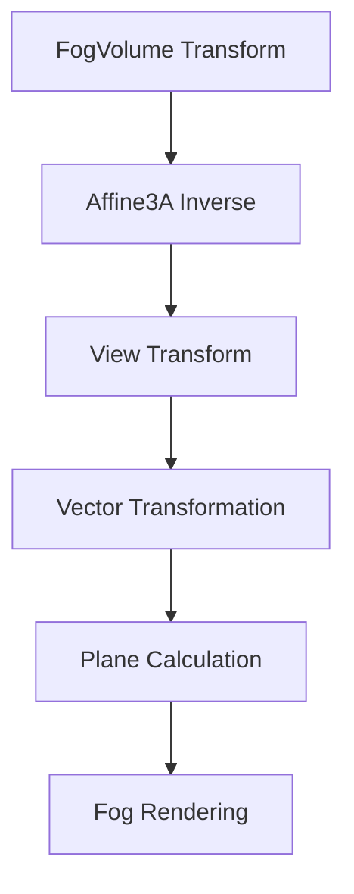

+++
title = "#20709 use affine in volumetric fog"
date = "2025-08-24T00:00:00"
draft = false
template = "pull_request_page.html"
in_search_index = true

[taxonomies]
list_display = ["show"]

[extra]
current_language = "en"
available_languages = {"en" = { name = "English", url = "/pull_request/bevy/2025-08/pr-20709-en-20250824" }, "zh-cn" = { name = "中文", url = "/pull_request/bevy/2025-08/pr-20709-zh-cn-20250824" }}
labels = ["A-Rendering"]
+++

# Title
use affine in volumetric fog

## Basic Information
- **Title**: use affine in volumetric fog
- **PR Link**: https://github.com/bevyengine/bevy/pull/20709
- **Author**: atlv24
- **Status**: MERGED
- **Labels**: A-Rendering, S-Ready-For-Final-Review
- **Created**: 2025-08-22T08:28:20Z
- **Merged**: 2025-08-24T21:12:22Z
- **Merged By**: alice-i-cecile

## Description Translation
# Objective

- avoid mat4 inverse on affine matrices
- simplify transform math
- improve perf

## Solution

- 

## Testing

- volumetric fog example

## The Story of This Pull Request

This PR addresses performance optimization in Bevy's volumetric fog rendering system by leveraging affine transformations instead of general 4x4 matrices. The core issue was that the system was performing expensive matrix inversions on affine matrices using general-purpose `Mat4` operations, which are computationally heavier than necessary for affine transformations.

The developer recognized that fog volume transformations are inherently affine (containing only translation, rotation, and uniform scaling), making them suitable for the more efficient `Affine3A` type. This change eliminates unnecessary computational overhead while maintaining identical visual results.

The implementation involved systematically replacing `Mat4` usage with `Affine3A` throughout the volumetric fog pipeline. Key changes include:
- Switching local storage from `Vec<Mat4>` to `Vec<Affine3A>` for fog volume transformations
- Using `affine().inverse()` instead of `to_matrix().inverse()` for faster inversion
- Replacing matrix-vector multiplication with specialized affine transformation methods
- Updating plane calculation and camera detection logic to work with affine transforms

These changes provide measurable performance improvements by reducing mathematical operations and leveraging optimized affine transformation methods. The code also becomes more semantically correct by using the appropriate transformation type for the domain.

## Visual Representation



## Key Files Changed

**crates/bevy_pbr/src/volumetric_fog/render.rs** (+18/-14)

This file contains the core implementation changes for volumetric fog rendering. The modifications replace general 4x4 matrix operations with optimized affine transformations.

Key changes include:

1. **Matrix storage type change**:
```rust
// Before:
mut local_from_world_matrices: Local<Vec<Mat4>>

// After:
mut local_from_world_matrices: Local<Vec<Affine3A>>
```

2. **Efficient affine inversion**:
```rust
// Before:
local_from_world_matrices.push(fog_transform.to_matrix().inverse());

// After:
local_from_world_matrices.push(fog_transform.affine().inverse());
```

3. **Affine transformation usage**:
```rust
// Before:
let bounding_radius = (Mat3A::from_mat4(view_from_local) * Vec3A::splat(0.5)).length();

// After:
let bounding_radius = view_from_local
    .transform_vector3a(Vec3A::splat(0.5))
    .length();
```

4. **Specialized affine methods**:
```rust
// Before:
let view_normal = (view_from_normal_local * local_normal).normalize_or_zero();

// After:
let view_normal = view_from_local
    .transform_vector3a(local_normal)
    .normalize_or_zero();
```

These changes optimize the transformation pipeline by using mathematically appropriate operations for affine transformations, reducing computational overhead while maintaining identical visual results.

## Further Reading

- [Affine Transformation - Wikipedia](https://en.wikipedia.org/wiki/Affine_transformation)
- [Bevy Math Documentation](https://docs.rs/bevy_math/latest/bevy_math/)
- [Computer Graphics: Principles and Practice - Foley, van Dam, Feiner, Hughes](https://www.amazon.com/Computer-Graphics-Principles-Practice-3rd/dp/0321399528)

## Full Code Diff
```diff
diff --git a/crates/bevy_pbr/src/volumetric_fog/render.rs b/crates/bevy_pbr/src/volumetric_fog/render.rs
index 7d1a55700e429..0c558fe2e804d 100644
--- a/crates/bevy_pbr/src/volumetric_fog/render.rs
+++ b/crates/bevy_pbr/src/volumetric_fog/render.rs
@@ -19,7 +19,7 @@ use bevy_ecs::{
 };
 use bevy_image::{BevyDefault, Image};
 use bevy_light::{FogVolume, VolumetricFog, VolumetricLight};
-use bevy_math::{vec4, Mat3A, Mat4, Vec3, Vec3A, Vec4, Vec4Swizzles as _};
+use bevy_math::{vec4, Affine3A, Mat4, Vec3, Vec3A, Vec4};
 use bevy_mesh::{Mesh, MeshVertexBufferLayoutRef};
 use bevy_render::{
     diagnostic::RecordDiagnostics,
@@ -698,12 +698,12 @@ pub fn prepare_volumetric_fog_uniforms(
     fog_volumes: Query<(Entity, &FogVolume, &GlobalTransform)>,
     render_device: Res<RenderDevice>,
     render_queue: Res<RenderQueue>,
-    mut local_from_world_matrices: Local<Vec<Mat4>>,
+    mut local_from_world_matrices: Local<Vec<Affine3A>>,
 ) {
     // Do this up front to avoid O(n^2) matrix inversion.
     local_from_world_matrices.clear();
     for (_, _, fog_transform) in fog_volumes.iter() {
-        local_from_world_matrices.push(fog_transform.to_matrix().inverse());
+        local_from_world_matrices.push(fog_transform.affine().inverse());
     }
 
     let uniform_count = view_targets.iter().len() * local_from_world_matrices.len();
@@ -715,7 +715,7 @@ pub fn prepare_volumetric_fog_uniforms(
     };
 
     for (view_entity, extracted_view, volumetric_fog) in view_targets.iter() {
-        let world_from_view = extracted_view.world_from_view.to_matrix();
+        let world_from_view = extracted_view.world_from_view.affine();
 
         let mut view_fog_volumes = vec![];
 
@@ -736,7 +736,9 @@ pub fn prepare_volumetric_fog_uniforms(
             );
 
             // Calculate the radius of the sphere that bounds the fog volume.
-            let bounding_radius = (Mat3A::from_mat4(view_from_local) * Vec3A::splat(0.5)).length();
+            let bounding_radius = view_from_local
+                .transform_vector3a(Vec3A::splat(0.5))
+                .length();
 
             // Write out our uniform.
             let uniform_buffer_offset = writer.write(&VolumetricFogUniform {
@@ -788,9 +790,8 @@ pub fn prepare_view_depth_textures_for_volumetric_fog(
     }
 }
 
-fn get_far_planes(view_from_local: &Mat4) -> [Vec4; 3] {
+fn get_far_planes(view_from_local: &Affine3A) -> [Vec4; 3] {
     let (mut far_planes, mut next_index) = ([Vec4::ZERO; 3], 0);
-    let view_from_normal_local = Mat3A::from_mat4(*view_from_local);
 
     for &local_normal in &[
         Vec3A::X,
@@ -800,13 +801,15 @@ fn get_far_planes(view_from_local: &Mat4) -> [Vec4; 3] {
         Vec3A::Z,
         Vec3A::NEG_Z,
     ] {
-        let view_normal = (view_from_normal_local * local_normal).normalize_or_zero();
+        let view_normal = view_from_local
+            .transform_vector3a(local_normal)
+            .normalize_or_zero();
         if view_normal.z <= 0.0 {
             continue;
         }
 
-        let view_position = *view_from_local * (-local_normal * 0.5).extend(1.0);
-        let plane_coords = view_normal.extend(-view_normal.dot(view_position.xyz().into()));
+        let view_position = view_from_local.transform_point3a(-local_normal * 0.5);
+        let plane_coords = view_normal.extend(-view_normal.dot(view_position));
 
         far_planes[next_index] = plane_coords;
         next_index += 1;
@@ -846,8 +849,9 @@ impl VolumetricFogBindGroupLayoutKey {
 
 /// Given the transform from the view to the 1×1×1 cube in local fog volume
 /// space, returns true if the camera is inside the volume.
-fn camera_is_inside_fog_volume(local_from_view: &Mat4) -> bool {
-    Vec3A::from(local_from_view.col(3).xyz())
+fn camera_is_inside_fog_volume(local_from_view: &Affine3A) -> bool {
+    local_from_view
+        .translation
         .abs()
         .cmple(Vec3A::splat(0.5))
         .all()
@@ -858,10 +862,10 @@ fn camera_is_inside_fog_volume(local_from_view: &Mat4) -> bool {
 fn calculate_fog_volume_clip_from_local_transforms(
     interior: bool,
     clip_from_view: &Mat4,
-    view_from_local: &Mat4,
+    view_from_local: &Affine3A,
 ) -> Mat4 {
     if !interior {
-        return *clip_from_view * *view_from_local;
+        return *clip_from_view * Mat4::from(*view_from_local);
     }
 
     // If the camera is inside the fog volume, then we'll be rendering a full
```