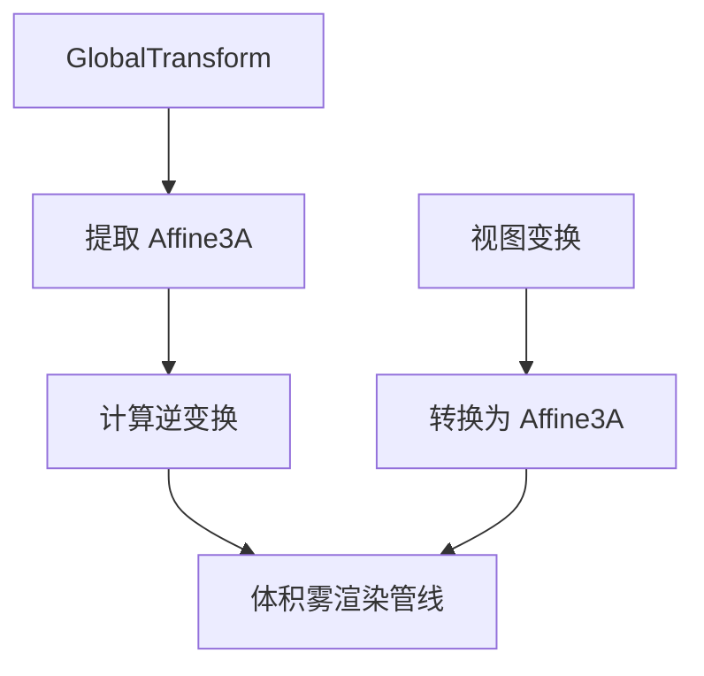

+++
title = "#20709 use affine in volumetric fog"
date = "2025-08-24T00:00:00"
draft = false
template = "pull_request_page.html"
in_search_index = false

[extra]
current_language = "zh-cn"
available_languages = {"en" = { name = "English", url = "/pull_request/bevy/2025-08/pr-20709-en-20250824" }, "zh-cn" = { name = "中文", url = "/pull_request/bevy/2025-08/pr-20709-zh-cn-20250824" }}
labels = ["A-Rendering"]
+++

# Title
use affine in volumetric fog

## Basic Information
- **Title**: use affine in volumetric fog
- **PR Link**: https://github.com/bevyengine/bevy/pull/20709
- **Author**: atlv24
- **Status**: MERGED
- **Labels**: A-Rendering, S-Ready-For-Final-Review
- **Created**: 2025-08-22T08:28:20Z
- **Merged**: 2025-08-24T21:12:22Z
- **Merged By**: alice-i-cecile

## Description Translation
# Objective

- 避免在仿射矩阵上执行 mat4 逆运算
- 简化变换数学计算
- 提升性能

## Solution

- 使用 Affine3A 替代 Mat4 处理仿射变换

## Testing

- 体积雾示例

## The Story of This Pull Request

这个 PR 解决了 Bevy 引擎中体积雾渲染系统的性能优化问题。在计算机图形学中，体积雾效果需要处理大量的矩阵运算，特别是世界空间与局部空间之间的转换。原有的实现使用完整的 4x4 矩阵（Mat4）来处理这些变换，但体积雾的变换实际上是仿射变换（affine transformations），包含旋转、平移和缩放，但不包含透视变形。

问题的核心在于：对完整的 4x4 矩阵求逆是一项计算代价较高的操作，而仿射矩阵的逆运算可以通过更高效的方式完成。当场景中存在多个雾体积时，这种性能开销会变得更加明显。

开发者采用了数学优化方法，利用 Bevy 数学库中的 Affine3A 类型来专门处理仿射变换。Affine3A 使用 3x4 矩阵表示仿射变换，相比完整的 4x4 矩阵更加紧凑，且求逆运算更加高效。这种优化不仅减少了计算量，还简化了变换数学的逻辑。

在实现过程中，开发者系统性地替换了相关函数中的矩阵类型：

1. 将局部变量 `local_from_world_matrices` 从 `Vec<Mat4>` 改为 `Vec<Affine3A>`
2. 使用 `fog_transform.affine().inverse()` 替代 `fog_transform.to_matrix().inverse()`
3. 使用 Affine3A 的专用方法（如 `transform_vector3a` 和 `transform_point3a`）进行向量和点变换
4. 在需要时通过 `Mat4::from(*view_from_local)` 将仿射变换转换为 4x4 矩阵

这种改变保持了算法的数学正确性，同时显著提升了性能。特别是在处理多个雾体积和视图时，避免了不必要的 4x4 矩阵逆运算。

从工程角度看，这种优化展示了类型系统在性能优化中的作用。通过使用更专门的数学类型（Affine3A），代码既表达了更精确的语义（这些变换确实是仿射变换），又获得了性能提升。这种模式在图形编程中很常见：选择最适合特定场景的数学表示形式。

## Visual Representation



## Key Files Changed

### `crates/bevy_pbr/src/volumetric_fog/render.rs` (+18/-14)

这个文件包含了体积雾渲染的主要逻辑。修改的核心是将矩阵类型从 Mat4 改为 Affine3A，以优化性能。

主要变更：

1. 局部存储类型变更：
```rust
// 之前:
mut local_from_world_matrices: Local<Vec<Mat4>>

// 之后:
mut local_from_world_matrices: Local<Vec<Affine3A>>
```

2. 矩阵逆运算优化：
```rust
// 之前:
local_from_world_matrices.push(fog_transform.to_matrix().inverse());

// 之后:
local_from_world_matrices.push(fog_transform.affine().inverse());
```

3. 视图变换提取：
```rust
// 之前:
let world_from_view = extracted_view.world_from_view.to_matrix();

// 之后:
let world_from_view = extracted_view.world_from_view.affine();
```

4. 向量变换方法更新：
```rust
// 之前:
let bounding_radius = (Mat3A::from_mat4(view_from_local) * Vec3A::splat(0.5)).length();

// 之后:
let bounding_radius = view_from_local
    .transform_vector3a(Vec3A::splat(0.5))
    .length();
```

这些变更统一使用了 Affine3A 类型处理仿射变换，避免了不必要的 4x4 矩阵运算。

## Further Reading

1. [Affine transformations - Wikipedia](https://en.wikipedia.org/wiki/Affine_transformation)
2. [Bevy Math API Documentation](https://docs.rs/bevy_math/latest/bevy_math/)
3. [Computer Graphics: Principles and Practice - Foley, van Dam, Feiner, Hughes](https://www.amazon.com/Computer-Graphics-Principles-Practice-3rd/dp/0321399528)