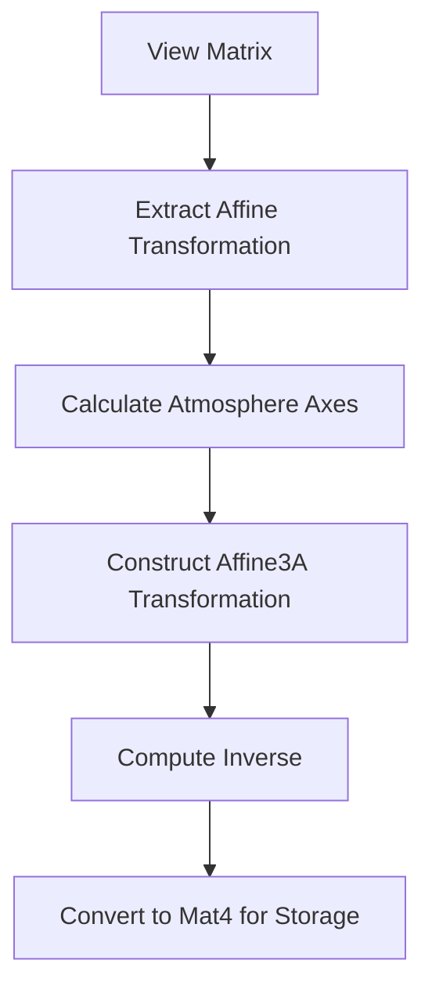

+++
title = "#20711 affine atmosphere"
date = "2025-08-22T00:00:00"
draft = false
template = "pull_request_page.html"
in_search_index = true

[taxonomies]
list_display = ["show"]

[extra]
current_language = "en"
available_languages = {"en" = { name = "English", url = "/pull_request/bevy/2025-08/pr-20711-en-20250822" }, "zh-cn" = { name = "中文", url = "/pull_request/bevy/2025-08/pr-20711-zh-cn-20250822" }}
labels = ["A-Rendering"]
+++

# Title
affine atmosphere

## Basic Information
- **Title**: affine atmosphere
- **PR Link**: https://github.com/bevyengine/bevy/pull/20711
- **Author**: atlv24
- **Status**: MERGED
- **Labels**: A-Rendering
- **Created**: 2025-08-22T08:43:21Z
- **Merged**: 2025-08-22T21:58:52Z
- **Merged By**: james7132

## Description Translation
# Objective

- dont mat4 inverse

## Solution

- use affine

## Testing

- atmosphere example

## The Story of This Pull Request

This PR addresses a performance optimization in Bevy's atmospheric rendering system. The core issue was the use of expensive matrix inversion operations on 4x4 matrices (Mat4::inverse) when calculating atmosphere transforms. Matrix inversion is computationally expensive, especially for full 4x4 matrices, and can become a bottleneck in rendering systems.

The developer identified that the transformation operations being performed were actually affine transformations - a subset of linear transformations that preserve points, straight lines, and planes. Affine transformations include translations, rotations, scaling, and shearing, but not perspective projections. Since the atmosphere rendering doesn't require full perspective projection matrices, the solution was to use the more efficient Affine3A type instead of Mat4.

The implementation replaces Mat4 operations with their Affine3A equivalents. Key changes include:

1. Using view.world_from_view.affine() instead of view.world_from_view.to_matrix()
2. Extracting camera axes from the affine matrix's matrix3 component
3. Using Vec3A for vector operations instead of Vec3
4. Constructing the transformation using Affine3A::from_cols()
5. Computing the inverse using the more efficient affine inverse operation

The Affine3A inverse operation is significantly faster than Mat4 inverse because it leverages the mathematical properties of affine transformations, avoiding the full general matrix inversion process. This optimization reduces computational overhead in the atmosphere rendering pipeline while maintaining identical visual results.

The changes were validated using the existing atmosphere example, ensuring that the visual output remained consistent while achieving the performance improvement.

## Visual Representation



## Key Files Changed

**File**: `crates/bevy_pbr/src/atmosphere/resources.rs`

**Changes**: Replaced Mat4-based transformation calculations with more efficient Affine3A operations to avoid expensive matrix inversions.

**Key modifications**:
```rust
// Before:
let world_from_view = view.world_from_view.to_matrix();
let camera_z = world_from_view.z_axis.truncate();
let camera_y = world_from_view.y_axis.truncate();
// ... Mat4 operations ...
let atmosphere_from_world = world_from_atmosphere.inverse();

// After:
let world_from_view = view.world_from_view.affine();
let camera_z = world_from_view.matrix3.z_axis;
let camera_y = world_from_view.matrix3.y_axis;
// ... Affine3A operations ...
let atmosphere_from_world = Mat4::from(world_from_atmosphere.inverse());
```

## Further Reading

- [Affine Transformations (Wikipedia)](https://en.wikipedia.org/wiki/Affine_transformation)
- [Bevy Math Documentation](https://docs.rs/bevy_math/latest/bevy_math/)
- [Computer Graphics: Principles and Practice - Affine Transformations](https://www.amazon.com/Computer-Graphics-Principles-Practice-3rd/dp/0321399528)

# Full Code Diff
```diff
diff --git a/crates/bevy_pbr/src/atmosphere/resources.rs b/crates/bevy_pbr/src/atmosphere/resources.rs
index 9e3a75d4b6921..ecabc6fe7bc12 100644
--- a/crates/bevy_pbr/src/atmosphere/resources.rs
+++ b/crates/bevy_pbr/src/atmosphere/resources.rs
@@ -11,7 +11,7 @@ use bevy_ecs::{
     world::{FromWorld, World},
 };
 use bevy_image::ToExtents;
-use bevy_math::{Mat4, Vec3};
+use bevy_math::{Affine3A, Mat4, Vec3A};
 use bevy_render::{
     extract_component::ComponentUniforms,
     render_resource::{binding_types::*, *},
@@ -530,23 +530,20 @@ pub(super) fn prepare_atmosphere_transforms(
     };
 
     for (entity, view) in &views {
-        let world_from_view = view.world_from_view.to_matrix();
-        let camera_z = world_from_view.z_axis.truncate();
-        let camera_y = world_from_view.y_axis.truncate();
+        let world_from_view = view.world_from_view.affine();
+        let camera_z = world_from_view.matrix3.z_axis;
+        let camera_y = world_from_view.matrix3.y_axis;
         let atmo_z = camera_z
             .with_y(0.0)
             .try_normalize()
             .unwrap_or_else(|| camera_y.with_y(0.0).normalize());
-        let atmo_y = Vec3::Y;
+        let atmo_y = Vec3A::Y;
         let atmo_x = atmo_y.cross(atmo_z).normalize();
-        let world_from_atmosphere = Mat4::from_cols(
-            atmo_x.extend(0.0),
-            atmo_y.extend(0.0),
-            atmo_z.extend(0.0),
-            world_from_view.w_axis,
-        );
+        let world_from_atmosphere =
+            Affine3A::from_cols(atmo_x, atmo_y, atmo_z, world_from_view.translation);
 
-        let atmosphere_from_world = world_from_atmosphere.inverse();
+        let atmosphere_from_world = Mat4::from(world_from_atmosphere.inverse());
+        let world_from_atmosphere = Mat4::from(world_from_atmosphere);
 
         commands.entity(entity).insert(AtmosphereTransformsOffset {
             index: writer.write(&AtmosphereTransform {
```