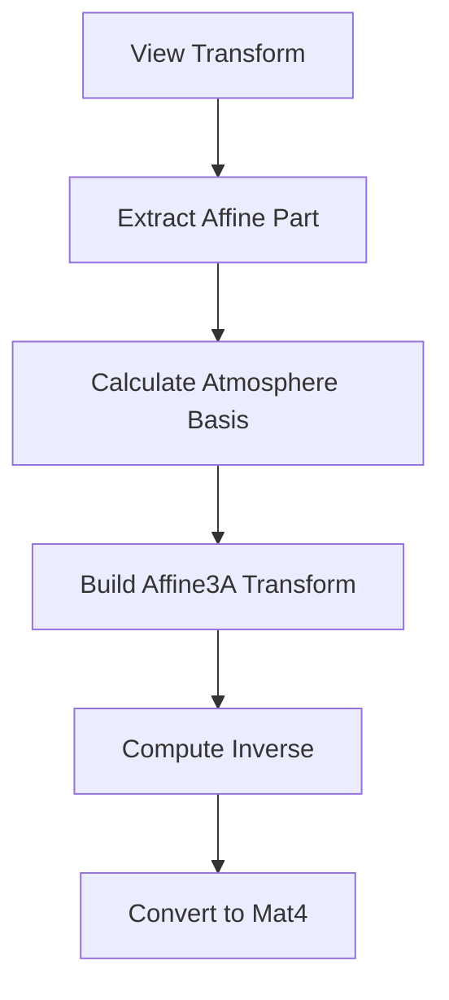

+++
title = "#20711 affine atmosphere"
date = "2025-08-22T00:00:00"
draft = false
template = "pull_request_page.html"
in_search_index = false

[extra]
current_language = "zh-cn"
available_languages = {"en" = { name = "English", url = "/pull_request/bevy/2025-08/pr-20711-en-20250822" }, "zh-cn" = { name = "中文", url = "/pull_request/bevy/2025-08/pr-20711-zh-cn-20250822" }}
labels = ["A-Rendering"]
+++

# affine atmosphere

## Basic Information
- **Title**: affine atmosphere
- **PR Link**: https://github.com/bevyengine/bevy/pull/20711
- **Author**: atlv24
- **Status**: MERGED
- **Labels**: A-Rendering
- **Created**: 2025-08-22T08:43:21Z
- **Merged**: 2025-08-22T21:58:52Z
- **Merged By**: james7132

## Description Translation
# Objective

- 避免使用mat4逆矩阵

## Solution

- 使用仿射变换

## Testing

- 大气层示例

## The Story of This Pull Request

这个PR解决了一个渲染性能优化问题。在大气渲染系统中，代码需要计算从世界空间到大气空间的变换矩阵，这涉及到矩阵逆运算。原来的实现使用了完整的4x4矩阵(`Mat4`)及其逆运算，这在计算上相对昂贵。

开发者识别到大气渲染的变换实际上是仿射变换(affine transformation)，而不是一般的投影变换。仿射变换保持了平行性和比例关系，可以用更高效的`Affine3A`类型来表示。这种变换只包含旋转、平移和缩放，不需要完整的4x4矩阵的所有功能。

解决方案是将原来的`Mat4`和`Vec3`替换为`Affine3A`和`Vec3A`。关键变化在于：
1. 使用`view.world_from_view.affine()`而不是`view.world_from_view.to_matrix()`来获取仿射部分
2. 使用`Affine3A`的`matrix3`属性来获取3x3旋转矩阵部分
3. 使用`Vec3A`进行向量运算，这提供了更好的SIMD优化可能性
4. 通过`Affine3A::from_cols`构建仿射变换，而不是`Mat4::from_cols`

最重要的优化是避免了昂贵的4x4矩阵求逆运算。`Affine3A`的逆运算比`Mat4`的逆运算计算量小得多，因为仿射变换的逆有更简单的数学形式。

这种优化虽然看似微小，但在渲染循环中每次帧都会执行，因此累积的性能提升是可观的。代码保持了相同的功能，但使用了更合适的数学表示和更高效的计算方法。

## Visual Representation



## Key Files Changed

### `crates/bevy_pbr/src/atmosphere/resources.rs` (+9/-12)

这个文件中的`prepare_atmosphere_transforms`函数进行了优化，使用仿射变换代替完整的4x4矩阵运算。

**关键变更：**

```rust
// Before:
let world_from_view = view.world_from_view.to_matrix();
let camera_z = world_from_view.z_axis.truncate();
let camera_y = world_from_view.y_axis.truncate();

// After:
let world_from_view = view.world_from_view.affine();
let camera_z = world_from_view.matrix3.z_axis;
let camera_y = world_from_view.matrix3.y_axis;
```

```rust
// Before:
let world_from_atmosphere = Mat4::from_cols(
    atmo_x.extend(0.0),
    atmo_y.extend(0.0),
    atmo_z.extend(0.0),
    world_from_view.w_axis,
);

// After:
let world_from_atmosphere =
    Affine3A::from_cols(atmo_x, atmo_y, atmo_z, world_from_view.translation);
```

```rust
// Before:
let atmosphere_from_world = world_from_atmosphere.inverse();

// After:
let atmosphere_from_world = Mat4::from(world_from_atmosphere.inverse());
let world_from_atmosphere = Mat4::from(world_from_atmosphere);
```

这些变更将完整的4x4矩阵运算替换为更高效的仿射变换运算，同时保持了相同的数学功能和渲染结果。

## Further Reading

- [Affine transformations on Wikipedia](https://en.wikipedia.org/wiki/Affine_transformation)
- [Bevy Math crate documentation](https://docs.rs/bevy_math/latest/bevy_math/)
- [Computer Graphics: Principles and Practice - Affine Transformations](https://www.cs.cornell.edu/courses/cs4620/2020fa/lectures/03transforms.pdf)

# Full Code Diff
```diff
diff --git a/crates/bevy_pbr/src/atmosphere/resources.rs b/crates/bevy_pbr/src/atmosphere/resources.rs
index 9e3a75d4b6921..ecabc6fe7bc12 100644
--- a/crates/bevy_pbr/src/atmosphere/resources.rs
+++ b/crates/bevy_pbr/src/atmosphere/resources.rs
@@ -11,7 +11,7 @@ use bevy_ecs::{
     world::{FromWorld, World},
 };
 use bevy_image::ToExtents;
-use bevy_math::{Mat4, Vec3};
+use bevy_math::{Affine3A, Mat4, Vec3A};
 use bevy_render::{
     extract_component::ComponentUniforms,
     render_resource::{binding_types::*, *},
@@ -530,23 +530,20 @@ pub(super) fn prepare_atmosphere_transforms(
     };
 
     for (entity, view) in &views {
-        let world_from_view = view.world_from_view.to_matrix();
-        let camera_z = world_from_view.z_axis.truncate();
-        let camera_y = world_from_view.y_axis.truncate();
+        let world_from_view = view.world_from_view.affine();
+        let camera_z = world_from_view.matrix3.z_axis;
+        let camera_y = world_from_view.matrix3.y_axis;
         let atmo_z = camera_z
             .with_y(0.0)
             .try_normalize()
             .unwrap_or_else(|| camera_y.with_y(0.0).normalize());
-        let atmo_y = Vec3::Y;
+        let atmo_y = Vec3A::Y;
         let atmo_x = atmo_y.cross(atmo_z).normalize();
-        let world_from_atmosphere = Mat4::from_cols(
-            atmo_x.extend(0.0),
-            atmo_y.extend(0.0),
-            atmo_z.extend(0.0),
-            world_from_view.w_axis,
-        );
+        let world_from_atmosphere =
+            Affine3A::from_cols(atmo_x, atmo_y, atmo_z, world_from_view.translation);
 
-        let atmosphere_from_world = world_from_atmosphere.inverse();
+        let atmosphere_from_world = Mat4::from(world_from_atmosphere.inverse());
+        let world_from_atmosphere = Mat4::from(world_from_atmosphere);
 
         commands.entity(entity).insert(AtmosphereTransformsOffset {
             index: writer.write(&AtmosphereTransform {
```