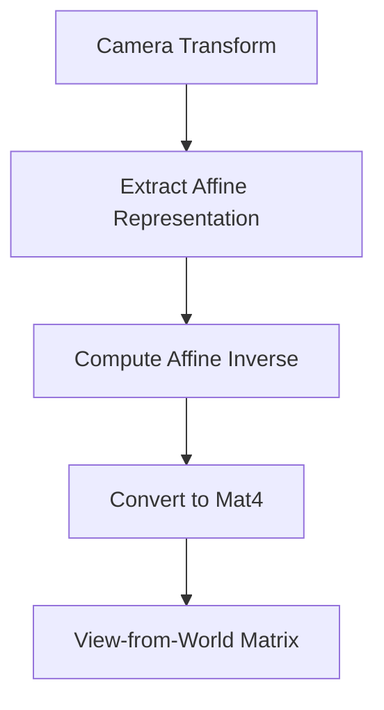

+++
title = "#20712 use affine inverse in cluster"
date = "2025-08-22T00:00:00"
draft = false
template = "pull_request_page.html"
in_search_index = true

[taxonomies]
list_display = ["show"]

[extra]
current_language = "en"
available_languages = {"en" = { name = "English", url = "/pull_request/bevy/2025-08/pr-20712-en-20250822" }, "zh-cn" = { name = "中文", url = "/pull_request/bevy/2025-08/pr-20712-zh-cn-20250822" }}
labels = ["A-Rendering"]
+++

# Title
Performance Optimization: Using Affine Inverse in Cluster Assignment

## Basic Information
- **Title**: use affine inverse in cluster
- **PR Link**: https://github.com/bevyengine/bevy/pull/20712
- **Author**: atlv24
- **Status**: MERGED
- **Labels**: A-Rendering
- **Created**: 2025-08-22T08:50:37Z
- **Merged**: 2025-08-22T21:35:47Z
- **Merged By**: james7132

## Description Translation
# Objective

- Avoid using expensive matrix4 inverse operations

## Solution

- Use more efficient affine inverse operations instead

## Testing

- Tested with clustered decals example

## The Story of This Pull Request

This PR addresses a performance optimization in Bevy's rendering system, specifically in the cluster assignment logic for lights and decals. The core issue was in the matrix inversion operation used to compute the view-from-world transformation matrix.

In the original implementation, the code was using a full 4x4 matrix inversion (`Mat4::inverse()`) which is computationally expensive. Since camera transformations in Bevy are always affine transformations (composed of translation, rotation, and uniform scaling), the developer recognized that a more efficient affine inverse operation could be used instead.

The solution replaces two key operations:
1. `camera_transform.to_matrix()` with `camera_transform.affine()` to get an affine representation
2. `world_from_view.inverse()` with `Mat4::from(world_from_view.inverse())` to use the affine inverse

This change is particularly impactful because cluster assignment runs for every frame and affects how lights and decals are distributed across screen space clusters. The affine inverse operation is significantly faster than a general matrix inverse because it leverages the mathematical properties of affine transformations, avoiding unnecessary computations for the perspective components that don't exist in camera transforms.

The optimization maintains identical mathematical results while reducing computational overhead. This is a classic example of using mathematical domain knowledge (knowing that camera transforms are always affine) to achieve performance gains without changing functionality.

## Visual Representation



## Key Files Changed

### `crates/bevy_light/src/cluster/assign.rs`
This file contains the cluster assignment logic for lights and decals. The changes optimize the matrix inversion operation used in view transformation calculations.

**Key modifications:**
```rust
// Before:
let world_from_view = camera_transform.to_matrix();
// ...
let view_from_world = world_from_view.inverse();

// After:
let world_from_view = camera_transform.affine();
// ...
let view_from_world = Mat4::from(world_from_view.inverse());
```

The changes replace the full 4x4 matrix operations with more efficient affine operations, maintaining the same mathematical result but with better performance.

## Further Reading

- [Affine transformation](https://en.wikipedia.org/wiki/Affine_transformation) - Wikipedia article on affine transformations
- [Matrix inversion](https://en.wikipedia.org/wiki/Invertible_matrix) - Mathematical background on matrix inversion
- [Bevy Transform documentation](https://docs.rs/bevy/latest/bevy/transform/components/struct.Transform.html) - Official Bevy documentation on Transform components