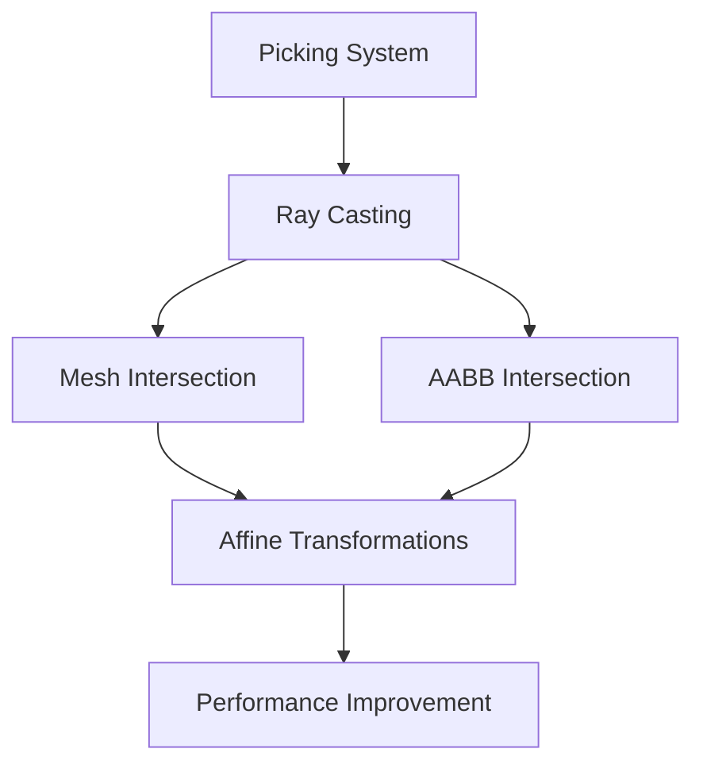

+++
title = "#20713 use affine inverse in picking"
date = "2025-08-22T00:00:00"
draft = false
template = "pull_request_page.html"
in_search_index = true

[taxonomies]
list_display = ["show"]

[extra]
current_language = "en"
available_languages = {"en" = { name = "English", url = "/pull_request/bevy/2025-08/pr-20713-en-20250822" }, "zh-cn" = { name = "中文", url = "/pull_request/bevy/2025-08/pr-20713-zh-cn-20250822" }}
labels = ["A-Picking"]
+++

# Title
use affine inverse in picking

## Basic Information
- **Title**: use affine inverse in picking
- **PR Link**: https://github.com/bevyengine/bevy/pull/20713
- **Author**: atlv24
- **Status**: MERGED
- **Labels**: A-Picking
- **Created**: 2025-08-22T09:15:29Z
- **Merged**: 2025-08-22T21:53:48Z
- **Merged By**: james7132

## Description Translation
# Objective

- Use affine inverse instead of mat4 inverse

## Solution

- Implement the change again

## Testing

- debug_picking example

## The Story of This Pull Request

This PR addresses a performance optimization in Bevy's picking system by replacing matrix inversion operations with more efficient affine transformations. The core issue was that the ray casting system for mesh picking was using general 4x4 matrix inversions (`Mat4::inverse()`) when transforming rays from world space to model space, which is computationally expensive.

The solution replaces `Mat4` with `Affine3A` for transformation operations throughout the picking system. Affine transformations are sufficient for model transformations (translation, rotation, scaling) and have a more efficient inversion algorithm compared to general 4x4 matrices. This change reduces computational overhead in the ray-mesh intersection tests, which are performed frequently during picking operations.

The implementation required changes across multiple components:
1. The benchmark system was updated to use `Affine3A` instead of `Mat4`
2. The core intersection detection functions now accept `Affine3A` parameters
3. The ray-AABB intersection test uses the affine inverse for transformation
4. Test cases were updated to use the affine representation of transformations

This optimization is particularly valuable because picking operations often need to be performed on many meshes each frame, and the matrix inversion was a significant bottleneck. By using affine inverses, the system achieves the same mathematical result with better performance characteristics.

## Visual Representation



## Key Files Changed

### `crates/bevy_picking/src/mesh_picking/ray_cast/intersections.rs` (+16/-12)
This file contains the core intersection detection logic. The changes replace `Mat4` with `Affine3A` for transformation operations:

```rust
// Before:
use bevy_math::{bounding::Aabb3d, Dir3, Mat4, Ray3d, Vec2, Vec3, Vec3A};

// After:
use bevy_math::{bounding::Aabb3d, Affine3A, Dir3, Ray3d, Vec2, Vec3, Vec3A};
```

```rust
// Before:
pub(super) fn ray_intersection_over_mesh(
    mesh: &Mesh,
    transform: &Mat4,
    ray: Ray3d,
    cull: Backfaces,
) -> Option<RayMeshHit> {

// After:
pub(super) fn ray_intersection_over_mesh(
    mesh: &Mesh,
    transform: &Affine3A,
    ray: Ray3d,
    cull: Backfaces,
) -> Option<RayMeshHit> {
```

### `benches/benches/bevy_picking/ray_mesh_intersection.rs` (+3/-3)
The benchmark file was updated to use `Affine3A` instead of `Mat4`:

```rust
// Before:
use bevy_math::{Dir3, Mat4, Ray3d, Vec3};
fn mesh_to_world(&self) -> Mat4 {
    Mat4::IDENTITY
}

// After:
use bevy_math::{Affine3A, Dir3, Ray3d, Vec3};
fn mesh_to_world(&self) -> Affine3A {
    Affine3A::IDENTITY
}
```

### `crates/bevy_picking/src/mesh_picking/ray_cast/mod.rs` (+2/-2)
The main ray casting module was updated to use affine transformations:

```rust
// Before:
&transform.to_matrix(),

// After:
&transform.affine(),
```

## Further Reading

- [Affine transformations](https://en.wikipedia.org/wiki/Affine_transformation)
- [Matrix inversion complexity](https://en.wikipedia.org/wiki/Invertible_matrix#Methods_of_matrix_inversion)
- [Bevy Transform documentation](https://docs.rs/bevy/latest/bevy/transform/components/struct.Transform.html)