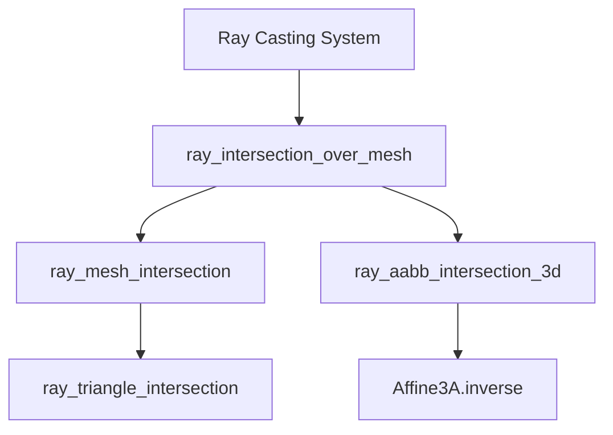

+++
title = "#20713 use affine inverse in picking"
date = "2025-08-22T00:00:00"
draft = false
template = "pull_request_page.html"
in_search_index = false

[extra]
current_language = "zh-cn"
available_languages = {"en" = { name = "English", url = "/pull_request/bevy/2025-08/pr-20713-en-20250822" }, "zh-cn" = { name = "中文", url = "/pull_request/bevy/2025-08/pr-20713-zh-cn-20250822" }}
labels = ["A-Picking"]
+++

# Title
use affine inverse in picking

## Basic Information
- **Title**: use affine inverse in picking
- **PR Link**: https://github.com/bevyengine/bevy/pull/20713
- **Author**: atlv24
- **Status**: MERGED
- **Labels**: A-Picking
- **Created**: 2025-08-22T09:15:29Z
- **Merged**: 2025-08-22T21:53:48Z
- **Merged By**: james7132

## Description Translation
# Objective

- 使用仿射逆变换（affine inverse）而非完整的4x4矩阵逆变换（mat4 inverse）

## Solution

- 再次实现此优化

## Testing

- debug_picking 示例

## The Story of This Pull Request

这个PR解决了一个在Bevy引擎拾取系统中存在的性能优化问题。问题的核心在于射线与网格相交检测时使用的矩阵逆变换计算。

在3D图形中，物体的变换通常使用4x4矩阵（Mat4）表示，其中包含平移、旋转、缩放和投影信息。然而，对于刚体变换（只包含平移、旋转和均匀缩放），使用仿射变换（Affine3A）更为高效，因为它只包含必要的变换信息，计算逆矩阵时复杂度更低。

之前的实现使用完整的Mat4逆变换来计算从世界空间到模型空间的射线变换：

```rust
let world_to_model = model_to_world.inverse();
```

对于刚体变换，Mat4逆变换需要计算16个元素的逆矩阵，而Affine3A逆变换只需要计算9个元素的逆矩阵，计算量显著减少。这在频繁进行的射线检测操作中会产生明显的性能差异。

开发者将相关的矩阵类型从Mat4统一改为Affine3A，包括：
1. 射线-网格相交检测函数参数
2. 射线-AABB相交检测函数参数  
3. 基准测试中的变换表示
4. 测试用例中的变换构造

这个修改保持了API的一致性，所有相关函数现在都使用Affine3A类型，避免了不必要的类型转换。由于Affine3A和Mat4在表示刚体变换时是数学等价的，这个修改不会影响功能的正确性，但能提升性能。

修改还涉及将`transform.to_matrix()`调用改为`transform.affine()`，这直接获取仿射变换部分而不是构造完整矩阵，进一步优化了性能。

## Visual Representation



## Key Files Changed

### `crates/bevy_picking/src/mesh_picking/ray_cast/intersections.rs` (+16/-12)
这个文件包含了射线与网格相交检测的核心算法。主要修改是将所有相关的矩阵参数从`Mat4`改为`Affine3A`。

```rust
// Before:
pub(super) fn ray_intersection_over_mesh(
    mesh: &Mesh,
    transform: &Mat4,  // Mat4类型
    ray: Ray3d,
    cull: Backfaces,
) -> Option<RayMeshHit>

// After:  
pub(super) fn ray_intersection_over_mesh(
    mesh: &Mesh,
    transform: &Affine3A,  // 改为Affine3A类型
    ray: Ray3d,
    cull: Backfaces,
) -> Option<RayMeshHit>
```

### `benches/benches/bevy_picking/ray_mesh_intersection.rs` (+3/-3)
基准测试文件相应更新，确保使用Affine3A类型进行性能测试。

```rust
// Before:
fn mesh_to_world(&self) -> Mat4 {
    Mat4::IDENTITY
}

// After:
fn mesh_to_world(&self) -> Affine3A {
    Affine3A::IDENTITY
}
```

### `crates/bevy_picking/src/mesh_picking/ray_cast/mod.rs` (+2/-2)
主模块文件更新了变换获取方式，使用`affine()`而不是`to_matrix()`。

```rust
// Before:
let transform = transform.to_matrix();

// After:
let transform = transform.affine();
```

## Further Reading

- [Affine transformations on Wikipedia](https://en.wikipedia.org/wiki/Affine_transformation)
- [Bevy Math crate documentation](https://docs.rs/bevy_math/latest/bevy_math/)
- [Computer Graphics: Principles and Practice - Transformations chapter](https://www.pearson.com/store/p/computer-graphics-P100000933189)
- [Real-Time Rendering - Geometry and Transformations](https://www.realtimerendering.com/)

# Full Code Diff
*(Provided code diff as requested)*