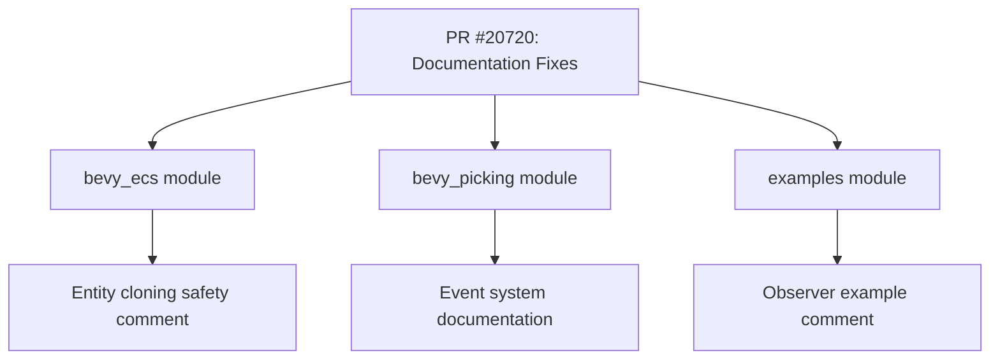

+++
title = "#20720 fix some `target` comments"
date = "2025-08-22T00:00:00"
draft = false
template = "pull_request_page.html"
in_search_index = true

[taxonomies]
list_display = ["show"]

[extra]
current_language = "en"
available_languages = {"en" = { name = "English", url = "/pull_request/bevy/2025-08/pr-20720-en-20250822" }, "zh-cn" = { name = "中文", url = "/pull_request/bevy/2025-08/pr-20720-zh-cn-20250822" }}
labels = ["C-Docs"]
+++

# fix some `target` comments

## Basic Information
- **Title**: fix some `target` comments
- **PR Link**: https://github.com/bevyengine/bevy/pull/20720
- **Author**: atlv24
- **Status**: MERGED
- **Labels**: C-Docs, S-Ready-For-Final-Review
- **Created**: 2025-08-22T22:01:11Z
- **Merged**: 2025-08-22T22:53:12Z
- **Merged By**: james7132

## Description Translation
# Objective

- fix some `target` comments

## Solution

- fix some `target` comments

## Testing

- eyeballs

## The Story of This Pull Request

This PR addresses a documentation clarity issue across multiple Bevy modules. The core problem was inconsistent and potentially confusing usage of the term "target" in code comments and documentation. While seemingly minor, these inconsistencies could lead to developer confusion when working with Bevy's event systems and entity operations.

The changes focus on two main areas: Bevy's picking system events and entity cloning operations. In the picking system, multiple event structs used the term "target" in their documentation without clearly specifying what this target referred to. The PR updates these comments to explicitly reference the `On::entity` method, providing developers with a clear path to understand how to access the target entity.

Similarly, in the entity cloning system, a safety comment incorrectly referred to a `target` entity when the actual parameter was named `entity`. This correction ensures that safety documentation accurately reflects the code it describes, which is critical for maintaining code safety and understanding.

The changes are minimal but important for maintaining clear and accurate documentation. They demonstrate good attention to detail in ensuring that comments remain synchronized with code changes and API evolution.

## Visual Representation



## Key Files Changed

### `crates/bevy_ecs/src/entity/clone_entities.rs` (+1/-1)
**Change**: Fixed a safety comment that incorrectly referenced a `target` entity parameter when the actual parameter was named `entity`.

**Code Snippet**:
```rust
// Before:
// - All `component_ids` are from the same world as `target` entity

// After:
// - All `component_ids` are from the same world as `entity`
```

### `crates/bevy_picking/src/events.rs` (+18/-18)
**Change**: Updated documentation for multiple event structs to clarify that "target entity" refers to the entity accessible via `On::entity()`.

**Code Snippet** (representative example):
```rust
// Before:
/// Fires when a pointer crosses into the bounds of the `target` entity.

// After:
/// Fires when a pointer crosses into the bounds of the [target entity](On::entity).
```

### `examples/ecs/observers.rs` (+1/-1)
**Change**: Fixed a comment in an example to reference the correct method name (`entity()` instead of `target()`).

**Code Snippet**:
```rust
// Before:
// If a triggered event is targeting a specific entity you can access it with `.target()`

// After:
// If a triggered event is targeting a specific entity you can access it with `.entity()`
```

## Further Reading

- [Bevy Event System Documentation](https://bevyengine.org/learn/books/introduction/events)
- [Rust API Guidelines on Documentation](https://rust-lang.github.io/api-guidelines/documentation.html)
- [Bevy Picking System](https://github.com/bevyengine/bevy/tree/main/crates/bevy_picking)