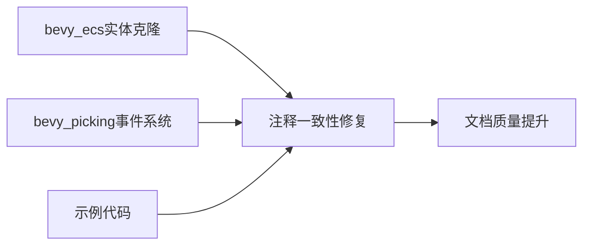

+++
title = "#20720 fix some `target` comments"
date = "2025-08-22T00:00:00"
draft = false
template = "pull_request_page.html"
in_search_index = false

[extra]
current_language = "zh-cn"
available_languages = {"en" = { name = "English", url = "/pull_request/bevy/2025-08/pr-20720-en-20250822" }, "zh-cn" = { name = "中文", url = "/pull_request/bevy/2025-08/pr-20720-zh-cn-20250822" }}
+++

# fix some `target` comments

## 基本信息
- **标题**: fix some `target` comments
- **PR链接**: https://github.com/bevyengine/bevy/pull/20720
- **作者**: atlv24
- **状态**: 已合并
- **标签**: C-Docs, S-Ready-For-Final-Review
- **创建时间**: 2025-08-22T22:01:11Z
- **合并时间**: 2025-08-22T22:53:12Z
- **合并者**: james7132

## 描述翻译
# 目标

- 修复一些 `target` 注释

## 解决方案

- 修复一些 `target` 注释

## 测试

- 肉眼检查

## PR分析

这个PR是一个典型的文档清理工作，主要目标是统一和澄清代码中关于"target"实体的注释表述。虽然修改量不大，但涉及多个核心模块，体现了良好的代码文档维护实践。

问题起源于代码注释中对于"target entity"的表述不一致。在某些地方使用了简单的`target`，而在其他地方则使用了更明确的`target entity`或者有文档链接的表述。这种不一致性可能会给开发者阅读文档带来困惑。

解决方案非常直接：系统性地检查所有相关的注释，将简单的`target`引用统一为更明确的`[target entity](On::entity)`格式。这种格式不仅明确了术语，还提供了到`On::entity`方法的直接文档链接，增强了代码文档的连贯性和可用性。

在实现方面，修改涉及三个文件：
1. `crates/bevy_ecs/src/entity/clone_entities.rs` - 修正了一处安全注释中的实体引用
2. `crates/bevy_picking/src/events.rs` - 统一了所有事件类型的target实体注释表述
3. `examples/ecs/observers.rs` - 更新了示例代码中的方法引用

这些修改虽然看似简单，但对于维护代码质量很重要。统一的术语和准确的文档链接可以帮助开发者更快地理解代码意图，减少理解偏差。特别是在像Bevy这样的大型开源项目中，清晰的文档对于社区贡献者至关重要。

从技术角度看，这个PR还展示了良好的文档实践：使用Markdown链接格式`[显示文本](链接目标)`来连接相关的API文档，这种做法既保持了注释的可读性，又提供了额外的上下文信息。

## 可视化表示



## 关键文件变更

### `crates/bevy_ecs/src/entity/clone_entities.rs` (+1/-1)
**修改内容**: 修正安全注释中的实体引用，使其与实际参数名一致
```rust
// 修改前:
// - All `component_ids` are from the same world as `target` entity

// 修改后:
// - All `component_ids` are from the same world as `entity`
```

### `crates/bevy_picking/src/events.rs` (+18/-18)
**修改内容**: 统一所有事件类型的target实体注释表述，添加文档链接
```rust
// 修改前:
/// Fires when a pointer crosses into the bounds of the `target` entity.

// 修改后:
/// Fires when a pointer crosses into the bounds of the [target entity](On::entity).
```

### `examples/ecs/observers.rs` (+1/-1)
**修改内容**: 更新示例代码中的方法引用，反映正确的API名称
```rust
// 修改前:
// If a triggered event is targeting a specific entity you can access it with `.target()`

// 修改后:
// If a triggered event is targeting a specific entity you can access it with `.entity()`
```

## 延伸阅读

- [Rust文档注释指南](https://doc.rust-lang.org/rustdoc/how-to-write-documentation.html)
- [Bevy ECS实体系统](https://bevyengine.org/learn/books/bevy-ecs/entities)
- [Bevy事件系统文档](https://bevyengine.org/learn/books/bevy-ecs/events)