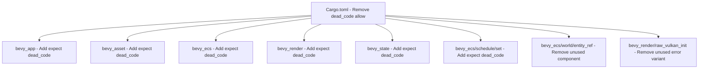

+++
title = "#20721 Re-enable the workspace wide dead_code lint"
date = "2025-08-24T00:00:00"
draft = false
template = "pull_request_page.html"
in_search_index = true

[taxonomies]
list_display = ["show"]

[extra]
current_language = "en"
available_languages = {"en" = { name = "English", url = "/pull_request/bevy/2025-08/pr-20721-en-20250824" }, "zh-cn" = { name = "中文", url = "/pull_request/bevy/2025-08/pr-20721-zh-cn-20250824" }}
+++

# Re-enable the workspace wide dead_code lint

## Basic Information
- **Title**: Re-enable the workspace wide dead_code lint
- **PR Link**: https://github.com/bevyengine/bevy/pull/20721
- **Author**: james7132
- **Status**: MERGED
- **Labels**: S-Ready-For-Final-Review
- **Created**: 2025-08-23T01:09:59Z
- **Merged**: 2025-08-24T21:11:18Z
- **Merged By**: alice-i-cecile

## Description Translation
# Objective
The `dead_code` lint was disabled in #20462 due to the encase errors, but that should be fixed as of #18047.

## Solution
Re-enabled the lint.

## Testing
Ran `cargo check --workspace --all-features` locally.

## The Story of This Pull Request

This PR addresses a temporary workaround that was implemented in PR #20462, where the `dead_code` lint was disabled across the entire Bevy workspace due to false positive warnings generated by the `encase` crate's macros. These macros were producing code that appeared unused to the Rust compiler but was actually essential for the shader type system.

With the fix in PR #18047 resolving the underlying `encase` issues, this PR removes the temporary allowance and re-enables the `dead_code` lint. This restoration helps maintain code quality by identifying truly unused code while avoiding the previous false positives.

The implementation involved two main changes:

1. **Removing the global allowance**: The `dead_code = "allow"` entries were removed from both the workspace and package lint configurations in `Cargo.toml`, restoring the lint to its default behavior.

2. **Targeted suppressions**: Several test structs used exclusively for derive macro compilation tests were annotated with `#[expect(dead_code)]` attributes. These structs are intentionally never constructed but must exist to verify that the derive macros compile correctly. The attributes suppress warnings for these specific cases while maintaining the lint's effectiveness elsewhere.

The changes also included some minor cleanup:
- Removal of an unused error variant in `raw_vulkan_init.rs`
- Removal of an unused component in test code
- Consistency improvements in expect attribute formatting

This approach balances code quality maintenance with practical considerations for test code, ensuring the lint catches actual dead code without generating noise for intentional test patterns.

## Visual Representation



## Key Files Changed

### `Cargo.toml` (+0/-4)
Removed the temporary allowance for dead_code lint that was added as a workaround for encase issues.

```toml
# Before:
[lints.rust]
# Strictly temporary until encase fixes dead code generation from ShaderType macros
dead_code = "allow"

# After:
[lints.rust]
missing_docs = "warn"
```

### `crates/bevy_ecs/src/lib.rs` (+32/-4)
Added expect attributes to test structs used for derive macro compilation tests and removed an unused field attribute.

```rust
// Before:
#[derive(Bundle)]
struct Tuple(Simple, ComponentB);

// After:
#[expect(
    dead_code,
    reason = "This struct is used as a compilation test to test the derive macros, and as such is intentionally never constructed."
)]
#[derive(Bundle)]
struct Tuple(Simple, ComponentB);
```

### `crates/bevy_app/src/app.rs` (+8/-0)
Added expect attributes to test label structs used for derive macro compilation.

```rust
// Added:
#[expect(
    dead_code,
    reason = "This struct is used as a compilation test to test the derive macros, and as such is intentionally never constructed."
)]
#[derive(AppLabel, Debug, Default, Clone, Copy, PartialEq, Eq, Hash)]
struct EmptyTupleLabel();
```

### `crates/bevy_asset/src/lib.rs` (+8/-0)
Added expect attributes to test asset structs used for derive macro compilation.

```rust
// Added:
#[expect(
    dead_code,
    reason = "This struct is used as a compilation test to test the derive macros, and as such is intentionally never constructed."
)]
#[derive(Asset, TypePath)]
pub struct StructTestAsset {
    #[dependency]
    field: Handle<TestAsset>,
    embedded: TestAsset,
}
```

### `crates/bevy_ecs/src/schedule/set.rs` (+16/-0)
Added expect attributes to test label and set structs used for derive macro compilation.

```rust
// Added:
#[expect(
    dead_code,
    reason = "This is a derive macro compilation test. It won't be constructed."
)]
#[derive(ScheduleLabel, Debug, Default, Clone, Copy, PartialEq, Eq, Hash)]
struct EmptyTupleLabel();
```

## Further Reading

- [Rust Lint Attributes](https://doc.rust-lang.org/rustc/lints/levels.html) - Official documentation on Rust's lint system
- [The Rust Programming Language - Unused Code](https://doc.rust-lang.org/book/ch09-04-advanced-types.html#dynamically-sized-types-and-the-sized-trait) - Understanding dead code detection in Rust
- [Bevy's Contribution Guidelines](https://github.com/bevyengine/bevy/blob/main/CONTRIBUTING.md) - Best practices for contributing to Bevy
- [PR #18047](https://github.com/bevyengine/bevy/pull/18047) - The fix that resolved the encase issues
- [PR #20462](https://github.com/bevyengine/bevy/pull/20462) - The original PR that temporarily disabled the lint