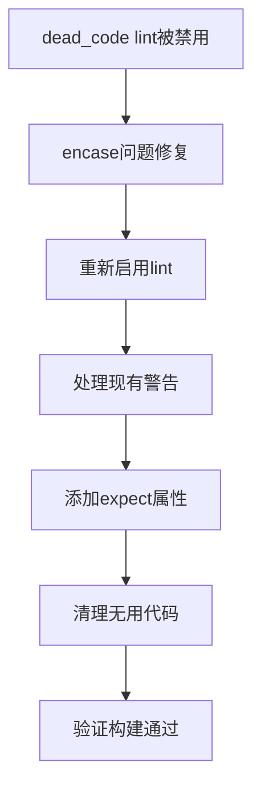

+++
title = "#20721 Re-enable the workspace wide dead_code lint"
date = "2025-08-24T00:00:00"
draft = false
template = "pull_request_page.html"
in_search_index = false

[extra]
current_language = "zh-cn"
available_languages = {"en" = { name = "English", url = "/pull_request/bevy/2025-08/pr-20721-en-20250824" }, "zh-cn" = { name = "中文", url = "/pull_request/bevy/2025-08/pr-20721-zh-cn-20250824" }}
+++

# PR #20721: Re-enable the workspace wide dead_code lint

## 基本信息
- **标题**: Re-enable the workspace wide dead_code lint
- **PR链接**: https://github.com/bevyengine/bevy/pull/20721
- **作者**: james7132
- **状态**: 已合并
- **标签**: S-Ready-For-Final-Review
- **创建时间**: 2025-08-23T01:09:59Z
- **合并时间**: 2025-08-24T21:11:18Z
- **合并人**: alice-i-cecile

## 描述翻译
# Objective
在 #20462 中由于 encase 错误而禁用了 `dead_code` lint，但这个问题应该在 #18047 中已经修复。

## Solution
重新启用该 lint。

## Testing
在本地运行了 `cargo check --workspace --all-features`。

## 这个PR的故事

这个PR的故事始于一个看似简单但实际重要的代码质量维护任务。在Rust生态中，`dead_code` lint是一个重要的静态分析工具，用于检测未被使用的代码，帮助开发者保持代码库的整洁和可维护性。

故事开始于之前的PR #20462，当时由于encase库的ShaderType宏会生成一些死代码，导致`dead_code` lint产生大量误报，开发团队不得不暂时在整个工作区范围内禁用这个lint。这是一个典型的工程权衡：在第三方依赖存在问题的情况下，暂时牺牲代码质量检查来保持构建的可行性。

随着PR #18047的合并，encase库的问题得到了解决，这意味着重新启用`dead_code` lint的技术障碍已经消除。james7132注意到了这个时机，决定恢复这个重要的代码质量检查工具。

重新启用lint的过程不仅仅是简单地翻转一个开关。虽然主要的修改确实是在Cargo.toml中移除两处`dead_code = "allow"`的配置，但团队还需要处理现有的死代码警告。这些警告主要来自测试代码中的派生宏编译测试结构体，这些结构体在设计上就是不会被实际构造和使用的。

解决方案是使用Rust的`#[expect(dead_code)]`属性来明确标记这些 intentionally unused 的代码。这种方法既保持了lint的有效性，又清晰地传达了开发者的意图：这些代码不是意外的死代码，而是有目的的测试结构。

在具体实现中，团队在多个crate的测试模块中添加了适当的expect属性：

```rust
// 在 bevy_app/src/app.rs 中
#[expect(
    dead_code,
    reason = "This struct is used as a compilation test to test the derive macros, and as such is intentionally never constructed."
)]
#[derive(AppLabel, Debug, Default, Clone, Copy, PartialEq, Eq, Hash)]
struct EmptyTupleLabel();
```

这种模式在多个文件中重复出现，包括bevy_asset、bevy_ecs、bevy_render等模块的测试代码。每个添加的expect属性都包含了清晰的reason说明，解释了为什么这些代码虽然是"dead"但却是必要的。

此外，PR还包含了一些清理工作，比如移除了不再需要的结构体定义和错误变体，进一步简化了代码库。

从技术角度来看，这个PR展示了几个重要的工程实践：
1. **及时恢复技术债务**：一旦外部依赖问题解决，立即恢复重要的代码质量检查
2. **精确的警告抑制**：使用`#[expect]`而不是`#[allow]`来针对性地处理特定情况
3. **清晰的文档**：为每个抑制的警告提供详细的理由说明
4. **全面的测试**：通过运行`cargo check --workspace --all-features`来验证修改的正确性

这个变更的影响是显著的：重新启用的dead_code lint将帮助Bevy团队及时发现和清理真正的死代码，提高代码库的整体质量，同时通过精确的expect属性保持了测试代码的完整性和可维护性。

## 可视化表示



## 关键文件变更

### `Cargo.toml` (+0/-4)
**变更描述**：移除了workspace范围内对dead_code lint的allow配置
```toml
# 移除的内容：
# Strictly temporary until encase fixes dead code generation from ShaderType macros
dead_code = "allow"
```
**关联性**：这是PR的核心变更，重新启用了dead_code lint检查

### `crates/bevy_ecs/src/lib.rs` (+32/-4)
**变更描述**：为测试中的派生宏编译测试结构体添加dead_code expect属性
```rust
// 添加的代码：
#[expect(
    dead_code,
    reason = "This struct is used as a compilation test to test the derive macros, and as such is intentionally never constructed."
)]
#[derive(Bundle)]
struct Tuple(Simple, ComponentB);
```
**关联性**：处理因重新启用lint而产生的警告，明确标记 intentionally unused 的测试代码

### `crates/bevy_app/src/app.rs` (+8/-0)
**变更描述**：为AppLabel派生宏的测试结构体添加expect属性
```rust
#[expect(
    dead_code,
    reason = "This struct is used as a compilation test to test the derive macros, and as such is intentionally never constructed."
)]
#[derive(AppLabel, Debug, Default, Clone, Copy, PartialEq, Eq, Hash)]
struct EmptyTupleLabel();
```
**关联性**：同样的模式，处理测试代码中的lint警告

### `crates/bevy_asset/src/lib.rs` (+8/-0)
**变更描述**：为Asset派生宏的测试结构体添加expect属性
```rust
#[expect(
    dead_code,
    reason = "This struct is used as a compilation test to test the derive macros, and as such is intentionally never constructed."
)]
#[derive(Asset, TypePath)]
pub struct StructTestAsset {
    #[dependency]
    field: Handle<TestAsset>,
    embedded: TestAsset,
}
```
**关联性**：确保asset模块的测试代码不会产生不必要的lint警告

### `crates/bevy_render/src/renderer/raw_vulkan_init.rs` (+0/-4)
**变更描述**：移除了未使用的错误变体
```rust
// 移除的内容：
#[error("Could not create a raw Vulkan device because the Vulkan backend is not supported")]
UnsupportedBackend,
```
**关联性**：清理真正的死代码，符合重新启用lint的目的

## 延伸阅读

- [Rust RFC: lint reasons](https://github.com/rust-lang/rfcs/blob/master/text/2383-lint-reasons.md) - 关于lint属性中reason功能的RFC文档
- [Rust Clippy Lints](https://doc.rust-lang.org/stable/clippy/) - Rust的代码质量检查工具
- [Bevy Engine Code Quality Guidelines](https://github.com/bevyengine/bevy/blob/main/CODEQUALITY.md) - Bevy项目的代码质量指南