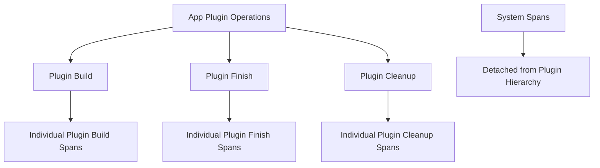

+++
title = "#20722 add plugin tracing spans"
date = "2025-08-26T00:00:00"
draft = false
template = "pull_request_page.html"
in_search_index = true

[taxonomies]
list_display = ["show"]

[extra]
current_language = "en"
available_languages = {"en" = { name = "English", url = "/pull_request/bevy/2025-08/pr-20722-en-20250826" }, "zh-cn" = { name = "中文", url = "/pull_request/bevy/2025-08/pr-20722-zh-cn-20250826" }}
labels = ["C-Performance", "A-App"]
+++

# add plugin tracing spans

## Basic Information
- **Title**: add plugin tracing spans
- **PR Link**: https://github.com/bevyengine/bevy/pull/20722
- **Author**: atlv24
- **Status**: MERGED
- **Labels**: C-Performance, S-Ready-For-Final-Review, A-App
- **Created**: 2025-08-23T06:50:27Z
- **Merged**: 2025-08-26T00:35:06Z
- **Merged By**: mockersf

## Description Translation
# Objective

- easily diagnose startup performance issues

## Solution

- add plugin tracing spans

## Testing

- i have not been able to get any tracing to work in any of bevy. idk if this code works, but it looks like it should. is tracing broken or do i have a setup issue?

## The Story of This Pull Request

This PR addresses a common challenge in Bevy application development: diagnosing startup performance issues. When applications experience slow initialization, developers need visibility into which plugins are contributing most to the startup time. Without proper instrumentation, it's difficult to identify performance bottlenecks during the plugin build, finish, and cleanup phases.

The solution implements tracing spans around plugin lifecycle operations. The implementation adds conditional tracing instrumentation that only activates when the `trace` feature is enabled, ensuring zero overhead for production builds without tracing. The changes cover three key areas of plugin execution:

1. **Plugin build phase**: Added tracing spans when plugins are built during app initialization
2. **Plugin finish phase**: Added spans when plugins finalize their setup
3. **Plugin cleanup phase**: Added spans during plugin cleanup operations

A notable technical consideration was ensuring proper span hierarchy. The PR modifies system spans to set their parent to `None`, preventing them from appearing as children of plugin build spans. This separation provides clearer trace visualization by keeping plugin-level and system-level instrumentation distinct.

The implementation uses Bevy's existing plugin registry iteration pattern, inserting tracing spans within the "hokeypokey" plugin swapping mechanism that avoids allocation while iterating through plugins. Each span includes the plugin name as metadata, making it easy to identify which plugin corresponds to each span in tracing output.

While the author noted uncertainty about whether tracing was working in their environment, the code follows established patterns for Bevy's tracing instrumentation and provides the necessary hooks for performance analysis when tracing is properly configured.

## Visual Representation



## Key Files Changed

### `crates/bevy_app/src/app.rs` (+13/-0)
Added tracing spans for plugin build, finish, and cleanup operations in the main App implementation.

Key changes:
```rust
// Added in finish() method
#[cfg(feature = "trace")]
let _finish_span = info_span!("plugin finish").entered();

// Added per-plugin in finish loop
#[cfg(feature = "trace")]
let _plugin_finish_span = info_span!("plugin finish", plugin = hokeypokey.name()).entered();

// Similar additions for cleanup() method
#[cfg(feature = "trace")]
let _cleanup_span = info_span!("plugin cleanup").entered();

// Added in add_plugin() build operation
#[cfg(feature = "trace")]
let _plugin_build_span = info_span!("plugin build", plugin = plugin.name()).entered();
```

### `crates/bevy_app/src/sub_app.rs` (+6/-0)
Added tracing spans for plugin finish and cleanup operations in SubApp implementation.

Key changes:
```rust
// Added per-plugin in finish() method
#[cfg(feature = "trace")]
let _plugin_finish_span = info_span!("plugin finish", plugin = hokeypokey.name()).entered();

// Added per-plugin in cleanup() method  
#[cfg(feature = "trace")]
let _plugin_cleanup_span = info_span!("plugin cleanup", plugin = hokeypokey.name()).entered();
```

### `crates/bevy_ecs/src/system/function_system.rs` (+6/-4)
Modified system spans to detach them from plugin build spans for clearer tracing hierarchy.

Key changes:
```rust
// Before:
#[cfg(feature = "trace")]
system_span: info_span!("system", name = name.clone().as_string()),

// After:  
#[cfg(feature = "trace")]
system_span: info_span!(parent: None, "system", name = name.clone().as_string()),

// Similar change for commands_span
```

## Further Reading

- [Bevy Tracing Documentation](https://docs.rs/bevy/latest/bevy/prelude/tracing/index.html)
- [Rust Tracing Library](https://docs.rs/tracing/latest/tracing/)
- [Bevy Plugin System](https://bevy-cheatbook.github.io/programming/plugins.html)
- [Performance Profiling with Tracing](https://tokio.rs/blog/2019-08-tracing)