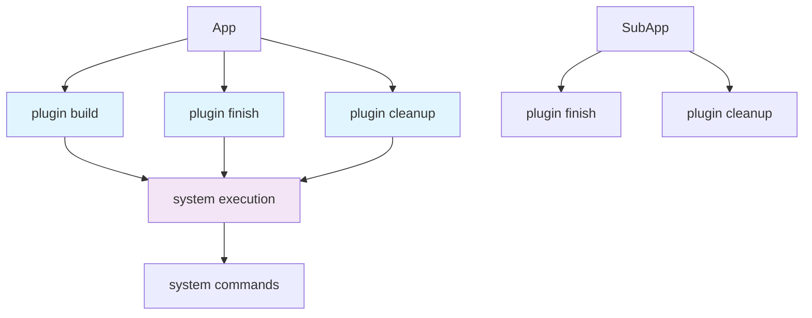

+++
title = "#20722 add plugin tracing spans"
date = "2025-08-26T00:00:00"
draft = false
template = "pull_request_page.html"
in_search_index = false

[extra]
current_language = "zh-cn"
available_languages = {"en" = { name = "English", url = "/pull_request/bevy/2025-08/pr-20722-en-20250826" }, "zh-cn" = { name = "中文", url = "/pull_request/bevy/2025-08/pr-20722-zh-cn-20250826" }}
+++

# add plugin tracing spans

## 基本信息
- **标题**: add plugin tracing spans
- **PR链接**: https://github.com/bevyengine/bevy/pull/20722
- **作者**: atlv24
- **状态**: 已合并
- **标签**: C-Performance, S-Ready-For-Final-Review, A-App
- **创建时间**: 2025-08-23T06:50:27Z
- **合并时间**: 2025-08-26T00:35:06Z
- **合并者**: mockersf

## 描述翻译
### Objective (目标)
- 轻松诊断启动性能问题

### Solution (解决方案)
- 添加插件追踪 spans

### Testing (测试)
- 我无法让任何追踪在bevy中正常工作。不知道这段代码是否有效，但从代码上看应该是可以的。是追踪功能坏了还是我的设置有问题？

## 本次PR的故事

这个PR解决了一个实际的性能诊断需求：当Bevy应用启动缓慢时，开发者难以确定是哪个插件导致了性能瓶颈。在没有详细的性能追踪数据的情况下，调试启动性能问题就像在黑盒中操作。

### 问题背景
Bevy引擎使用插件系统来组织功能模块，每个插件在应用的build、finish和cleanup阶段执行相应的初始化逻辑。当应用启动变慢时，开发者需要知道每个插件在这些生命周期阶段的具体耗时，但现有的系统缺乏细粒度的性能监控能力。

### 解决方案
作者采用了Rust的tracing库来实现性能追踪，在每个插件的关键生命周期点添加了instrumentation spans。这些spans会在启用`trace`特性时激活，为性能分析工具提供详细的时间数据。

### 实现细节
实现集中在三个核心文件，分别处理主应用、子应用和系统级别的追踪：

**1. 主应用插件追踪 (crates/bevy_app/src/app.rs)**
在`build`、`finish`和`cleanup`方法中添加了span追踪：

```rust
// 在build方法中添加
#[cfg(feature = "trace")]
let _plugin_build_span = info_span!("plugin build", plugin = plugin.name()).entered();

// 在finish和cleanup循环中添加
#[cfg(feature = "trace")]
let _plugin_finish_span = info_span!("plugin finish", plugin = hokeypokey.name()).entered();
```

**2. 子应用插件追踪 (crates/bevy_app/src/sub_app.rs)**
为子应用的finish和cleanup操作添加了类似的span：

```rust
#[cfg(feature = "trace")]
let _plugin_finish_span = info_span!("plugin finish", plugin = hokeypokey.name()).entered();
```

**3. 系统span层级调整 (crates/bevy_ecs/src/system/function_system.rs)**
关键改进：修改system span的父级关系，防止它们成为插件build span的子span：

```rust
// 修改前:
system_span: info_span!("system", name = name.clone().as_string()),

// 修改后:
system_span: info_span!(parent: None, "system", name = name.clone().as_string()),
```

这个修改确保了系统执行的追踪数据不会错误地归属于插件构建时间，提供了更准确的性能分析视图。

### 技术考量
- **条件编译**: 所有追踪代码都使用`#[cfg(feature = "trace")]`包装，确保只在需要时包含性能开销
- **零成本抽象**: 在未启用trace特性时，这些代码不会产生任何运行时开销
- **上下文保持**: 使用`.entered()`方法确保span在整个作用域内保持活跃
- **层级关系管理**: 通过明确设置`parent: None`来维护正确的追踪层级

### 实际影响
这个PR为Bevy开发者提供了重要的性能诊断工具。现在可以使用tracing收集器（如tracing-subscriber）来捕获详细的插件初始化时间线，帮助识别启动性能瓶颈。

作者在测试中提到的困难（无法让tracing工作）可能源于tracing后端的配置问题，而不是代码本身的问题。这提醒我们在使用tracing时需要正确设置订阅者(subscriber)来收集和输出span数据。

## 可视化表示



## 关键文件变更

### 1. `crates/bevy_app/src/app.rs` (+13/-0)
**目的**: 在主应用的插件生命周期关键点添加追踪span

**关键变更**:
```rust
// 在finish()方法中添加
#[cfg(feature = "trace")]
let _finish_span = info_span!("plugin finish").entered();

// 在插件循环中添加每个插件的独立span
#[cfg(feature = "trace")]
let _plugin_finish_span = info_span!("plugin finish", plugin = hokeypokey.name()).entered();
```

### 2. `crates/bevy_ecs/src/system/function_system.rs` (+6/-4)
**目的**: 调整系统span的父级关系，避免错误的层级归属

**关键变更**:
```rust
// 修改前:
system_span: info_span!("system", name = name.clone().as_string()),

// 修改后:
system_span: info_span!(parent: None, "system", name = name.clone().as_string()),
```

### 3. `crates/bevy_app/src/sub_app.rs` (+6/-0)
**目的**: 为子应用添加与主应用一致的插件追踪支持

**关键变更**:
```rust
#[cfg(feature = "trace")]
let _plugin_finish_span = info_span!("plugin finish", plugin = hokeypokey.name()).entered();
```

## 进一步阅读

- [Rust Tracing库文档](https://docs.rs/tracing/latest/tracing/) - 了解tracing框架的基本用法
- [Bevy插件系统](https://bevy-cheatbook.github.io/programming/plugins.html) - 理解Bevy插件的工作原理
- [性能分析实践](https://github.com/bevyengine/bevy/blob/main/docs/plugins_guidelines.md#performance) - Bevy性能优化指南
- [Tracing Span使用指南](https://docs.rs/tracing/latest/tracing/span/index.html) - 学习span的创建和管理