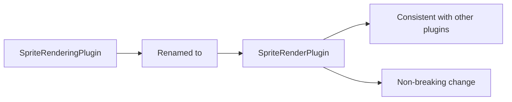

+++
title = "#20723 rename SpriteRenderingPlugin to SpriteRenderPlugin"
date = "2025-08-26T00:00:00"
draft = false
template = "pull_request_page.html"
in_search_index = true

[taxonomies]
list_display = ["show"]

[extra]
current_language = "en"
available_languages = {"en" = { name = "English", url = "/pull_request/bevy/2025-08/pr-20723-en-20250826" }, "zh-cn" = { name = "中文", url = "/pull_request/bevy/2025-08/pr-20723-zh-cn-20250826" }}
labels = ["A-Rendering"]
+++

# Title
rename SpriteRenderingPlugin to SpriteRenderPlugin

## Basic Information
- **Title**: rename SpriteRenderingPlugin to SpriteRenderPlugin
- **PR Link**: https://github.com/bevyengine/bevy/pull/20723
- **Author**: atlv24
- **Status**: MERGED
- **Labels**: A-Rendering, S-Ready-For-Final-Review
- **Created**: 2025-08-23T06:55:53Z
- **Merged**: 2025-08-26T03:49:23Z
- **Merged By**: alice-i-cecile

## Description Translation
# Objective

- consistency

## Solution

- rename SpriteRenderingPlugin to SpriteRenderPlugin

## Testing

Not breaking, this didnt exist last cycle.

## The Story of This Pull Request

This PR addresses a straightforward naming inconsistency in Bevy's sprite rendering module. The core issue was that the plugin name `SpriteRenderingPlugin` didn't follow Bevy's established naming conventions for rendering plugins.

The problem emerged from recent architectural changes in Bevy's rendering system. As the engine evolved, the rendering logic was split into separate crates, and during this restructuring, the plugin naming became inconsistent with other similar components in the codebase.

The solution was a simple but important rename: changing `SpriteRenderingPlugin` to `SpriteRenderPlugin`. This change aligns with the naming pattern used by other rendering plugins in Bevy, such as `MeshRenderPlugin` and `MaterialRenderPlugin`. The rename maintains consistency across the codebase and follows the established convention of using "Render" rather than "Rendering" in plugin names.

The implementation required changes in two files:
1. The plugin definition in `bevy_sprite_render/src/lib.rs`
2. The plugin registration in `bevy_internal/src/default_plugins.rs`

The change is non-breaking because this plugin didn't exist in the previous release cycle, as noted in the testing section. This means users upgrading from previous versions won't experience any breaking changes from this rename.

From an engineering perspective, this change demonstrates the importance of maintaining consistent naming conventions in a large codebase. Consistent naming improves code discoverability, reduces cognitive load for developers, and makes the API more predictable for users.

## Visual Representation



## Key Files Changed

### `crates/bevy_sprite_render/src/lib.rs`
**Changes**: Renamed the main plugin struct from `SpriteRenderingPlugin` to `SpriteRenderPlugin`

```rust
// Before:
pub struct SpriteRenderingPlugin;

impl Plugin for SpriteRenderingPlugin {
    // implementation
}

// After:
pub struct SpriteRenderPlugin;

impl Plugin for SpriteRenderPlugin {
    // implementation
}
```

### `crates/bevy_internal/src/default_plugins.rs`
**Changes**: Updated the plugin registration to use the new name

```rust
// Before:
bevy_sprite_render:::SpriteRenderingPlugin,

// After:
bevy_sprite_render:::SpriteRenderPlugin,
```

## Further Reading

- [Bevy Plugin System Documentation](https://bevyengine.org/learn/book/getting-started/plugins/)
- [Rust Naming Conventions](https://rust-lang.github.io/api-guidelines/naming.html)
- [Bevy Code Organization](https://bevyengine.org/learn/book/getting-started/ecs/)