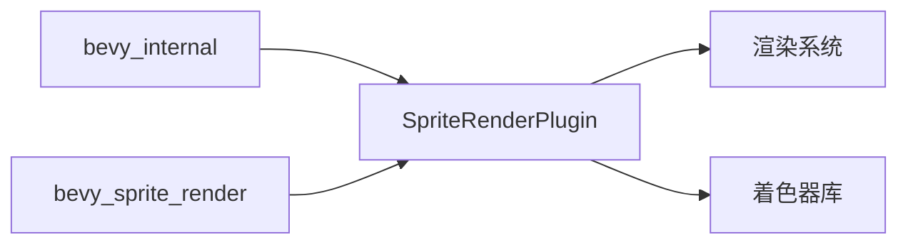

+++
title = "#20723 rename SpriteRenderingPlugin to SpriteRenderPlugin"
date = "2025-08-26T00:00:00"
draft = false
template = "pull_request_page.html"
in_search_index = false

[extra]
current_language = "zh-cn"
available_languages = {"en" = { name = "English", url = "/pull_request/bevy/2025-08/pr-20723-en-20250826" }, "zh-cn" = { name = "中文", url = "/pull_request/bevy/2025-08/pr-20723-zh-cn-20250826" }}
labels = ["A-Rendering"]
+++

# PR 分析报告：rename SpriteRenderingPlugin to SpriteRenderPlugin

## Basic Information
- **Title**: rename SpriteRenderingPlugin to SpriteRenderPlugin  
- **PR Link**: https://github.com/bevyengine/bevy/pull/20723  
- **Author**: atlv24  
- **Status**: MERGED  
- **Labels**: A-Rendering, S-Ready-For-Final-Review  
- **Created**: 2025-08-23T06:55:53Z  
- **Merged**: 2025-08-26T03:49:23Z  
- **Merged By**: alice-i-cecile  

## Description Translation
# Objective
- 一致性 (consistency)

## Solution
- 将 SpriteRenderingPlugin 重命名为 SpriteRenderPlugin

## Testing
不会造成破坏性变更，这个插件在上个开发周期中还不存在。

## The Story of This Pull Request

这个PR的核心目标是保持Bevy引擎代码库的命名一致性。开发者atlv24注意到在新增的`bevy_sprite_render`模块中，有一个插件的命名与其他类似插件不一致。

在Bevy的架构中，插件(Plugin)是组织功能模块的主要方式。通常插件命名会遵循`[功能名]Plugin`的模式，比如`SpritePlugin`、`TextPlugin`、`UiPlugin`等。然而，新添加的`sprite_render`模块中的插件被命名为`SpriteRenderingPlugin`，这与其他插件的命名模式产生了不一致。

这种命名不一致虽然看起来是个小问题，但在大型代码库中会带来维护成本。不一致的命名会让新贡献者感到困惑，增加代码阅读的理解负担，也可能导致在导入和使用插件时出现错误。

开发者采取了最直接有效的解决方案：将`SpriteRenderingPlugin`重命名为`SpriteRenderPlugin`。这个新名称更简洁，同时保持了与其他插件命名模式的一致性。从`Rendering`改为`Render`不仅减少了字符数，也更符合图形编程领域的常用术语（如Render Pass、Render Pipeline等）。

由于这个插件是在上一个开发周期新添加的，还没有被广泛使用，所以这个重命名不会造成破坏性变更。这是一个在早期阶段修正命名问题的好时机，避免了后续需要处理向后兼容性的复杂情况。

修改涉及两个关键文件：在`bevy_internal`的默认插件列表中和在`bevy_sprite_render`模块本身的定义中更新插件名称。这种同步更新确保了整个代码库中对这个插件的引用都保持一致。

## Visual Representation



## Key Files Changed

### 1. `crates/bevy_internal/src/default_plugins.rs`
**修改原因**：更新默认插件列表中的插件名称引用

```rust
// 修改前：
#[cfg(feature = "bevy_sprite_render")]
bevy_sprite_render:::SpriteRenderingPlugin,

// 修改后：
#[cfg(feature = "bevy_sprite_render")]
bevy_sprite_render:::SpriteRenderPlugin,
```

### 2. `crates/bevy_sprite_render/src/lib.rs`
**修改原因**：更新插件结构体本身的定义

```rust
// 修改前：
pub struct SpriteRenderingPlugin;

impl Plugin for SpriteRenderingPlugin {
    // 实现内容
}

// 修改后：
pub struct SpriteRenderPlugin;

impl Plugin for SpriteRenderPlugin {
    // 实现内容保持不变
}
```

## Further Reading

- [Bevy Plugin System Documentation](https://bevyengine.org/learn/book/getting-started/plugins/)
- [Rust API Guidelines on Naming](https://rust-lang.github.io/api-guidelines/naming.html)
- [Bevy Engine GitHub Repository](https://github.com/bevyengine/bevy)

# Full Code Diff
```diff
diff --git a/crates/bevy_internal/src/default_plugins.rs b/crates/bevy_internal/src/default_plugins.rs
index a314ab41b3612..0e8ae5f6222e4 100644
--- a/crates/bevy_internal/src/default_plugins.rs
+++ b/crates/bevy_internal/src/default_plugins.rs
@@ -45,7 +45,7 @@ plugin_group! {
         #[cfg(feature = "bevy_sprite")]
         bevy_sprite:::SpritePlugin,
         #[cfg(feature = "bevy_sprite_render")]
-        bevy_sprite_render:::SpriteRenderingPlugin,
+        bevy_sprite_render:::SpriteRenderPlugin,
         #[cfg(feature = "bevy_text")]
         bevy_text:::TextPlugin,
         #[cfg(feature = "bevy_ui")]
diff --git a/crates/bevy_sprite_render/src/lib.rs b/crates/bevy_sprite_render/src/lib.rs
index 43ec82e742e93..e902f13dee004 100644
--- a/crates/bevy_sprite_render/src/lib.rs
+++ b/crates/bevy_sprite_render/src/lib.rs
@@ -49,7 +49,7 @@ use crate::text2d::extract_text2d_sprite;
 
 /// Adds support for 2D sprite rendering.
 #[derive(Default)]
-pub struct SpriteRenderingPlugin;
+pub struct SpriteRenderPlugin;
 
 /// System set for sprite rendering.
 #[derive(Debug, Hash, PartialEq, Eq, Clone, SystemSet)]
@@ -62,7 +62,7 @@ pub enum SpriteSystems {
 #[deprecated(since = "0.17.0", note = "Renamed to `SpriteSystems`.")]
 pub type SpriteSystem = SpriteSystems;
 
-impl Plugin for SpriteRenderingPlugin {
+impl Plugin for SpriteRenderPlugin {
     fn build(&self, app: &mut App) {
         load_shader_library!(app, "render/sprite_view_bindings.wgsl");
```