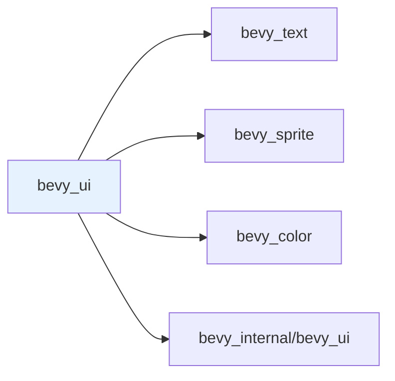

+++
title = "#20724 remove irrelevant ui dependencies"
date = "2025-08-24T00:00:00"
draft = false
template = "pull_request_page.html"
in_search_index = true

[taxonomies]
list_display = ["show"]

[extra]
current_language = "en"
available_languages = {"en" = { name = "English", url = "/pull_request/bevy/2025-08/pr-20724-en-20250824" }, "zh-cn" = { name = "中文", url = "/pull_request/bevy/2025-08/pr-20724-zh-cn-20250824" }}
labels = ["C-Bug"]
+++

# Title
remove irrelevant ui dependencies

## Basic Information
- **Title**: remove irrelevant ui dependencies
- **PR Link**: https://github.com/bevyengine/bevy/pull/20724
- **Author**: atlv24
- **Status**: MERGED
- **Labels**: C-Bug, S-Ready-For-Final-Review
- **Created**: 2025-08-23T07:02:36Z
- **Merged**: 2025-08-24T07:19:42Z
- **Merged By**: james7132

## Description Translation
# Objective

- ui shouldnt need core pipelines and anti aliasing

## Solution

- remove irrelevant ui dependencies

## Testing

## The Story of This Pull Request

This PR addresses a dependency management issue in Bevy's UI module. The problem was straightforward: the `bevy_ui` feature was including unnecessary dependencies that weren't required for core UI functionality. Specifically, `bevy_core_pipeline` and `bevy_anti_aliasing` were being pulled in as dependencies despite not being essential for UI rendering.

The solution approach was surgical - simply remove these extraneous dependencies from the feature definition. This reduces the dependency footprint for projects using Bevy's UI system, which can lead to faster compile times and smaller binary sizes. The changes don't affect functionality since these dependencies weren't actually required for UI rendering.

The implementation involved modifying the `Cargo.toml` file to clean up the dependency list. The before and after shows the precise changes made:

```toml
# Before:
bevy_ui = [
  "bevy_internal/bevy_ui",
  "bevy_core_pipeline",
  "bevy_text",
  "bevy_sprite",
  "bevy_color",
  "bevy_anti_aliasing",
]

# After:
bevy_ui = ["bevy_internal/bevy_ui", "bevy_text", "bevy_sprite", "bevy_color"]
```

This change demonstrates good dependency hygiene. By removing unnecessary dependencies, the PR reduces potential conflicts and improves build performance. The core UI functionality remains intact since the removed dependencies were not actually used by the UI system itself.

The impact is primarily on developer experience - faster compilation and cleaner dependency graphs for projects using Bevy's UI. This aligns with Rust's philosophy of minimal dependencies and efficient compilation.

## Visual Representation



## Key Files Changed

### `Cargo.toml`
This file defines the workspace dependencies and feature flags for the Bevy engine. The changes remove unnecessary dependencies from the `bevy_ui` feature.

**Changes:**
```toml
# Before:
bevy_ui = [
  "bevy_internal/bevy_ui",
  "bevy_core_pipeline",
  "bevy_text",
  "bevy_sprite",
  "bevy_color",
  "bevy_anti_aliasing",
]

# After:
bevy_ui = ["bevy_internal/bevy_ui", "bevy_text", "bevy_sprite", "bevy_color"]
```

The removal of `bevy_core_pipeline` and `bevy_anti_aliasing` from the UI dependencies reduces the transitive dependency graph for projects using Bevy's UI system, potentially improving compile times and reducing binary size.

## Further Reading

- [Cargo Features Documentation](https://doc.rust-lang.org/cargo/reference/features.html)
- [Bevy Engine Architecture](https://bevyengine.org/learn/architecture/)
- [Rust Dependency Management Best Practices](https://doc.rust-lang.org/cargo/guide/creating-a-new-project.html#working-with-dependencies)