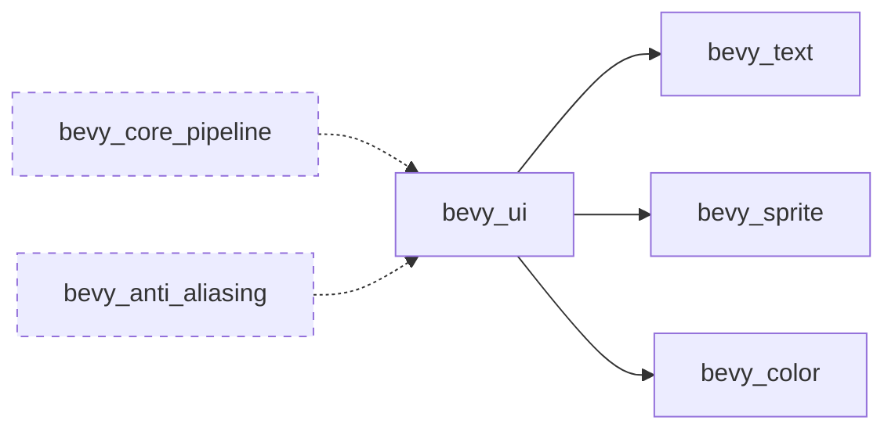

+++
title = "#20724 remove irrelevant ui dependencies"
date = "2025-08-24T00:00:00"
draft = false
template = "pull_request_page.html"
in_search_index = false

[extra]
current_language = "zh-cn"
available_languages = {"en" = { name = "English", url = "/pull_request/bevy/2025-08/pr-20724-en-20250824" }, "zh-cn" = { name = "中文", url = "/pull_request/bevy/2025-08/pr-20724-zh-cn-20250824" }}
+++

# 移除不相关的 UI 依赖项

## 基本信息
- **标题**: remove irrelevant ui dependencies
- **PR 链接**: https://github.com/bevyengine/bevy/pull/20724
- **作者**: atlv24
- **状态**: 已合并
- **标签**: C-Bug, S-Ready-For-Final-Review
- **创建时间**: 2025-08-23T07:02:36Z
- **合并时间**: 2025-08-24T07:19:42Z
- **合并者**: james7132

## 描述翻译
# Objective (目标)

- ui shouldnt need core pipelines and anti aliasing (UI 不应该需要核心渲染管线和抗锯齿功能)

## Solution (解决方案)

- remove irrelevant ui dependencies (移除不相关的 UI 依赖项)

## Testing (测试)


## 这个 PR 的故事

这个 PR 解决了一个在 Bevy 引擎中 UI 模块依赖关系的问题。问题的核心是 UI 模块不必要地依赖了与渲染管线和抗锯齿相关的功能，这增加了编译时间和二进制大小，却没有提供实际价值。

在 Bevy 的架构中，UI 系统主要负责处理用户界面元素的布局和渲染，而核心渲染管线 (core pipeline) 和抗锯齿 (anti-aliasing) 功能主要是为 3D 场景渲染设计的。UI 元素通常是 2D 的，使用不同的渲染路径，不需要这些高级的 3D 渲染特性。

开发者 atlv24 识别到了这个问题，并提出了一个直接的解决方案：从 bevy_ui 的特性依赖中移除 `bevy_core_pipeline` 和 `bevy_anti_aliasing` 这两个不必要的依赖项。

这个修改虽然看起来简单，但实际上体现了良好的工程实践：
1. **最小化依赖原则**：每个模块应该只依赖它真正需要的功能
2. **编译优化**：减少不必要的依赖可以显著缩短编译时间
3. **二进制大小优化**：避免包含不需要的代码可以减少最终应用程序的大小

从技术角度来看，这个修改是安全的，因为：
- UI 渲染实际上并不使用核心渲染管线的功能
- 抗锯齿处理通常在后期处理阶段进行，而 UI 渲染有自己独立的处理方式
- 这些依赖可能是历史遗留问题，而不是基于实际需求

这个修改不会影响 UI 系统的功能，因为被移除的依赖项并不是 UI 渲染所必需的。UI 系统仍然保留了它真正需要的依赖：`bevy_text`（文本渲染）、`bevy_sprite`（精灵渲染）和 `bevy_color`（颜色处理）。

## 可视化表示



虚线表示被移除的依赖关系

## 关键文件变更

**Cargo.toml** (+1/-8)
这个文件定义了 Bevy 的模块依赖关系和特性标志。修改内容简化了 bevy_ui 的特性依赖列表。

```toml
# 修改前:
bevy_ui = [
  "bevy_internal/bevy_ui",
  "bevy_core_pipeline",
  "bevy_text",
  "bevy_sprite",
  "bevy_color",
  "bevy_anti_aliasing",
]

# 修改后:
bevy_ui = ["bevy_internal/bevy_ui", "bevy_text", "bevy_sprite", "bevy_color"]
```

这个变更移除了两个不必要的依赖项 (`bevy_core_pipeline` 和 `bevy_anti_aliasing`)，使依赖关系更加清晰和精确。

## 延伸阅读

- [Bevy 官方文档 - 特性标志](https://bevyengine.org/learn/books/introduction/features/)
- [Cargo 手册 - 特性标志](https://doc.rust-lang.org/cargo/reference/features.html)
- [Rust 性能优化：减少依赖](https://nnethercote.github.io/perf-book/compile-times.html#reduce-dependencies)

# 完整代码差异
```diff
diff --git a/Cargo.toml b/Cargo.toml
index 28612f1c0a516..4f6f83a4ef92f 100644
--- a/Cargo.toml
+++ b/Cargo.toml
@@ -284,14 +284,7 @@ bevy_sprite_render = [
 bevy_text = ["bevy_internal/bevy_text", "bevy_asset"]
 
 # A custom ECS-driven UI framework
-bevy_ui = [
-  "bevy_internal/bevy_ui",
-  "bevy_core_pipeline",
-  "bevy_text",
-  "bevy_sprite",
-  "bevy_color",
-  "bevy_anti_aliasing",
-]
+bevy_ui = ["bevy_internal/bevy_ui", "bevy_text", "bevy_sprite", "bevy_color"]
 
 # Provides rendering functionality for bevy_ui
 bevy_ui_render = [
```