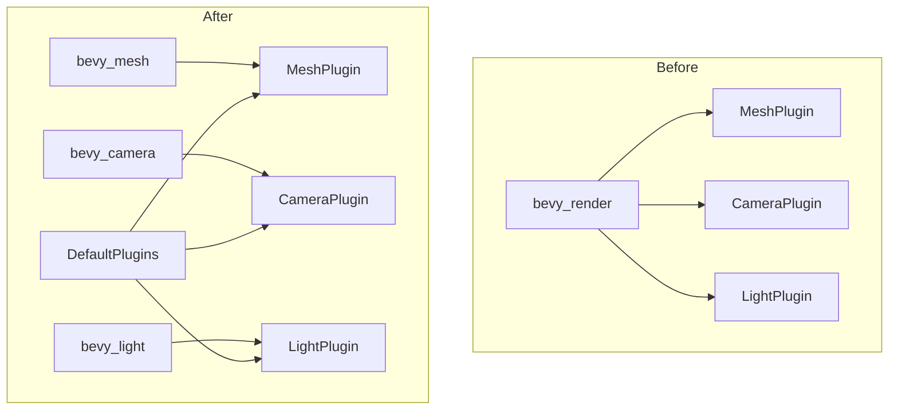

+++
title = "#20725 extract MeshPlugin"
date = "2025-08-24T00:00:00"
draft = false
template = "pull_request_page.html"
in_search_index = true

[taxonomies]
list_display = ["show"]

[extra]
current_language = "en"
available_languages = {"en" = { name = "English", url = "/pull_request/bevy/2025-08/pr-20725-en-20250824" }, "zh-cn" = { name = "中文", url = "/pull_request/bevy/2025-08/pr-20725-zh-cn-20250824" }}
labels = ["C-Bug", "A-Rendering", "P-Crash"]
+++

# Title
extract MeshPlugin

## Basic Information
- **Title**: extract MeshPlugin
- **PR Link**: https://github.com/bevyengine/bevy/pull/20725
- **Author**: atlv24
- **Status**: MERGED
- **Labels**: C-Bug, A-Rendering, P-Crash, S-Ready-For-Final-Review
- **Created**: 2025-08-23T07:07:33Z
- **Merged**: 2025-08-24T21:10:11Z
- **Merged By**: alice-i-cecile

## Description Translation
# Objective

- use meshes, lights, cameras without rendering
- this is a bug because without it, running a bevy app without bevy_render instantly crashes on expected Assets resources not being present

## Solution

- make LightPlugin and CameraPlugin be included without needing rendering crates to add them
- extract MeshPlugin

## Testing

- disabled all rendering features and ran a bare app

## The Story of This Pull Request

This PR addresses a critical issue where Bevy applications would crash when running without the `bevy_render` feature enabled. The core problem was that mesh, light, and camera assets weren't being properly initialized when rendering was disabled, despite these components being usable in non-rendering contexts like headless servers or simulation environments.

The solution involved decoupling asset management from rendering-specific functionality. The developer extracted the `MeshPlugin` from `bevy_render` into `bevy_mesh`, making it available independently of rendering capabilities. This allows applications to use mesh assets without requiring the full rendering pipeline.

Key changes included moving mesh asset initialization to the `bevy_mesh` crate and ensuring that `LightPlugin` and `CameraPlugin` could be included without rendering dependencies. The default plugins were updated to conditionally include these plugins when their respective features are enabled, providing proper asset management regardless of rendering status.

The implementation required careful handling of system scheduling to avoid conflicts. Specifically, the `mark_3d_meshes_as_changed_if_their_assets_changed` system was moved to `bevy_mesh` and explicitly configured to avoid ambiguity with visibility calculation systems.

These changes maintain backward compatibility while enabling new use cases. Applications can now use meshes, lights, and cameras in headless mode without crashes, making Bevy more flexible for non-graphical applications and testing scenarios.

## Visual Representation



## Key Files Changed

1. `crates/bevy_mesh/src/lib.rs` (+17/-1)
   - Added `MeshPlugin` implementation to handle mesh asset initialization
   - Now manages mesh asset registration and change detection systems

```rust
// After:
#[derive(Default)]
pub struct MeshPlugin;

impl Plugin for MeshPlugin {
    fn build(&self, app: &mut App) {
        app.init_asset::<Mesh>()
            .register_asset_reflect::<Mesh>()
            .add_systems(
                PostUpdate,
                mark_3d_meshes_as_changed_if_their_assets_changed.before(AssetEventSystems),
            );
    }
}
```

2. `crates/bevy_render/src/mesh/mod.rs` (+3/-12)
   - Removed mesh asset management functionality (now in bevy_mesh)
   - Now focuses only on rendering-specific mesh processing

```rust
// After:
impl Plugin for MeshPlugin {
    fn build(&self, app: &mut App) {
        app.init_asset::<skinning::SkinnedMeshInverseBindposes>()
            .add_plugins(RenderAssetPlugin::<RenderMesh, GpuImage>::default())
            .add_plugins(MeshAllocatorPlugin);
    }
}
```

3. `crates/bevy_camera/src/visibility/mod.rs` (+7/-2)
   - Added explicit ambiguity resolution between visibility systems and mesh change detection
   - Ensures proper system scheduling without conflicts

```rust
// After:
.configure_sets(
    PostUpdate,
    (
        CalculateBounds
            .ambiguous_with(mark_3d_meshes_as_changed_if_their_assets_changed),
        UpdateFrusta,
        VisibilityPropagate,
    )
        .before(CheckVisibility)
        .after(TransformSystems::Propagate),
)
```

4. `crates/bevy_internal/src/default_plugins.rs` (+6/-0)
   - Added conditional inclusion of mesh, camera, and light plugins
   - Ensures these plugins are available without requiring rendering

```rust
// After:
#[cfg(feature = "bevy_mesh")]
bevy_mesh:::MeshPlugin,
#[cfg(feature = "bevy_camera")]
bevy_camera:::CameraPlugin,
#[cfg(feature = "bevy_light")]
bevy_light:::LightPlugin,
```

5. `crates/bevy_pbr/src/lib.rs` (+2/-3)
   - Removed direct LightPlugin inclusion (now handled by default plugins)
   - Simplified PBR plugin implementation

## Further Reading

- [Bevy Plugin System Documentation](https://bevyengine.org/learn/book/getting-started/plugins/)
- [Asset System Overview](https://bevyengine.org/learn/book/getting-started/assets/)
- [ECS Scheduling and Systems](https://bevyengine.org/learn/book/getting-started/ecs/)