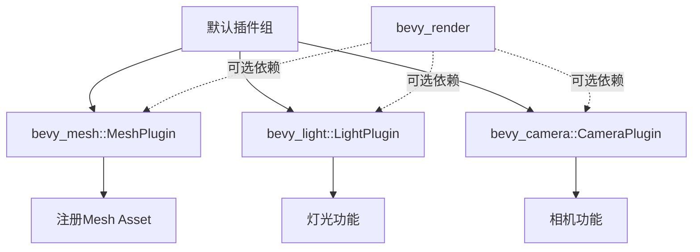

+++
title = "#20725 extract MeshPlugin"
date = "2025-08-24T00:00:00"
draft = false
template = "pull_request_page.html"
in_search_index = false

[extra]
current_language = "zh-cn"
available_languages = {"en" = { name = "English", url = "/pull_request/bevy/2025-08/pr-20725-en-20250824" }, "zh-cn" = { name = "中文", url = "/pull_request/bevy/2025-08/pr-20725-zh-cn-20250824" }}
+++

# extract MeshPlugin

## 基本信息
- **标题**: extract MeshPlugin
- **PR链接**: https://github.com/bevyengine/bevy/pull/20725
- **作者**: atlv24
- **状态**: 已合并
- **标签**: C-Bug, A-Rendering, P-Crash, S-Ready-For-Final-Review
- **创建时间**: 2025-08-23T07:07:33Z
- **合并时间**: 2025-08-24T21:10:11Z
- **合并者**: alice-i-cecile

## 描述翻译
# 目标 (Objective)

- 在不使用渲染功能的情况下使用网格 (meshes)、灯光 (lights) 和相机 (cameras)
- 这是一个bug，因为没有此修复，在不使用bevy_render的情况下运行bevy应用会立即崩溃，因为预期的Assets资源不存在

## 解决方案 (Solution)

- 使LightPlugin和CameraPlugin在不需渲染crates的情况下也能被包含
- 提取MeshPlugin

## 测试 (Testing)

- 禁用了所有渲染功能并运行了一个基础应用

## 本PR的故事

这个PR解决了一个实际工程问题：当开发者想要使用Bevy的网格、灯光和相机功能但不启用渲染时，应用会崩溃。问题的根本原因是这些功能的插件依赖关系管理不当。

**问题背景**
在Bevy的原有架构中，`MeshPlugin`、`LightPlugin`和`CameraPlugin`都直接依赖于渲染系统。当开发者创建一个不包含`bevy_render`的应用时，这些插件无法正常初始化，导致应用启动时崩溃，因为系统期望的Assets资源没有被正确注册。

**解决方案思路**
开发者采取了模块化重构的方法，将核心功能插件从渲染依赖中解耦：
1. 将`MeshPlugin`从`bevy_render`移动到`bevy_mesh` crate中
2. 确保`LightPlugin`和`CameraPlugin`能够独立于渲染系统工作
3. 在默认插件组中条件性地包含这些插件

**具体实现**
在`bevy_mesh/src/lib.rs`中新增了`MeshPlugin`实现：

```rust
#[derive(Default)]
pub struct MeshPlugin;

impl Plugin for MeshPlugin {
    fn build(&self, app: &mut App) {
        app.init_asset::<Mesh>()
            .register_asset_reflect::<Mesh>()
            .add_systems(
                PostUpdate,
                mark_3d_meshes_as_changed_if_their_assets_changed.before(AssetEventSystems),
            );
    }
}
```

同时从`bevy_render/src/mesh/mod.rs`中移除了相应的插件注册代码，保持了功能的单一职责原则。

**技术洞察**
这个重构展示了良好的插件架构设计：
1. **依赖倒置**: 核心功能不再依赖具体实现（渲染）
2. **条件编译**: 使用`#[cfg(feature = "...")]`控制插件包含
3. **系统顺序**: 通过`before(AssetEventSystems)`确保系统执行顺序正确

**影响**
这个修改使得Bevy的架构更加灵活：
- 开发者可以使用网格、灯光、相机功能而不强制包含渲染
- 减少了不必要的依赖和二进制大小
- 为未来的功能模块化奠定了基础

## 可视化表示



## 关键文件变更

### `crates/bevy_mesh/src/lib.rs` (+17/-1)
**变更原因**: 将MeshPlugin从渲染模块移动到mesh模块，实现功能解耦

```rust
// 新增MeshPlugin实现
#[derive(Default)]
pub struct MeshPlugin;

impl Plugin for MeshPlugin {
    fn build(&self, app: &mut App) {
        app.init_asset::<Mesh>()
            .register_asset_reflect::<Mesh>()
            .add_systems(
                PostUpdate,
                mark_3d_meshes_as_changed_if_their_assets_changed.before(AssetEventSystems),
            );
    }
}
```

### `crates/bevy_render/src/mesh/mod.rs` (+3/-12)
**变更原因**: 移除重复的MeshPlugin实现，保持单一职责

```rust
// 移除了原有的MeshPlugin实现，只保留渲染相关功能
impl Plugin for MeshPlugin {
    fn build(&self, app: &mut App) {
        app.init_asset::<skinning::SkinnedMeshInverseBindposes>()
            .add_plugins(RenderAssetPlugin::<RenderMesh, GpuImage>::default())
            .add_plugins(MeshAllocatorPlugin);
    }
}
```

### `crates/bevy_internal/src/default_plugins.rs` (+6/-0)
**变更原因**: 在默认插件组中条件性地包含核心功能插件

```rust
// 新增条件插件包含
#[cfg(feature = "bevy_mesh")]
bevy_mesh:::MeshPlugin,
#[cfg(feature = "bevy_camera")]
bevy_camera:::CameraPlugin,
#[cfg(feature = "bevy_light")]
bevy_light:::LightPlugin,
```

### `crates/bevy_light/src/lib.rs` (+1/-0)
**变更原因**: 为LightPlugin添加Default派生，便于插件管理

```rust
// 新增Default派生
#[derive(Default)]
pub struct LightPlugin;
```

### `crates/bevy_pbr/src/lib.rs` (+2/-3)
**变更原因**: 移除PbrPlugin中多余的LightPlugin包含，避免重复注册

```rust
// 移除了重复的LightPlugin注册
impl Plugin for PbrPlugin {
    fn build(&self, app: &mut App) {
        // ...
        // 移除了: LightPlugin,
        // ...
    }
}
```

## 延伸阅读

- [Bevy插件系统文档](https://bevyengine.org/learn/book/getting-started/plugins/)
- [Rust条件编译](https://doc.rust-lang.org/reference/conditional-compilation.html)
- [ECS架构模式](https://en.wikipedia.org/wiki/Entity_component_system)
- [依赖倒置原则](https://en.wikipedia.org/wiki/Dependency_inversion_principle)

## 完整代码差异
由于代码差异较长，这里提供关键变更的总结：
- 将MeshPlugin从bevy_render移动到bevy_mesh
- 为LightPlugin添加Default派生
- 在默认插件组中添加条件性插件包含
- 移除各模块中的重复插件注册
- 调整系统顺序和依赖关系

完整差异请查看PR链接: https://github.com/bevyengine/bevy/pull/20725