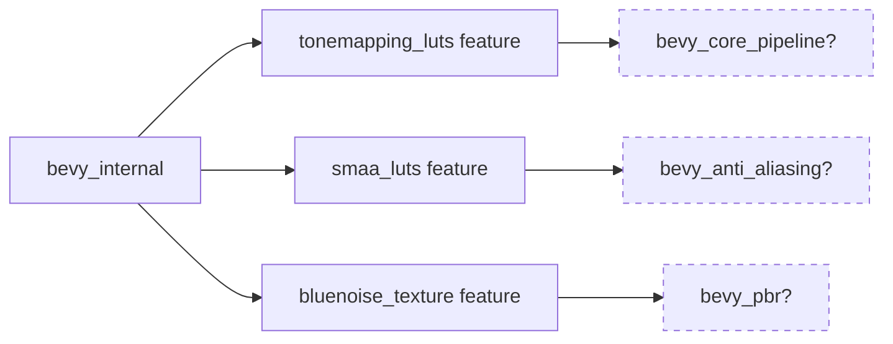

+++
title = "#20726 Conditional Feature Dependencies for LUTs in Bevy"
date = "2025-08-23T00:00:00"
draft = false
template = "pull_request_page.html"
in_search_index = true

[taxonomies]
list_display = ["show"]

[extra]
current_language = "en"
available_languages = {"en" = { name = "English", url = "/pull_request/bevy/2025-08/pr-20726-en-20250823" }, "zh-cn" = { name = "中文", url = "/pull_request/bevy/2025-08/pr-20726-zh-cn-20250823" }}
labels = ["A-Rendering"]
+++

# Title: Conditional Feature Dependencies for LUTs in Bevy

## Basic Information
- **Title**: make smaa_luts and tonemap_luts not unconditionally bring in rendering crates
- **PR Link**: https://github.com/bevyengine/bevy/pull/20726
- **Author**: atlv24
- **Status**: MERGED
- **Labels**: A-Rendering, S-Needs-Review
- **Created**: 2025-08-23T07:10:44Z
- **Merged**: 2025-08-23T08:08:29Z
- **Merged By**: mockersf

## Description Translation
# Objective

- I don't actually know if this is desirable, but I think I'd prefer this. It's also consistent with how bluenoise texture is set up. I feel that these are "addon" features that should only really do anything if the base crate they apply to is in use.

## Solution

- I really have no idea how to use this PR template a lot of the time

## Testing

- 

## The Story of This Pull Request

This PR addresses a dependency management issue in Bevy's feature flag system. The problem was that enabling certain lookup table (LUT) features would unconditionally pull in rendering crates, even when those crates weren't otherwise needed in a project.

The author noticed an inconsistency in how feature dependencies were handled. While the `bluenoise_texture` feature was already properly configured with optional dependencies (using the `?` syntax), the `tonemapping_luts` and `smaa_luts` features were forcing unconditional inclusion of their respective rendering crates.

The solution was straightforward: modify the dependency declarations in `crates/bevy_internal/Cargo.toml` to use the same optional dependency pattern already established for `bluenoise_texture`. This change ensures that:

1. The LUT features only activate when their parent crates are already included
2. Projects that don't use the rendering pipeline won't pull in unnecessary dependencies
3. The behavior is now consistent across all similar feature flags

The implementation required minimal changes - just adding the `?` character to two dependency declarations. This small syntax change transforms the dependencies from mandatory to optional, matching the established pattern in the codebase.

This change improves build times for projects that use these LUT features but don't require the full rendering pipeline, as it prevents pulling in unnecessary crates and their dependencies.

## Visual Representation



## Key Files Changed

**File: `crates/bevy_internal/Cargo.toml`**

This file contains the feature definitions for the main Bevy crate. The changes modify two feature dependencies to make them optional instead of mandatory.

**Before:**
```toml
# Include tonemapping LUT KTX2 files.
tonemapping_luts = ["bevy_core_pipeline/tonemapping_luts"]
# Include Bluenoise texture for environment map generation.
bluenoise_texture = ["bevy_pbr?/bluenoise_texture"]

# Include SMAA LUT KTX2 Files
smaa_luts = ["bevy_anti_aliasing/smaa_luts"]
```

**After:**
```toml
# Include tonemapping LUT KTX2 files.
tonemapping_luts = ["bevy_core_pipeline?/tonemapping_luts"]
# Include Bluenoise texture for environment map generation.
bluenoise_texture = ["bevy_pbr?/bluenoise_texture"]

# Include SMAA LUT KTX2 Files
smaa_luts = ["bevy_anti_aliasing?/smaa_luts"]
```

The changes align the `tonemapping_luts` and `smaa_luts` features with the existing pattern used by `bluenoise_texture`, making their dependency on rendering crates conditional rather than mandatory.

## Further Reading

- [Cargo Features Documentation](https://doc.rust-lang.org/cargo/reference/features.html)
- [Bevy Engine Documentation](https://bevyengine.org/learn/)
- [Optional Dependencies in Cargo](https://doc.rust-lang.org/cargo/reference/features.html#optional-dependencies)