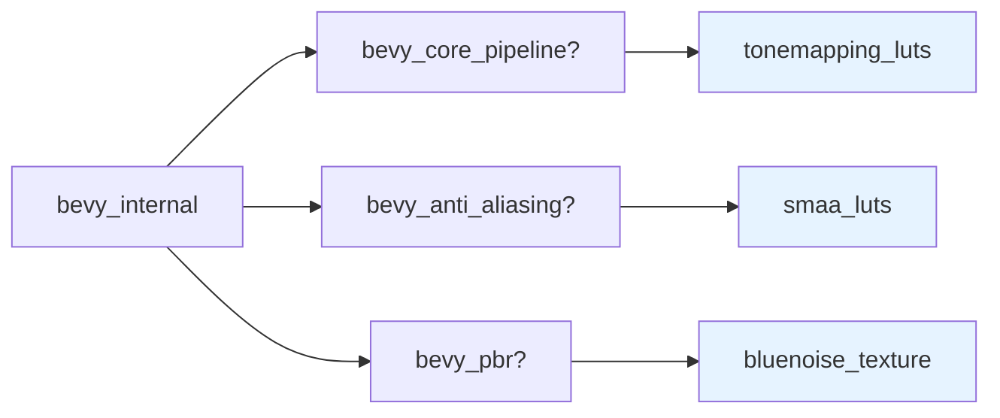

+++
title = "#20726 make smaa_luts and tonemap_luts not unconditionally bring in rendering crates"
date = "2025-08-23T00:00:00"
draft = false
template = "pull_request_page.html"
in_search_index = false

[extra]
current_language = "zh-cn"
available_languages = {"en" = { name = "English", url = "/pull_request/bevy/2025-08/pr-20726-en-20250823" }, "zh-cn" = { name = "中文", url = "/pull_request/bevy/2025-08/pr-20726-zh-cn-20250823" }}
+++

# 分析报告：PR #20726 - make smaa_luts and tonemap_luts not unconditionally bring in rendering crates

## 基本信息
- **标题**: make smaa_luts and tonemap_luts not unconditionally bring in rendering crates
- **PR链接**: https://github.com/bevyengine/bevy/pull/20726
- **作者**: atlv24
- **状态**: 已合并
- **标签**: A-Rendering, S-Needs-Review
- **创建时间**: 2025-08-23T07:10:44Z
- **合并时间**: 2025-08-23T08:08:29Z
- **合并者**: mockersf

## 描述翻译
**目标**

- 我不确定这是否可取，但我认为我更喜欢这种方式。这也与 bluenoise 纹理的设置方式保持一致。我觉得这些是"附加"功能，只有在它们应用的基础 crate 被使用时才应该真正起作用。

**解决方案**

- 我真的不知道很多时候如何使用这个 PR 模板

**测试**

- 

## 这个PR的故事

这个PR解决了一个Cargo特性依赖管理的问题。在Bevy引擎中，某些可选功能如SMAA（增强型子像素形态抗锯齿）LUTs（查找表）和色调映射LUTs被设计为只在相关渲染功能启用时才应该被包含，但之前的实现无条件地引入了这些依赖。

问题的核心在于Cargo.toml中的特性定义。在Rust的Cargo构建系统中，特性(features)允许有条件地启用依赖项。当特性名后面加上问号(?)，表示这个特性只有在其他crate已经启用该特性时才会被包含，这是一种可选依赖的声明方式。

开发者注意到现有的`bluenoise_texture`特性已经正确使用了这种模式：
```toml
bluenoise_texture = ["bevy_pbr?/bluenoise_texture"]
```

但`smaa_luts`和`tonemapping_luts`特性却没有使用问号语法：
```toml
tonemapping_luts = ["bevy_core_pipeline/tonemapping_luts"]
smaa_luts = ["bevy_anti_aliasing/smaa_luts"]
```

这种差异意味着即使相关的渲染crate没有被使用，这些LUT资源仍然会被包含在构建中，增加了不必要的依赖和构建时间。

解决方案很简单但有效：在特性路径中添加问号使其变为条件依赖：
```toml
tonemapping_luts = ["bevy_core_pipeline?/tonemapping_luts"]
smaa_luts = ["bevy_anti_aliasing?/smaa_luts"]
```

这个改动确保了：
1. 只有当`bevy_core_pipeline`crate被启用时，色调映射LUTs才会被包含
2. 只有当`bevy_anti_aliasing`crate被启用时，SMAA LUTs才会被包含
3. 与现有的`bluenoise_texture`特性保持一致的行为模式

这种改动对于大型项目特别重要，因为它减少了不必要的依赖传递，优化了构建时间和最终的二进制大小。对于游戏引擎这样的项目，模块化设计和可选的依赖管理是至关重要的架构考量。

## 可视化表示



## 关键文件更改

**crates/bevy_internal/Cargo.toml** (+2/-2)

这个文件包含了Bevy引擎的特性定义。修改将两个特性的依赖从强制依赖改为可选依赖。

```toml
# 修改前:
tonemapping_luts = ["bevy_core_pipeline/tonemapping_luts"]
smaa_luts = ["bevy_anti_aliasing/smaa_luts"]

# 修改后:
tonemapping_luts = ["bevy_core_pipeline?/tonemapping_luts"]
smaa_luts = ["bevy_anti_aliasing?/smaa_luts"]
```

这些更改确保了LUT资源只在相关的渲染crate被启用时才会被包含，与现有的bluenoise_texture特性保持一致。

## 延伸阅读

- [Cargo文档 - 特性](https://doc.rust-lang.org/cargo/reference/features.html): 了解Rust Cargo特性系统的工作原理
- [Bevy引擎特性指南](https://bevyengine.org/learn/advanced-topics/features/): Bevy特定的特性使用模式
- [条件编译与特性标志](https://doc.rust-lang.org/cargo/reference/features.html#conditional-compilation): 如何使用特性进行条件编译

# 完整代码差异
```diff
diff --git a/crates/bevy_internal/Cargo.toml b/crates/bevy_internal/Cargo.toml
index e382008231f1d..62a1307e8bd28 100644
--- a/crates/bevy_internal/Cargo.toml
+++ b/crates/bevy_internal/Cargo.toml
@@ -66,12 +66,12 @@ statically-linked-dxc = ["bevy_render/statically-linked-dxc"]
 raw_vulkan_init = ["bevy_render/raw_vulkan_init"]
 
 # Include tonemapping LUT KTX2 files.
-tonemapping_luts = ["bevy_core_pipeline/tonemapping_luts"]
+tonemapping_luts = ["bevy_core_pipeline?/tonemapping_luts"]
 # Include Bluenoise texture for environment map generation.
 bluenoise_texture = ["bevy_pbr?/bluenoise_texture"]
 
 # Include SMAA LUT KTX2 Files
-smaa_luts = ["bevy_anti_aliasing/smaa_luts"]
+smaa_luts = ["bevy_anti_aliasing?/smaa_luts"]
 
 # NVIDIA Deep Learning Super Sampling
 dlss = ["bevy_anti_aliasing/dlss", "bevy_solari?/dlss"]
```