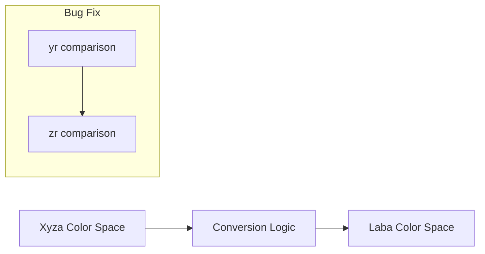

+++
title = "#20728 Fixed `Xyza` to `Laba` color conversion."
date = "2025-08-23T00:00:00"
draft = false
template = "pull_request_page.html"
in_search_index = true

[taxonomies]
list_display = ["show"]

[extra]
current_language = "en"
available_languages = {"en" = { name = "English", url = "/pull_request/bevy/2025-08/pr-20728-en-20250823" }, "zh-cn" = { name = "中文", url = "/pull_request/bevy/2025-08/pr-20728-zh-cn-20250823" }}
labels = ["C-Bug", "D-Trivial", "A-Color"]
+++

# Fixed `Xyza` to `Laba` color conversion

## Basic Information
- **Title**: Fixed `Xyza` to `Laba` color conversion.
- **PR Link**: https://github.com/bevyengine/bevy/pull/20728
- **Author**: 443eb9
- **Status**: MERGED
- **Labels**: C-Bug, D-Trivial, S-Needs-Review, A-Color
- **Created**: 2025-08-23T11:03:34Z
- **Merged**: 2025-08-23T13:04:57Z
- **Merged By**: mockersf

## Description Translation
# Objective

Fixes `Xyza` to `Laba` color conversion.

As the website referenced in comment:


The variable that used to compares to `epsilon` is `zr`, but in actual code, it's mistyped into `yr`.

## Solution

Changed `yr` to `zr`.

## The Story of This Pull Request

This PR addresses a straightforward but important bug in Bevy's color conversion system. The issue was in the conversion logic from Xyza (CIE 1931 color space with alpha) to Laba (CIELAB color space with alpha). The bug manifested as incorrect color transformations due to a simple variable naming error.

The problem occurred in the calculation of the `fz` component of the Laba color. According to the CIE standard and the referenced implementation, the condition for applying the cubic root transformation should check the `zr` (z reference) value against the CIE epsilon constant. However, the original code incorrectly used `yr` (y reference) in this condition, which would cause incorrect transformations for colors where the z component was below the epsilon threshold but the y component was above it.

The fix was minimal but critical: changing a single variable name from `yr` to `zr` in the condition check. This ensures the correct mathematical transformation is applied according to the CIE standard, maintaining color accuracy throughout the conversion process.

```rust
// Before (incorrect):
let fz = if yr > Laba::CIE_EPSILON {
    ops::cbrt(zr)
} else {
    (Laba::CIE_KAPPA * zr + 16.0) / 116.0
};

// After (correct):
let fz = if zr > Laba::CIE_EPSILON {
    ops::cbrt(zr)
} else {
    (Laba::CIE_KAPPA * zr + 16.0) / 116.0
};
```

This type of bug highlights the importance of careful variable naming and cross-referencing implementations against established standards. While the change was trivial, it ensures color accuracy for applications using Bevy's color conversion utilities, particularly important for graphics applications where precise color representation matters.

## Visual Representation



## Key Files Changed

- `crates/bevy_color/src/laba.rs` (+1/-1)

This file contains the implementation of Laba color space operations, including conversions from other color spaces. The change was made to the `From<Xyza> for Laba` implementation.

**Key modification:**
```rust
// Before:
let fz = if yr > Laba::CIE_EPSILON {
    ops::cbrt(zr)
} else {
    (Laba::CIE_KAPPA * zr + 16.0) / 116.0
};

// After:
let fz = if zr > Laba::CIE_EPSILON {
    ops::cbrt(zr)
} else {
    (Laba::CIE_KAPPA * zr + 16.0) / 116.0
};
```

The change ensures the correct variable (`zr`) is compared against the epsilon value, fixing the color conversion logic.

## Further Reading

- [CIELAB color space documentation](https://en.wikipedia.org/wiki/CIELAB_color_space)
- [CIE 1931 color space](https://en.wikipedia.org/wiki/CIE_1931_color_space)
- [Bevy Color documentation](https://docs.rs/bevy_color/latest/bevy_color/)

# Full Code Diff
```diff
diff --git a/crates/bevy_color/src/laba.rs b/crates/bevy_color/src/laba.rs
index 010b3df249678..3797c7500d82e 100644
--- a/crates/bevy_color/src/laba.rs
+++ b/crates/bevy_color/src/laba.rs
@@ -275,7 +275,7 @@ impl From<Xyza> for Laba {
         } else {
             (Laba::CIE_KAPPA * yr + 16.0) / 116.0
         };
-        let fz = if yr > Laba::CIE_EPSILON {
+        let fz = if zr > Laba::CIE_EPSILON {
             ops::cbrt(zr)
         } else {
             (Laba::CIE_KAPPA * zr + 16.0) / 116.0
```