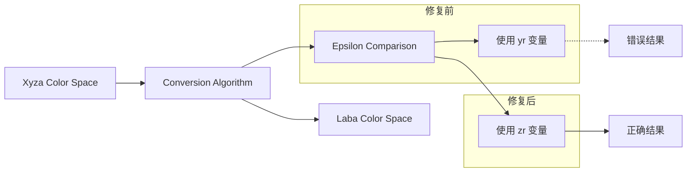

+++
title = "#20728 Fixed `Xyza` to `Laba` color conversion"
date = "2025-08-23T00:00:00"
draft = false
template = "pull_request_page.html"
in_search_index = false

[extra]
current_language = "zh-cn"
available_languages = {"en" = { name = "English", url = "/pull_request/bevy/2025-08/pr-20728-en-20250823" }, "zh-cn" = { name = "中文", url = "/pull_request/bevy/2025-08/pr-20728-zh-cn-20250823" }}
+++

# Fixed `Xyza` to `Laba` color conversion

## 基本信息
- **标题**: Fixed `Xyza` to `Laba` color conversion
- **PR链接**: https://github.com/bevyengine/bevy/pull/20728
- **作者**: 443eb9
- **状态**: 已合并
- **标签**: C-Bug, D-Trivial, S-Needs-Review, A-Color
- **创建时间**: 2025-08-23T11:03:34Z
- **合并时间**: 2025-08-23T13:04:57Z
- **合并者**: mockersf

## 描述翻译

### Objective（目标）

修复 `Xyza` 到 `Laba` 的颜色转换。

正如注释中引用的网站所示：


原本应该与 `epsilon` 比较的变量是 `zr`，但在实际代码中，它被错误地打成了 `yr`。

### Solution（解决方案）

将 `yr` 改为 `zr`。

## 本次PR的故事

这个PR解决了一个在颜色空间转换中的简单但重要的拼写错误。问题出现在Xyza颜色空间到Laba颜色空间的转换算法中，具体是在处理CIE XYZ颜色空间的归一化值时。

在颜色转换的数学计算中，当处理小数值时需要使用epsilon值来进行条件判断，以避免数值不稳定问题。原本的算法意图是对zr值（蓝色相关的分量）进行判断，但代码中错误地写成了yr值（绿色相关的分量）。

这种错误虽然看起来很小，但在颜色处理中可能会在某些边界情况下导致不准确的颜色转换结果。特别是在处理接近黑色或极暗的颜色时，这种数值精度的差异可能会变得明显。

从技术实现角度来看，这个修复确保了颜色转换算法遵循了标准的CIE L*a*b*颜色空间转换规范。Laba颜色空间的设计是为了更均匀地表示人类视觉感知的颜色差异，因此数学计算的准确性很重要。

修复本身极其简单 - 只是将变量名从`yr`改为`zr`，但这体现了在实现复杂数学算法时即使是小的拼写错误也可能影响功能的正确性。这种类型的错误在开发过程中很容易被忽略，因为编译器不会报错，只有在特定的输入条件下才会表现出问题。

## 可视化表示



## 关键文件变更

- `crates/bevy_color/src/laba.rs` (+1/-1)

这个文件包含了从Xyza到Laba颜色空间的转换实现。具体修改如下：

```rust
// 文件: crates/bevy_color/src/laba.rs
// 修改前:
let fz = if yr > Laba::CIE_EPSILON {
    ops::cbrt(zr)
} else {
    (Laba::CIE_KAPPA * zr + 16.0) / 116.0
};

// 修改后:
let fz = if zr > Laba::CIE_EPSILON {
    ops::cbrt(zr)
} else {
    (Laba::CIE_KAPPA * zr + 16.0) / 116.0
};
```

这个修改将条件判断中的变量从`yr`更正为`zr`，确保了在计算fz（与蓝色分量相关的函数）时，正确地对zr值而不是yr值进行epsilon比较。这保证了颜色转换算法的数学正确性。

## 延伸阅读

对于想要了解更多关于颜色空间和转换算法的开发者，可以参考以下资源：

1. [CIE L*a*b*颜色空间 Wikipedia](https://en.wikipedia.org/wiki/CIELAB_color_space) - 详细解释了Lab颜色空间的原理和数学基础
2. [Color Space Conversions](https://www.easyrgb.com/en/math.php) - 各种颜色空间转换的数学公式和实现
3. [Bevy Color Documentation](https://docs.rs/bevy_color/latest/bevy_color/) - Bevy引擎颜色模块的官方文档

# 完整代码差异

```diff
diff --git a/crates/bevy_color/src/laba.rs b/crates/bevy_color/src/laba.rs
index 010b3df249678..3797c7500d82e 100644
--- a/crates/bevy_color/src/laba.rs
+++ b/crates/bevy_color/src/laba.rs
@@ -275,7 +275,7 @@ impl From<Xyza> for Laba {
         } else {
             (Laba::CIE_KAPPA * yr + 16.0) / 116.0
         };
-        let fz = if yr > Laba::CIE_EPSILON {
+        let fz = if zr > Laba::CIE_EPSILON {
             ops::cbrt(zr)
         } else {
             (Laba::CIE_KAPPA * zr + 16.0) / 116.0
```