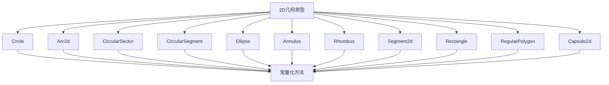

+++
title = "#20732 Constify math/dim2"
date = "2025-08-24T00:00:00"
draft = false
template = "pull_request_page.html"
in_search_index = false

[extra]
current_language = "zh-cn"
available_languages = {"en" = { name = "English", url = "/pull_request/bevy/2025-08/pr-20732-en-20250824" }, "zh-cn" = { name = "中文", url = "/pull_request/bevy/2025-08/pr-20732-zh-cn-20250824" }}
+++

# Constify math/dim2

## 基本信息
- **标题**: Constify math/dim2
- **PR链接**: https://github.com/bevyengine/bevy/pull/20732
- **作者**: exoego
- **状态**: 已合并
- **标签**: D-Trivial, C-Usability, S-Ready-For-Final-Review, A-Math
- **创建时间**: 2025-08-24T02:53:00Z
- **合并时间**: 2025-08-24T20:58:29Z
- **合并者**: alice-i-cecile

## 描述翻译
# 目标

作为 https://github.com/bevyengine/bevy/issues/16124 的一部分

## 解决方案

- 在看起来合理且易于维护的地方进行常量化
   - 许多地方未做改动，这些地方使用了非常量操作，例如 Vec2::length
- 不仅浮点运算，布尔运算和构造函数也被常量化，与现有的其他代码保持一致

## 测试

- 你是否测试了这些更改？如果是，如何测试的？
    - `cargo test --manifest-path /Users/tatsuno/IdeaProjects/bevy/crates/bevy_math/Cargo.toml`
- 是否有任何部分需要更多测试？
- 其他人（审阅者）如何测试你的更改？有什么他们需要了解的特定信息吗？
- 如果相关，你在哪些平台上测试了这些更改，是否有无法测试的重要平台？

---

## 这个拉取请求的故事

这个PR是Bevy数学库持续优化的一部分，专注于将2D几何原型的函数标记为常量函数（const fn）。这项工作源于项目整体的性能优化计划，旨在让尽可能多的计算在编译时完成，从而减少运行时开销。

开发者面临的核心问题是：许多简单的几何计算函数虽然只涉及基本算术运算，但之前没有被标记为const fn，这意味着它们无法在编译时求值。这在需要高性能计算的游戏引擎中是一个明显的优化机会。

解决方案采取了务实的方法：只对那些明显安全且易于维护的函数进行常量化。开发者没有试图强制将所有函数都改为常量，而是明智地跳过了那些涉及非常量操作（如向量长度计算）或复杂数学运算的函数。这种选择性常量化确保了代码的稳定性和可维护性。

从实现细节来看，这个PR主要做了两件事：一是给现有的简单函数添加const关键字，二是重构一些构造函数以避免使用非常量操作。例如，原本使用向量除法（Vec2 / 2.0）的地方被替换为显式的分量除法（Vec2::new(size.x / 2.0, size.y / 2.0)），因为向量除法在Rust中目前还不能作为常量函数使用。

这种改变带来的主要好处是：现在这些函数可以在编译时求值，使得常量几何形状的定义更加高效。例如，开发者现在可以编写`const CIRCLE: Circle = Circle::new(5.0);`，相关的直径计算会在编译时完成，而不是在运行时。

从技术角度来看，这个PR展示了如何在现有代码库中逐步引入常量化优化，而不破坏现有功能。它遵循了Rust常量函数的发展路线，利用了Rust编译器对常量表达式求值能力的持续改进。

值得注意的是，开发者保持了良好的测试实践，确保了这些更改不会引入回归问题。虽然这些更改大部分是语法层面的，但它们为性能敏感的场景提供了实实在在的好处。

## 视觉表示



## 关键文件更改

- `crates/bevy_math/src/primitives/dim2.rs` (+71/-55)

这个文件包含了所有2D几何原型的定义和实现。更改主要包括：

1. 为简单计算方法和构造函数添加const关键字
2. 重构一些方法以避免使用非常量操作

主要更改示例：

```rust
// 之前:
pub fn diameter(&self) -> f32 {
    2.0 * self.radius
}

// 之后:
pub const fn diameter(&self) -> f32 {
    2.0 * self.radius
}
```

```rust
// 之前:
pub fn from_size(size: Vec2) -> Self {
    Self {
        half_size: size / 2.0,
    }
}

// 之后:
pub const fn from_size(size: Vec2) -> Self {
    Self {
        half_size: Vec2::new(size.x / 2.0, size.y / 2.0),
    }
}
```

这些更改使得这些函数可以在编译时求值，提高了性能，同时保持了相同的API接口。

## 延伸阅读

- [Rust常量函数官方文档](https://doc.rust-lang.org/reference/const_eval.html)
- [Bevy数学库介绍](https://bevyengine.org/learn/quick-start/math/)
- [Rust中的编译时计算](https://blog.rust-lang.org/2021/10/21/Rust-1.56.0.html#const-generics)
- [Bevy项目#16124 - 数学库常量化](https://github.com/bevyengine/bevy/issues/16124)