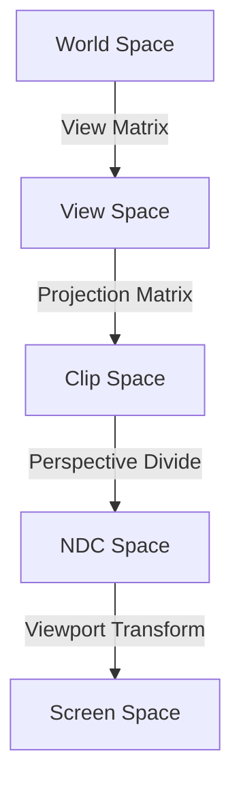

+++
title = "#20740 add clip space docs"
date = "2025-08-26T00:00:00"
draft = false
template = "pull_request_page.html"
in_search_index = true

[taxonomies]
list_display = ["show"]

[extra]
current_language = "en"
available_languages = {"en" = { name = "English", url = "/pull_request/bevy/2025-08/pr-20740-en-20250826" }, "zh-cn" = { name = "中文", url = "/pull_request/bevy/2025-08/pr-20740-zh-cn-20250826" }}
labels = ["C-Docs", "A-Rendering", "D-Straightforward"]
+++

# add clip space docs

## Basic Information
- **Title**: add clip space docs
- **PR Link**: https://github.com/bevyengine/bevy/pull/20740
- **Author**: atlv24
- **Status**: MERGED
- **Labels**: C-Docs, A-Rendering, S-Ready-For-Final-Review, X-Uncontroversial, D-Straightforward
- **Created**: 2025-08-25T00:49:29Z
- **Merged**: 2025-08-26T03:50:43Z
- **Merged By**: alice-i-cecile

## Description Translation
# Objective

- clip space is not documented, but the rest of the spaces used are.

## Solution

- doc it

## Testing

## The Story of This Pull Request

The PR addresses a documentation gap in Bevy's rendering system. While working with coordinate space transformations, the developer noticed that clip space - a fundamental concept in computer graphics - was missing from the existing documentation that covered other coordinate spaces like world space, view space, NDC, and UV space.

Clip space is the coordinate space that exists after applying the projection matrix but before perspective division. It's a homogeneous coordinate space where points are still in 4D (x, y, z, w) format. The perspective divide (dividing by w) transforms these coordinates into Normalized Device Coordinates (NDC).

The solution was straightforward: add clear, concise documentation for clip space in the same WGSL files where other coordinate spaces were already documented. The implementation maintains consistency with existing documentation style and provides essential technical information about the relationship between clip space and NDC space.

This documentation improvement helps developers working with Bevy's rendering pipeline understand the transformation pipeline more completely, which is particularly valuable when writing custom shaders or debugging rendering issues.

## Visual Representation



## Key Files Changed

### `crates/bevy_pbr/src/render/view_transformations.wgsl`
Added documentation for clip space to match the existing documentation pattern for other coordinate spaces.

```wgsl
/// Clip space:
/// This is NDC before the perspective divide, still in homogenous coordinate space.
/// Dividing a clip space point by its w component yields a point in NDC space.
```

### `crates/bevy_render/src/view/view.wgsl`
Added identical documentation for clip space to maintain consistency across the codebase.

```wgsl
/// Clip space:
/// This is NDC before the perspective divide, still in homogenous coordinate space.
/// Dividing a clip space point by its w component yields a point in NDC space.
```

## Further Reading

- [OpenGL Transformation Pipeline](https://www.khronos.org/opengl/wiki/Vertex_Transformation)
- [Coordinate Systems in Computer Graphics](https://learnopengl.com/Getting-started/Coordinate-Systems)
- [Homogeneous Coordinates and Perspective Divide](https://www.tomdalling.com/blog/modern-opengl/explaining-homogenous-coordinates-and-projective-geometry/)