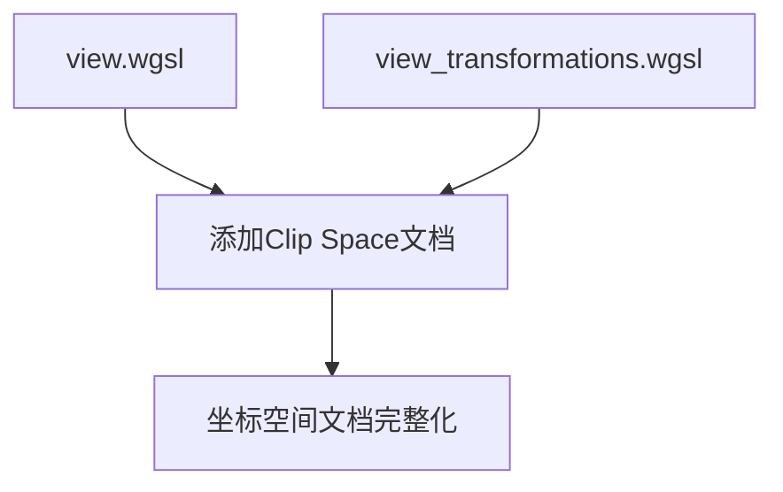

+++
title = "#20740 add clip space docs"
date = "2025-08-26T00:00:00"
draft = false
template = "pull_request_page.html"
in_search_index = false

[extra]
current_language = "zh-cn"
available_languages = {"en" = { name = "English", url = "/pull_request/bevy/2025-08/pr-20740-en-20250826" }, "zh-cn" = { name = "中文", url = "/pull_request/bevy/2025-08/pr-20740-zh-cn-20250826" }}
+++

# add clip space docs

## 基本信息
- **标题**: add clip space docs
- **PR链接**: https://github.com/bevyengine/bevy/pull/20740
- **作者**: atlv24
- **状态**: 已合并
- **标签**: C-Docs, A-Rendering, S-Ready-For-Final-Review, X-Uncontroversial, D-Straightforward
- **创建时间**: 2025-08-25T00:49:29Z
- **合并时间**: 2025-08-26T03:50:43Z
- **合并人**: alice-i-cecile

## 描述翻译
### Objective
- clip space 未被文档化，但使用的其他空间都有文档。

### Solution
- 为其添加文档

### Testing

## 本次PR的故事

这是一个典型的文档完善PR，专注于解决渲染系统中clip space缺乏文档说明的问题。在计算机图形学中，坐标空间转换是核心概念，开发者需要清晰理解各个空间的定义和转换关系才能正确编写着色器代码。

问题出现在Bevy引擎的两个关键着色器文件中：`view_transformations.wgsl`和`view.wgsl`。这两个文件已经包含了world space、view space、NDC space和UV space的详细文档，但唯独缺少了对clip space的说明。这种文档缺失可能导致开发者混淆clip space和NDC space的概念，进而产生错误的坐标转换逻辑。

解决方案非常直接：在两个文件的相同位置添加一致的clip space文档说明。新增的注释明确解释了clip space是进行透视除法(perspective divide)之前的归一化设备坐标(NDC)，仍然处于齐次坐标空间(homogenous coordinate space)。最关键的是说明了将clip space点除以其w分量后会得到NDC空间中的点——这是理解透视投影转换的关键技术细节。

从工程角度看，这个修改虽然简单但非常重要：
1. 保持了文档的一致性，所有坐标空间都有了明确说明
2. 提供了关键的技术细节，帮助开发者正确理解图形管线中的坐标转换
3. 使用专业准确的术语，保持了与现有文档相同的风格和质量

这种文档补充对于渲染引擎特别有价值，因为着色器代码往往难以调试，清晰的文档可以显著降低开发者的认知负担和调试难度。

## 可视化表示



## 关键文件变更

### 1. `crates/bevy_pbr/src/render/view_transformations.wgsl`
**变更描述**: 在坐标空间定义区域添加clip space的文档说明

```wgsl
// 变更前:
/// UV space:
/// 0.0, 0.0 is the top left
/// 1.0, 1.0 is the bottom right

// 变更后:
/// Clip space:
/// This is NDC before the perspective divide, still in homogenous coordinate space.
/// Dividing a clip space point by its w component yields a point in NDC space.

/// UV space:
/// 0.0, 0.0 is the top left
/// 1.0, 1.0 is the bottom right
```

### 2. `crates/bevy_render/src/view/view.wgsl`
**变更描述**: 在View结构体的文档区域添加相同的clip space说明

```wgsl
// 变更前:
///    Perspective projection: 0.0 is inf far away
///    Orthographic projection: 0.0 is far clipping plane

/// UV space:
/// 0.0, 0.0 is the top left
/// 1.0, 1.0 is the bottom right

// 变更后:
///    Perspective projection: 0.0 is inf far away
///    Orthographic projection: 0.0 is far clipping plane

/// Clip space:
/// This is NDC before the perspective divide, still in homogenous coordinate space.
/// Dividing a clip space point by its w component yields a point in NDC space.

/// UV space:
/// 0.0, 0.0 is the top left
/// 1.0, 1.0 is the bottom right
```

## 延伸阅读

- [OpenGL坐标系统](https://learnopengl.com/Getting-started/Coordinate-Systems)
- [WGSL着色语言规范](https://www.w3.org/TR/WGSL/)
- [计算机图形学中的坐标转换](https://scrapbox.io/elaborate/Computer_Graphics_Coordinate_Spaces)
- [Bevy渲染管线文档](https://bevyengine.org/learn/books/introduction/rendering-pipeline)