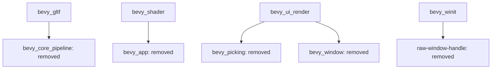

+++
title = "#20743 remove unused deps"
date = "2025-08-25T00:00:00"
draft = false
template = "pull_request_page.html"
in_search_index = true

[taxonomies]
list_display = ["show"]

[extra]
current_language = "en"
available_languages = {"en" = { name = "English", url = "/pull_request/bevy/2025-08/pr-20743-en-20250825" }, "zh-cn" = { name = "中文", url = "/pull_request/bevy/2025-08/pr-20743-zh-cn-20250825" }}
labels = ["D-Trivial", "C-Dependencies"]
+++

# remove unused deps

## Basic Information
- **Title**: remove unused deps
- **PR Link**: https://github.com/bevyengine/bevy/pull/20743
- **Author**: atlv24
- **Status**: MERGED
- **Labels**: D-Trivial, C-Dependencies
- **Created**: 2025-08-25T05:54:44Z
- **Merged**: 2025-08-25T07:35:57Z
- **Merged By**: james7132

## Description Translation
# Objective

- dont have unnecessary dependencies

## Solution

- remove them

## The Story of This Pull Request

This PR addresses a common maintenance task in Rust projects: removing unused dependencies from Cargo.toml files. The developer identified several crates that were declared as dependencies but not actually used in the codebase, creating unnecessary bloat and potential maintenance overhead.

The changes are straightforward but important for maintaining a clean dependency graph. Unused dependencies can:
- Increase compile times unnecessarily
- Bloat the final binary size
- Create potential security concerns from unused code
- Make dependency management more complex

The implementation involved systematically reviewing four different Cargo.toml files across the Bevy codebase and removing dependencies that were no longer needed. This type of cleanup is typically done after refactoring or when features are removed from a project.

The technical approach was simple but effective: identify dependencies that weren't being imported or used in any module, then remove them from the dependency declarations. This required verifying that the removal wouldn't break any functionality by ensuring the crates still compiled successfully.

The impact of these changes is primarily in reducing technical debt. While individual dependency removals might seem minor, collectively they help maintain a cleaner, more efficient codebase. The changes also make the actual dependency relationships more explicit and accurate for developers working on the project.

## Visual Representation



## Key Files Changed

### `crates/bevy_gltf/Cargo.toml`
Removed unused `bevy_core_pipeline` dependency that was likely leftover from previous refactoring.

```toml
# Before:
bevy_core_pipeline = { path = "../bevy_core_pipeline", version = "0.17.0-dev" }

# After:
# (dependency removed entirely)
```

### `crates/bevy_shader/Cargo.toml`
Removed unused `bevy_app` dependency that wasn't being utilized in the shader crate.

```toml
# Before:
bevy_app = { path = "../bevy_app", version = "0.17.0-dev" }

# After:
# (dependency removed entirely)
```

### `crates/bevy_ui_render/Cargo.toml`
Removed multiple unused dependencies and features:
- `bevy_picking` (optional dependency)
- `bevy_window` dependency
- `bevy_ui_picking_backend` feature that depended on the removed picking functionality

```toml
# Before:
bevy_picking = { path = "../bevy_picking", version = "0.17.0-dev", optional = true }
bevy_window = { path = "../bevy_window", version = "0.17.0-dev", default-features = false }

[features]
bevy_ui_picking_backend = ["bevy_picking"]

# After:
# (dependencies and feature removed entirely)
```

### `crates/bevy_winit/Cargo.toml`
Removed unused `raw-window-handle` dependency that was likely replaced by other window handling mechanisms.

```toml
# Before:
raw-window-handle = "0.6"

# After:
# (dependency removed entirely)
```

## Further Reading

- [Cargo Documentation on Dependencies](https://doc.rust-lang.org/cargo/reference/specifying-dependencies.html)
- [Rust Performance Checklist: Dependency Management](https://www.rust-lang.org/learn/performance)
- [Bevy Engine Documentation](https://bevyengine.org/learn/)
- [Managing Rust Dependencies Effectively](https://blog.rust-lang.org/2023/11/16/rust-1.74.0.html)