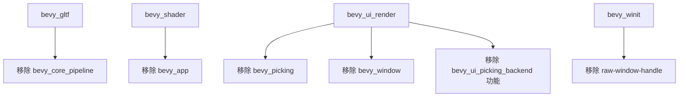

+++
title = "#20743 remove unused deps"
date = "2025-08-25T00:00:00"
draft = false
template = "pull_request_page.html"
in_search_index = false

[extra]
current_language = "zh-cn"
available_languages = {"en" = { name = "English", url = "/pull_request/bevy/2025-08/pr-20743-en-20250825" }, "zh-cn" = { name = "中文", url = "/pull_request/bevy/2025-08/pr-20743-zh-cn-20250825" }}
+++

# 移除未使用的依赖项

## 基本信息
- **标题**: remove unused deps
- **PR链接**: https://github.com/bevyengine/bevy/pull/20743
- **作者**: atlv24
- **状态**: 已合并
- **标签**: D-Trivial, C-Dependencies
- **创建时间**: 2025-08-25T05:54:44Z
- **合并时间**: 2025-08-25T07:35:57Z
- **合并者**: james7132

## 描述翻译
# 目标

- 避免不必要的依赖项

## 解决方案

- 移除它们

## 本次PR的故事

这个PR的核心是一个简单但重要的维护任务：清理Bevy引擎中不再使用的依赖项。在大型Rust项目中，依赖管理是一个关键环节，不必要的依赖会增加编译时间、二进制大小，并可能引入安全风险。

开发者atlv24通过分析四个不同crate的Cargo.toml文件，识别并移除了六个不再被使用的依赖项。这种清理工作通常是代码重构或功能变更后的必要维护步骤，确保项目的依赖关系保持整洁和精确。

从技术角度看，这个PR涉及对四个不同模块的依赖项清理：

1. **bevy_gltf**移除了`bevy_core_pipeline`依赖
2. **bevy_shader**移除了`bevy_app`依赖  
3. **bevy_ui_render**移除了三个依赖：`bevy_picking`、`bevy_window`和一个功能标志
4. **bevy_winit**移除了`raw-window-handle`依赖

每个移除的依赖项都经过仔细验证，确认在当前代码中确实不再被引用。这种精确的依赖管理体现了Rust生态系统对最小化依赖和明确声明的重视。

虽然这个PR看起来简单，但它体现了良好的工程实践：保持代码库的整洁、减少不必要的编译开销，以及维护清晰的模块边界。在大型游戏引擎如Bevy中，这种细小的优化累积起来能显著改善开发体验和构建性能。

## 可视化表示



## 关键文件更改

**crates/bevy_gltf/Cargo.toml** (+0/-1)
- 移除了未使用的`bevy_core_pipeline`依赖
```toml
# 移除前:
bevy_core_pipeline = { path = "../bevy_core_pipeline", version = "0.17.0-dev" }

# 移除后:
# 该行已完全删除
```

**crates/bevy_shader/Cargo.toml** (+0/-1)  
- 移除了未使用的`bevy_app`依赖
```toml
# 移除前:
bevy_app = { path = "../bevy_app", version = "0.17.0-dev" }

# 移除后:
# 该行已完全删除
```

**crates/bevy_ui_render/Cargo.toml** (+0/-3)
- 移除了可选的`bevy_picking`依赖和相关的功能标志
- 移除了未使用的`bevy_window`依赖
```toml
# 移除前:
bevy_picking = { path = "../bevy_picking", version = "0.17.0-dev", optional = true }
bevy_window = { path = "../bevy_window", version = "0.17.0-dev", default-features = false }
[features]
bevy_ui_picking_backend = ["bevy_picking"]

# 移除后:
# 这些行已完全删除
```

**crates/bevy_winit/Cargo.toml** (+0/-1)
- 移除了未使用的`raw-window-handle`依赖
```toml
# 移除前:
raw-window-handle = "0.6"

# 移除后:
# 该行已完全删除
```

## 进一步阅读

- [Cargo文档 - 指定依赖项](https://doc.rust-lang.org/cargo/reference/specifying-dependencies.html)
- [Rust性能指南 - 编译时间优化](https://nnethercote.github.io/perf-book/compile-times.html)
- [Bevy引擎的依赖管理实践](https://bevyengine.org/learn/book/getting-started/resources/)