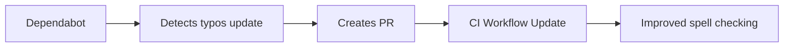

+++
title = "#20745 Bump crate-ci/typos from 1.35.4 to 1.35.5"
date = "2025-08-31T00:00:00"
draft = false
template = "pull_request_page.html"
in_search_index = true

[taxonomies]
list_display = ["show"]

[extra]
current_language = "en"
available_languages = {"en" = { name = "English", url = "/pull_request/bevy/2025-08/pr-20745-en-20250831" }, "zh-cn" = { name = "中文", url = "/pull_request/bevy/2025-08/pr-20745-zh-cn-20250831" }}
labels = ["D-Trivial", "A-Build-System", "C-Dependencies"]
+++

# Bump crate-ci/typos from 1.35.4 to 1.35.5

## Basic Information
- **Title**: Bump crate-ci/typos from 1.35.4 to 1.35.5
- **PR Link**: https://github.com/bevyengine/bevy/pull/20745
- **Author**: app/dependabot
- **Status**: MERGED
- **Labels**: D-Trivial, A-Build-System, C-Dependencies, S-Ready-For-Final-Review
- **Created**: 2025-08-25T10:10:23Z
- **Merged**: 2025-08-31T07:57:35Z
- **Merged By**: mockersf

## Description Translation
Bumps [crate-ci/typos](https://github.com/crate-ci/typos) from 1.35.4 to 1.35.5.
<details>
<summary>Release notes</summary>
<p><em>Sourced from <a href="https://github.com/crate-ci/typos/releases">crate-ci/typos's releases</a>.</em></p>
<blockquote>
<h2>v1.35.5</h2>
<h2>[1.35.5] - 2025-08-18</h2>
<h3>Fixes</h3>
<ul>
<li>Fix typo in correction to <code>accidently</code></li>
<li>Fix typo in correction to <code>dynamincally</code></li>
<li>Fix typo in correction to <code>interruptability</code></li>
<li>Fix typo in correction to <code>interruptability</code></li>
<li>Fix typo in correction to <code>messager</code></li>
<li>Fix typo in correction to <code>preferables</code></li>
<li>Fix typo in correction to <code>producibles</code></li>
<li>Fix typo in correction to <code>restauranteur</code></li>
<li>Fix typo in correction to <code>restauranteurs</code></li>
<li>Fix typo in correction to <code>searialize</code></li>
<li>Fix typo in correction to <code>somethin</code></li>
<li>Fix typo in correction to <code>unaccessible</code></li>
<li>Fix typo in correction to <code>unnesessarily</code></li>
</ul>
</blockquote>
</details>
<details>
<summary>Changelog</summary>
<p><em>Sourced from <a href="https://github.com/crate-ci/typos/blob/master/CHANGELOG.md">crate-ci/typos's changelog</a>.</em></p>
<blockquote>
<h2>[1.35.5] - 2025-08-18</h2>
<h3>Fixes</h3>
<ul>
<li>Fix typo in correction to <code>accidently</code></li>
<li>Fix typo in correction to <code>dynamincally</code></li>
<li>Fix typo in correction to <code>interruptability</code></li>
<li>Fix typo in correction to <code>interruptability</code></li>
<li>Fix typo in correction to <code>messager</code></li>
<li>Fix typo in correction to <code>preferables</code></li>
<li>Fix typo in correction to <code>producibles</code></li>
<li>Fix typo in correction to <code>restauranteur</code></li>
<li>Fix typo in correction to <code>restauranteurs</code></li>
<li>Fix typo in correction to <code>searialize</code></li>
<li>Fix typo in correction to <code>somethin</code></li>
<li>Fix typo in correction to <code>unaccessible</code></li>
<li>Fix typo in correction to <code>unnesessarily</code></li>
</ul>
</blockquote>
</details>
<details>
<summary>Commits</summary>
<ul>
<li><a href="https://github.com/crate-ci/typos/commit/a4c3e43aea0a9e9b9e6578d2731ebd9a27e8f6cd"><code>a4c3e43</code></a> chore: Release</li>
<li><a href="https://github.com/crate-ci/typos/commit/bc2ad8a213e892ff2ff64a581486c59e38ae8293"><code>bc2ad8a</code></a> docs: Ipdate changelog</li>
<li><a href="https://github.com/crate-ci/typos/commit/d5601e99dfabb0c53634697e9453697623f904a5"><code>d5601e9</code></a> chore: Release</li>
<li><a href="https://github.com/crate-ci/typos/commit/3f713a7ceee8c8ae1d8384a703603afa6b398320"><code>3f713a7</code></a> Merge pull request <a href="https://redirect.github.com/crate-ci/typos/issues/1358">#1358</a> from epage/fixes</li>
<li><a href="https://github.com/crate-ci/typos/commit/3c23c6ba04275c5063345192efb4d7f3e4b249a0"><code>3c23c6b</code></a> fix(dict): Remove incorrect corrections</li>
<li>See full diff in <a href="https://github.com/crate-ci/typos/compare/v1.35.4...v1.35.5">compare view</a></li>
</ul>
</details>
<br />


[](https://docs.github.com/en/github/managing-security-vulnerabilities/about-dependabot-security-updates#about-compatibility-scores)

Dependabot will resolve any conflicts with this PR as long as you don't alter it yourself. You can also trigger a rebase manually by commenting `@dependabot rebase`.

[//]: # (dependabot-automerge-start)
[//]: # (dependabot-automerge-end)

---

<details>
<summary>Dependabot commands and options</summary>
<br />

You can trigger Dependabot actions by commenting on this PR:
- `@dependabot rebase` will rebase this PR
- `@dependabot recreate` will recreate this PR, overwriting any edits that have been made to it
- `@dependabot merge` will merge this PR after your CI passes on it
- `@dependabot squash and merge` will squash and merge this PR after your CI passes on it
- `@dependabot cancel merge` will cancel a previously requested merge and block automerging
- `@dependabot reopen` will reopen this PR if it is closed
- `@dependabot close` will close this PR and stop Dependabot recreating it. You can achieve the same result by closing it manually
- `@dependabot show <dependency name> ignore conditions` will show all of the ignore conditions of the specified dependency
- `@dependabot ignore this major version` will close this PR and stop Dependabot creating any more for this major version (unless you reopen the PR or upgrade to it yourself)
- `@dependabot ignore this minor version` will close this PR and stop Dependabot creating any more for this minor version (unless you reopen the PR or upgrade to it yourself)
- `@dependabot ignore this dependency` will close this PR and stop Dependabot creating any more for this dependency (unless you reopen the PR or upgrade to it yourself)


</details>

## The Story of This Pull Request

This PR represents a routine dependency update in the Bevy engine's CI pipeline. The core issue was straightforward: the crate-ci/typos GitHub Action used for spell checking needed to be updated from version 1.35.4 to 1.35.5 to incorporate recent bug fixes in the typos tool.

The typos tool is integrated into Bevy's CI workflow to catch spelling mistakes in code and documentation. Version 1.35.5 of crate-ci/typos contained important fixes for several incorrect corrections in the tool's dictionary. These fixes addressed issues with suggested corrections for words like "accidently," "dynamincally," and "interruptability," among others. Without this update, the CI system could potentially suggest wrong corrections or miss actual typos.

The solution approach was minimal and targeted: update the version tag in the GitHub Actions workflow file. This is a standard maintenance task that ensures the project benefits from the latest improvements in its dependencies. The change was automatically generated by Dependabot, GitHub's dependency management service, which monitors project dependencies and creates PRs when updates are available.

The implementation involved a single-line change in the CI configuration file. The update from v1.35.4 to v1.35.5 ensures that the spell checking step in Bevy's CI pipeline uses the most accurate version of the typos tool available. This maintains the quality of the codebase by catching legitimate spelling errors while reducing false positives from incorrect corrections.

From a technical perspective, this change demonstrates the importance of keeping development tools updated, even for seemingly minor dependencies. The typos tool plays a crucial role in maintaining code quality and documentation standards, and using the latest version ensures it operates with the highest accuracy.

The impact of this change is subtle but meaningful. It improves the accuracy of spell checking in the CI pipeline without requiring any changes to the actual Bevy codebase. This helps maintain professional standards in documentation and comments while reducing noise from incorrect spell check suggestions.

## Visual Representation



## Key Files Changed

- `.github/workflows/ci.yml` (+1/-1)

This file contains the GitHub Actions workflow configuration for Bevy's continuous integration pipeline. The change updates the version of the crate-ci/typos action used in the spell checking job.

**Code Change:**
```yaml
# File: .github/workflows/ci.yml
# Before:
-        uses: crate-ci/typos@v1.35.4

# After:
+        uses: crate-ci/typos@v1.35.5
```

This single-line change updates the typos checker from version 1.35.4 to 1.35.5, ensuring the CI pipeline uses the latest version with improved correction accuracy.

## Further Reading

- [GitHub Actions documentation](https://docs.github.com/en/actions)
- [crate-ci/typos GitHub repository](https://github.com/crate-ci/typos)
- [Dependabot documentation](https://docs.github.com/en/code-security/dependabot)
- [Semantic Versioning](https://semver.org/)