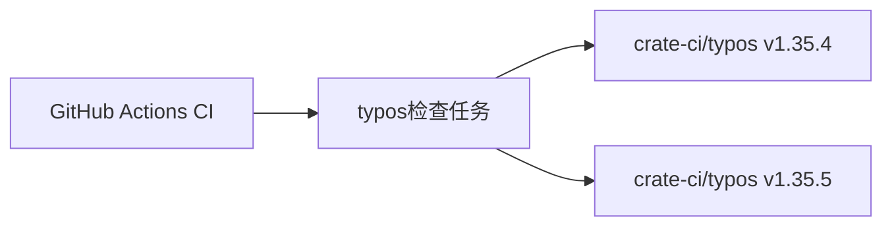

+++
title = "#20745 Bump crate-ci/typos from 1.35.4 to 1.35.5"
date = "2025-08-31T00:00:00"
draft = false
template = "pull_request_page.html"
in_search_index = false

[extra]
current_language = "zh-cn"
available_languages = {"en" = { name = "English", url = "/pull_request/bevy/2025-08/pr-20745-en-20250831" }, "zh-cn" = { name = "中文", url = "/pull_request/bevy/2025-08/pr-20745-zh-cn-20250831" }}
+++

# Bump crate-ci/typos from 1.35.4 to 1.35.5

## 基本信息
- **标题**: Bump crate-ci/typos from 1.35.4 to 1.35.5
- **PR链接**: https://github.com/bevyengine/bevy/pull/20745
- **作者**: app/dependabot
- **状态**: 已合并
- **标签**: D-Trivial, A-Build-System, C-Dependencies, S-Ready-For-Final-Review
- **创建时间**: 2025-08-25T10:10:23Z
- **合并时间**: 2025-08-31T07:57:35Z
- **合并者**: mockersf

## 描述翻译
将 crate-ci/typos 从 1.35.4 升级到 1.35.5。
<details>
<summary>发布说明</summary>
<p><em>来源自 <a href="https://github.com/crate-ci/typos/releases">crate-ci/typos 的发布页面</a>。</em></p>
<blockquote>
<h2>v1.35.5</h2>
<h2>[1.35.5] - 2025-08-18</h2>
<h3>修复</h3>
<ul>
<li>修复了对 <code>accidently</code> 的更正中的拼写错误</li>
<li>修复了对 <code>dynamincally</code> 的更正中的拼写错误</li>
<li>修复了对 <code>interruptability</code> 的更正中的拼写错误</li>
<li>修复了对 <code>interruptability</code> 的更正中的拼写错误</li>
<li>修复了对 <code>messager</code> 的更正中的拼写错误</li>
<li>修复了对 <code>preferables</code> 的更正中的拼写错误</li>
<li>修复了对 <code>producibles</code> 的更正中的拼写错误</li>
<li>修复了对 <code>restauranteur</code> 的更正中的拼写错误</li>
<li>修复了对 <code>restauranteurs</code> 的更正中的拼写错误</li>
<li>修复了对 <code>searialize</code> 的更正中的拼写错误</li>
<li>修复了对 <code>somethin</code> 的更正中的拼写错误</li>
<li>修复了对 <code>unaccessible</code> 的更正中的拼写错误</li>
<li>修复了对 <code>unnesessarily</code> 的更正中的拼写错误</li>
</ul>
</blockquote>
</details>
<details>
<summary>更新日志</summary>
<p><em>来源自 <a href="https://github.com/crate-ci/typos/blob/master/CHANGELOG.md">crate-ci/typos 的更新日志</a>。</em></p>
<blockquote>
<h2>[1.35.5] - 2025-08-18</h2>
<h3>修复</h3>
<ul>
<li>修复了对 <code>accidently</code> 的更正中的拼写错误</li>
<li>修复了对 <code>dynamincally</code> 的更正中的拼写错误</li>
<li>修复了对 <code>interruptability</code> 的更正中的拼写错误</li>
<li>修复了对 <code>interruptability</code> 的更正中的拼写错误</li>
<li>修复了对 <code>messager</code> 的更正中的拼写错误</li>
<li>修复了对 <code>preferables</code> 的更正中的拼写错误</li>
<li>修复了对 <code>producibles</code> 的更正中的拼写错误</li>
<li>修复了对 <code>restauranteur</code> 的更正中的拼写错误</li>
<li>修复了对 <code>restauranteurs</code> 的更正中的拼写错误</li>
<li>修复了对 <code>searialize</code> 的更正中的拼写错误</li>
<li>修复了对 <code>somethin</code> 的更正中的拼写错误</li>
<li>修复了对 <code>unaccessible</code> 的更正中的拼写错误</li>
<li>修复了对 <code>unnesessarily</code> 的更正中的拼写错误</li>
</ul>
</blockquote>
</details>
<details>
<summary>提交</summary>
<ul>
<li><a href="https://github.com/crate-ci/typos/commit/a4c3e43aea0a9e9b9e6578d2731ebd9a27e8f6cd"><code>a4c3e43</code></a> chore: 发布</li>
<li><a href="https://github.com/crate-ci/typos/commit/bc2ad8a213e892ff2ff64a581486c59e38ae8293"><code>bc2ad8a</code></a> docs: 更新更新日志</li>
<li><a href="https://github.com/crate-ci/typos/commit/d5601e99dfabb0c53634697e9453697623f904a5"><code>d5601e9</code></a> chore: 发布</li>
<li><a href="https://github.com/crate-ci/typos/commit/3f713a7ceee8c8ae1d8384a703603afa6b398320"><code>3f713a7</code></a> 合并拉取请求 <a href="https://redirect.github.com/crate-ci/typos/issues/1358">#1358</a> from epage/fixes</li>
<li><a href="https://github.com/crate-ci/typos/commit/3c23c6ba04275c5063345192efb4d7f3e4b249a0"><code>3c23c6b</code></a> fix(dict): 移除不正确的更正</li>
<li>查看完整差异 <a href="https://github.com/crate-ci/typos/compare/v1.35.4...v1.35.5">比较视图</a></li>
</ul>
</details>
<br />


[](https://docs.github.com/en/github/managing-security-vulnerabilities/about-dependabot-security-updates#about-compatibility-scores)

只要你没有手动修改，Dependabot 会自动解决此 PR 中的任何冲突。你也可以通过评论 `@dependabot rebase` 手动触发 rebase。

[//]: # (dependabot-automerge-start)
[//]: # (dependabot-automerge-end)

---

<details>
<summary>Dependabot 命令和选项</summary>
<br />

你可以通过在此 PR 上评论来触发 Dependabot 操作：
- `@dependabot rebase` 会 rebase 此 PR
- `@dependabot recreate` 会重新创建此 PR，覆盖已对其进行的任何编辑
- `@dependabot merge` 会在 CI 通过后合并此 PR
- `@dependabot squash and merge` 会在 CI 通过后 squash 并合并此 PR
- `@dependabot cancel merge` 会取消先前请求的合并并阻止自动合并
- `@dependabot reopen` 会重新打开此 PR（如果已关闭）
- `@dependabot close` 会关闭此 PR 并阻止 Dependabot 重新创建它。你可以通过手动关闭它来实现相同的结果
- `@dependabot show <dependency name> ignore conditions` 会显示指定依赖项的所有忽略条件
- `@dependabot ignore this major version` 会关闭此 PR 并阻止 Dependabot 为此主要版本创建更多 PR（除非你重新打开 PR 或自行升级）
- `@dependabot ignore this minor version` 会关闭此 PR 并阻止 Dependabot 为此次要版本创建更多 PR（除非你重新打开 PR 或自行升级）
- `@dependabot ignore this dependency` 会关闭此 PR 并阻止 Dependabot 为此依赖项创建更多 PR（除非你重新打开 PR 或自行升级）


</details>

## 这个拉取请求的故事

这个PR是一个典型的依赖管理更新，由Dependabot自动生成。在软件开发中，保持依赖项的最新状态是维护代码库健康的重要实践。crate-ci/typos是一个用于检测代码中拼写错误的工具，Bevy项目将其集成在CI工作流中，以确保代码质量和文档的专业性。

此次更新从版本1.35.4升级到1.35.5，主要修复了字典中的多个拼写校正错误。这些修复包括对常见拼写错误如"accidently"、"dynamincally"、"interruptability"等的更正准确性提升。虽然这些更改看似微小，但对于一个旨在检测拼写错误的工具来说，确保自身字典的准确性至关重要。

Dependabot作为自动化依赖管理工具，定期检查项目依赖项的最新版本，并在发现更新时自动创建PR。这种自动化流程减少了手动跟踪依赖项更新的负担，确保了项目能够及时获得安全补丁和功能改进。

此次更新没有引入破坏性变更，兼容性评分为高分，表明升级是安全的。维护团队在验证后迅速合并了这个PR，体现了对依赖项管理的重视和高效的工作流程。

## 视觉表示



## 关键文件更改

- `.github/workflows/ci.yml` (+1/-1)

这个文件包含了Bevy项目的GitHub Actions CI工作流配置。更改很简单，只是更新了typos工具的版本号：

```yaml
# File: .github/workflows/ci.yml
# Before:
      - name: Check for typos
        uses: crate-ci/typos@v1.35.4

# After:
      - name: Check for typos
        uses: crate-ci/typos@v1.35.5
```

这个更改确保了CI流水线使用最新版本的typos工具，从而受益于其拼写检查准确性的改进。

## 延伸阅读

- [Dependabot文档](https://docs.github.com/en/code-security/dependabot) - 了解GitHub的依赖项管理自动化工具
- [crate-ci/typos项目](https://github.com/crate-ci/typos) - 拼写检查工具的项目页面
- [GitHub Actions工作流语法](https://docs.github.com/en/actions/using-workflows/workflow-syntax-for-github-actions) - 学习如何配置CI/CD流水线

# 完整代码差异
```diff
diff --git a/.github/workflows/ci.yml b/.github/workflows/ci.yml
index 93f2bdb895d49..95b8e75ed0bb1 100644
--- a/.github/workflows/ci.yml
+++ b/.github/workflows/ci.yml
@@ -340,7 +340,7 @@ jobs:
     steps:
       - uses: actions/checkout@v5
       - name: Check for typos
-        uses: crate-ci/typos@v1.35.4
+        uses: crate-ci/typos@v1.35.5
       - name: Typos info
         if: failure()
         run: |
```