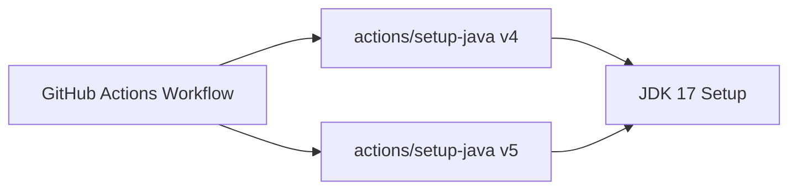

+++
title = "#20749 Bump actions/setup-java from 4 to 5"
date = "2025-08-31T00:00:00"
draft = false
template = "pull_request_page.html"
in_search_index = true

[taxonomies]
list_display = ["show"]

[extra]
current_language = "en"
available_languages = {"en" = { name = "English", url = "/pull_request/bevy/2025-08/pr-20749-en-20250831" }, "zh-cn" = { name = "中文", url = "/pull_request/bevy/2025-08/pr-20749-zh-cn-20250831" }}
labels = ["D-Trivial", "A-Build-System", "C-Dependencies"]
+++

# Bump actions/setup-java from 4 to 5

## Basic Information
- **Title**: Bump actions/setup-java from 4 to 5
- **PR Link**: https://github.com/bevyengine/bevy/pull/20749
- **Author**: app/dependabot
- **Status**: MERGED
- **Labels**: D-Trivial, A-Build-System, C-Dependencies, S-Ready-For-Final-Review
- **Created**: 2025-08-25T13:33:37Z
- **Merged**: 2025-08-31T07:57:52Z
- **Merged By**: mockersf

## Description Translation
Bumps [actions/setup-java](https://github.com/actions/setup-java) from 4 to 5.
<details>
<summary>Release notes</summary>
<p><em>Sourced from <a href="https://github.com/actions/setup-java/releases">actions/setup-java's releases</a>.</em></p>
<blockquote>
<h2>v5.0.0</h2>
<h2>What's Changed</h2>
<h3>Breaking Changes</h3>
<ul>
<li>Upgrade to node 24 by <a href="https://github.com/salmanmkc"><code>@​salmanmkc</code></a> in <a href="https://redirect.github.com/actions/setup-java/pull/888">actions/setup-java#888</a></li>
</ul>
<p>Make sure your runner is updated to this version or newer to use this release. v2.327.1 <a href="https://github.com/actions/runner/releases/tag/v2.327.1">Release Notes</a></p>
<h3>Dependency Upgrades</h3>
<ul>
<li>Upgrade Publish Immutable Action by <a href="https://github.com/HarithaVattikuti"><code>@​HarithaVattikuti</code></a> in <a href="https://redirect.github.com/actions/setup-java/pull/798">actions/setup-java#798</a></li>
<li>Upgrade eslint-plugin-jest from 27.9.0 to 28.11.0 by <a href="https://github.com/dependabot"><code>@​dependabot</code></a>[bot] in <a href="https://redirect.github.com/actions/setup-java/pull/730">actions/setup-java#730</a></li>
<li>Upgrade undici from 5.28.5 to 5.29.0 by <a href="https://github.com/dependabot"><code>@​dependabot</code></a>[bot] in <a href="https://redirect.github.com/actions/setup-java/pull/833">actions/setup-java#833</a></li>
<li>Upgrade form-data to bring in fix for critical vulnerability by <a href="https://github.com/gowridurgad"><code>@​gowridurgad</code></a> in <a href="https://redirect.github.com/actions/setup-java/pull/887">actions/setup-java#887</a></li>
<li>Upgrade actions/checkout from 4 to 5 by <a href="https://github.com/dependabot"><code>@​dependabot</code></a>[bot] in <a href="https://redirect.github.com/actions/setup-java/pull/896">actions/setup-java#896</a></li>
</ul>
<h3>Bug Fixes</h3>
<ul>
<li>Prevent default installation of JetBrains pre-releases by <a href="https://github.com/priyagupta108"><code>@​priyagupta108</code></a> in <a href="https://redirect.github.com/actions/setup-java/pull/859">actions/setup-java#859</a></li>
<li>Improve Error Handling for Setup-Java Action to Help Debug Intermittent Failures by <a href="https://github.com/gowridurgad"><code>@​gowridurgad</code></a> in <a href="https://redirect.github.com/actions/setup-java/pull/848">actions/setup-java#848</a></li>
</ul>
<h2>New Contributors</h2>
<ul>
<li><a href="https://github.com/gowridurgad"><code>@​gowridurgad</code></a> made their first contribution in <a href="https://redirect.github.com/actions/setup-java/pull/848">actions/setup-java#848</a></li>
<li><a href="https://github.com/salmanmkc"><code>@​salmanmkc</code></a> made their first contribution in <a href="https://redirect.github.com/actions/setup-java/pull/888">actions/setup-java#888</a></li>
</ul>
<p><strong>Full Changelog</strong>: <a href="https://github.com/actions/setup-java/compare/v4...v5.0.0">https://github.com/actions/setup-java/compare/v4...v5.0.0</a></p>
<h2>v4.7.1</h2>
<h2>What's Changed</h2>
<h3>Documentation changes</h3>
<ul>
<li>Add Documentation to Recommend Using GraalVM JDK 17 Version to 17.0.12 to Align with GFTC License Terms by <a href="https://github.com/aparnajyothi-y"><code>@​aparnajyothi-y</code></a> in <a href="https://redirect.github.com/actions/setup-java/pull/704">actions/setup-java#704</a></li>
<li>Remove duplicated GraalVM section in documentation by <a href="https://github.com/Marcono1234"><code>@​Marcono1234</code></a> in <a href="https://redirect.github.com/actions/setup-java/pull/716">actions/setup-java#716</a></li>
</ul>
<h3>Dependency updates:</h3>
<ul>
<li>Upgrade <code>@​action/cache</code> from 4.0.0 to 4.0.2 by <a href="https://github.com/aparnajyothi-y"><code>@​aparnajyothi-y</code></a> in <a href="https://redirect.github.com/actions/setup-java/pull/766">actions/setup-java#766</a></li>
<li>Upgrade <code>@​actions/glob</code> from 0.4.0 to 0.5.0 by <a href="https://github.com/dependabot"><code>@​dependabot</code></a> in <a href="https://redirect.github.com/actions/setup-java/pull/744">actions/setup-java#744</a></li>
<li>Upgrade ts-jest from 29.1.2 to 29.2.5 by <a href="https://github.com/dependabot"><code>@​dependabot</code></a> in <a href="https://redirect.github.com/actions/setup-java/pull/743">actions/setup-java#743</a></li>
<li>Upgrade <code>@​action/cache</code> to 4.0.3 by <a href="https://github.com/aparnajyothi-y"><code>@​aparnajyothi-y</code></a> in <a href="https://redirect.github.com/actions/setup-java/pull/773">actions/setup-java#773</a></li>
</ul>
<p><strong>Full Changelog</strong>: <a href="https://github.com/actions/setup-java/compare/v4...v4.7.1">https://github.com/actions/setup-java/compare/v4...v4.7.1</a></p>
<h2>v4.7.0</h2>
<h2>What's Changed</h2>
<ul>
<li>Configure Dependabot settings by <a href="https://github.com/HarithaVattikuti"><code>@​HarithaVattikuti</code></a> in <a href="https://redirect.github.com/actions/setup-java/pull/722">actions/setup-java#722</a></li>
<li>README Update: Added a permissions section by <a href="https://github.com/benwells"><code>@​benwells</code></a> in <a href="https://redirect.github.com/actions/setup-java/pull/723">actions/setup-java#723</a></li>
<li>Upgrade <code>cache</code> from version 3.2.4 to 4.0.0 by <a href="https://github.com/aparnajyothi-y"><code>@​aparnajyothi-y</code></a> in <a href="https://redirect.github.com/actions/setup-java/pull/724">actions/setup-java#724</a></li>
<li>Upgrade <code>@actions/http-client</code> from 2.2.1 to 2.2.3 by <a href="https://github.com/dependabot"><code>@​dependabot</code></a> in <a href="https://redirect.github.com/actions/setup-java/pull/728">actions/setup-java#728</a></li>
<li>Upgrade <code>actions/publish-immutable-action</code> from 0.0.3 to 0.0.4 by <a href="https://github.com/dependabot"><code>@​dependabot</code></a> in <a href="https://redirect.github.com/actions/setup-java/pull/727">actions/setup-java#727</a></li>
<li>Upgrade <code>@types/jest</code> from 29.5.12 to 29.5.14 by <a href="https://github.com/dependabot"><code>@​dependabot</code></a> in <a href="https://redirect.github.com/actions/setup-java/pull/729">actions/setup-java#729</a></li>
</ul>
<!-- raw HTML omitted -->
</blockquote>
<p>... (truncated)</p>
</details>
<details>
<summary>Commits</summary>
<ul>
<li><a href="https://github.com/actions/setup-java/commit/dded0888837ed1f317902acf8a20df0ad188d165"><code>dded088</code></a> Bump actions/checkout from 4 to 5 (<a href="https://redirect.github.com/actions/setup-java/issues/896">#896</a>)</li>
<li><a href="https://github.com/actions/setup-java/commit/0913e9a06eb8b69c62db76aa61f580c2b3a5b4e0"><code>0913e9a</code></a> Upgrade to node 24 (<a href="https://redirect.github.com/actions/setup-java/issues/888">#888</a>)</li>
<li><a href="https://github.com/actions/setup-java/commit/e9343db97e09d87a3c50e544105d99fe912c204b"><code>e9343db</code></a> Bumps form-data (<a href="https://redirect.github.com/actions/setup-java/issues/887">#887</a>)</li>
<li><a href="https://github.com/actions/setup-java/commit/ae2b61dbc685e60e4427b2e8ed4f0135c6ea8597"><code>ae2b61d</code></a> Bump undici from 5.28.5 to 5.29.0 (<a href="https://redirect.github.com/actions/setup-java/issues/833">#833</a>)</li>
<li><a href="https://github.com/actions/setup-java/commit/c190c18febcf6c040d80b10ea201a05a2c320263"><code>c190c18</code></a> Bump eslint-plugin-jest from 27.9.0 to 29.0.1 (<a href="https://redirect.github.com/actions/setup-java/issues/730">#730</a>)</li>
<li><a href="https://github.com/actions/setup-java/commit/67aec007b3fcabe15ca665bfccc1e255dd52e30d"><code>67aec00</code></a> Fix: prevent default installation of JetBrains pre-releases (<a href="https://redirect.github.com/actions/setup-java/issues/859">#859</a>)</li>
<li><a href="https://github.com/actions/setup-java/commit/ebb356cc4e59bcf94f518203228485f5d40e4b58"><code>ebb356c</code></a> Improve Error Handling for Setup-Java Action to Help Debug Intermittent Failu...</li>
<li><a href="https://github.com/actions/setup-java/commit/f4f1212c880fdec8162ea9a6493f4495191887b4"><code>f4f1212</code></a> Update publish-immutable-actions.yml (<a href="https://redirect.github.com/actions/setup-java/issues/798">#798</a>)</li>
<li>See full diff in <a href="https://github.com/actions/setup-java/compare/v4...v5">compare view</a></li>
</ul>
</details>
<br />


[](https://docs.github.com/en/github/managing-security-vulnerabilities/about-dependabot-security-updates#about-compatibility-scores)

Dependabot will resolve any conflicts with this PR as long as you don't alter it yourself. You can also trigger a rebase manually by commenting `@dependabot rebase`.

[//]: # (dependabot-automerge-start)
[//]: # (dependabot-automerge-end)

---

<details>
<summary>Dependabot commands and options</summary>
<br />

You can trigger Dependabot actions by commenting on this PR:
- `@dependabot rebase` will rebase this PR
- `@dependabot recreate` will recreate this PR, overwriting any edits that have been made to it
- `@dependabot merge` will merge this PR after your CI passes on it
- `@dependabot squash and merge` will squash and merge this PR after your CI passes on it
- `@dependabot cancel merge` will cancel a previously requested merge and block automerging
- `@dependabot reopen` will reopen this PR if it is closed
- `@dependabot close` will close this PR and stop Dependabot recreating it. You can achieve the same result by closing it manually
- `@dependabot show <dependency name> ignore conditions` will show all of the ignore conditions of the specified dependency
- `@dependabot ignore this major version` will close this PR and stop Dependabot creating any more for this major version (unless you reopen the PR or upgrade to it yourself)
- `@dependabot ignore this minor version` will close this PR and stop Dependabot creating any more for this minor version (unless you reopen the PR or upgrade to it yourself)
- `@dependabot ignore this dependency` will close this PR and stop Dependabot creating any more for this dependency (unless you reopen the PR or upgrade to it yourself)


</details>

## The Story of This Pull Request

This PR represents a routine but important maintenance update to Bevy's GitHub Actions workflow. The change was automatically generated by Dependabot, GitHub's dependency management service, which monitors project dependencies for updates and security fixes.

The core issue being addressed is keeping Bevy's CI infrastructure up-to-date with the latest version of the `actions/setup-java` GitHub Action. This action is used in the validation workflow to set up Java JDK 17 for testing purposes. While this might seem like a minor dependency update, it follows established best practices for maintaining secure and efficient CI/CD pipelines.

The update from v4 to v5 of `actions/setup-java` includes several important changes. The most significant is the upgrade to Node.js 24 as the runtime environment, which requires GitHub Actions runners to be updated to version 2.327.1 or newer. This Node.js upgrade provides performance improvements and security updates. The new version also includes critical security fixes, particularly for the form-data dependency which had a vulnerability patched in v5.

Other improvements in v5 include better error handling for debugging intermittent failures, prevention of default installation of JetBrains pre-releases, and various dependency updates that enhance stability and security. These changes ensure that Bevy's Java setup in CI remains reliable and secure.

The implementation approach was straightforward - a single-line change updating the action version from `v4` to `v5` in the workflow configuration file. This minimal change follows the principle of keeping dependencies current while maintaining backward compatibility where possible. The compatibility score indicated by Dependabot suggests high compatibility between versions, reducing the risk of breaking changes.

From a technical perspective, this update demonstrates the importance of maintaining CI/CD tooling. While the change itself is simple, it contributes to the overall health and security of the development pipeline. The use of Dependabot for automated dependency updates represents modern DevOps practices where routine maintenance tasks are automated, allowing developers to focus on core functionality.

The impact of this change is primarily operational rather than functional. Bevy's validation workflows will continue to set up Java JDK 17 exactly as before, but with improved underlying security, better error reporting, and modern runtime support. This helps ensure that Java-dependent tests and tools in the Bevy ecosystem run on a well-maintained and secure foundation.

## Visual Representation



## Key Files Changed

- `.github/workflows/validation-jobs.yml` (+1/-1)

This file contains GitHub Actions workflow definitions for validation jobs. The change updates the version of the `actions/setup-java` action used in the Java setup step.

**Code Change:**
```yaml
# File: .github/workflows/validation-jobs.yml
# Before:
- name: Set up JDK 17
  uses: actions/setup-java@v4
  with:
    java-version: "17"
    distribution: "temurin"

# After:
- name: Set up JDK 17
  uses: actions/setup-java@v5
  with:
    java-version: "17"
    distribution: "temurin"
```

The change is minimal but significant - it updates the action version from v4 to v5 while preserving all configuration parameters. This ensures that Java JDK 17 continues to be set up using the Temurin distribution, maintaining consistency in the development environment while benefiting from the improvements in the newer action version.

## Further Reading

- [actions/setup-java GitHub Repository](https://github.com/actions/setup-java)
- [GitHub Actions Documentation](https://docs.github.com/en/actions)
- [Dependabot Documentation](https://docs.github.com/en/code-security/dependabot)
- [Node.js 24 Release Notes](https://nodejs.org/en/blog/release/v24.0.0)

## Full Code Diff
```diff
diff --git a/.github/workflows/validation-jobs.yml b/.github/workflows/validation-jobs.yml
index 3e85860526561..333bf9824d642 100644
--- a/.github/workflows/validation-jobs.yml
+++ b/.github/workflows/validation-jobs.yml
@@ -64,7 +64,7 @@ jobs:
       - uses: dtolnay/rust-toolchain@stable
 
       - name: Set up JDK 17
-        uses: actions/setup-java@v4
+        uses: actions/setup-java@v5
         with:
           java-version: "17"
           distribution: "temurin"
```