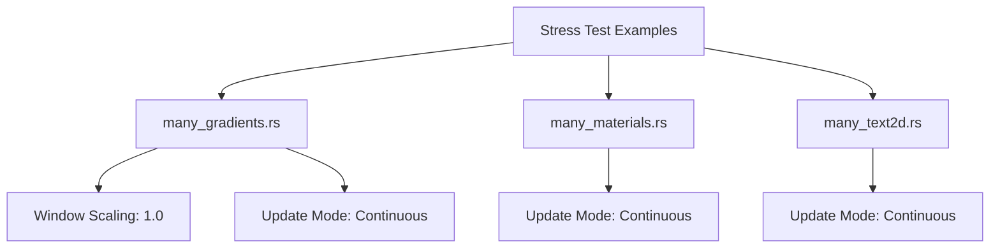

+++
title = "#20751 update some stress tests to use the common setup"
date = "2025-08-25T00:00:00"
draft = false
template = "pull_request_page.html"
in_search_index = true

[taxonomies]
list_display = ["show"]

[extra]
current_language = "en"
available_languages = {"en" = { name = "English", url = "/pull_request/bevy/2025-08/pr-20751-en-20250825" }, "zh-cn" = { name = "中文", url = "/pull_request/bevy/2025-08/pr-20751-zh-cn-20250825" }}
labels = ["D-Trivial", "C-Examples"]
+++

# Title

## Basic Information
- **Title**: update some stress tests to use the common setup
- **PR Link**: https://github.com/bevyengine/bevy/pull/20751
- **Author**: mockersf
- **Status**: MERGED
- **Labels**: D-Trivial, C-Examples
- **Created**: 2025-08-25T15:27:58Z
- **Merged**: 2025-08-25T21:18:22Z
- **Merged By**: mockersf

## Description Translation

# Objective

- `many_gradients`, `many_materials` and `many_text2d` don't always run at their full potential

## Solution

- Use the same scale factor as other stress tests.
- Use the same winit settings as other stress tests.

## The Story of This Pull Request

This PR addresses a consistency issue in Bevy's stress test examples. The `many_gradients`, `many_materials`, and `many_text2d` examples were not performing at their maximum capacity because they lacked standardized configuration settings used by other stress tests in the codebase.

The core problem was that these three examples had inconsistent window scaling and update behavior compared to other stress tests. Without a fixed scale factor of 1.0, the tests could experience variable performance depending on the display's scaling settings. Additionally, the default winit update mode (which pauses rendering when the window is unfocused) prevented these tests from running continuously, limiting their effectiveness as stress tests.

The solution implemented standardizes these examples to use the same configuration as other stress tests in the Bevy codebase. Each example now:

1. Forces a scale factor of 1.0 to ensure consistent rendering performance regardless of display settings
2. Uses continuous update mode for both focused and unfocused states to maintain maximum rendering throughput

These changes ensure that these stress tests consistently run at their full potential, providing more reliable performance measurements and stress testing capabilities. The implementation follows the established pattern used by other stress tests in the codebase, maintaining consistency across the test suite.

## Visual Representation



## Key Files Changed

### `examples/stress_tests/many_gradients.rs` (+6/-1)
This file received the most comprehensive changes, adding both scale factor normalization and continuous update mode.

**Key changes:**
```rust
// Added import
use bevy::winit::{UpdateMode, WinitSettings};

// Modified window resolution with scale factor override
resolution: WindowResolution::new(1920, 1080).with_scale_factor_override(1.0),

// Added WinitSettings resource
.insert_resource(WinitSettings {
    focused_mode: UpdateMode::Continuous,
    unfocused_mode: UpdateMode::Continuous,
})
```

### `examples/stress_tests/many_materials.rs` (+6/-1)
This example was updated to use continuous update mode for consistent performance testing.

**Key changes:**
```rust
// Added import
use bevy::winit::{UpdateMode, WinitSettings};

// Added WinitSettings resource
.insert_resource(WinitSettings {
    focused_mode: UpdateMode::Continuous,
    unfocused_mode: UpdateMode::Continuous,
})
```

### `examples/stress_tests/many_text2d.rs` (+5/-0)
This example was updated to use continuous update mode for consistent text rendering performance testing.

**Key changes:**
```rust
// Added import
use bevy::winit::{UpdateMode, WinitSettings};

// Added WinitSettings resource
.insert_resource(WinitSettings {
    focused_mode: UpdateMode::Continuous,
    unfocused_mode: UpdateMode::Continuous,
})
```

## Further Reading

- [Bevy Winit Settings Documentation](https://docs.rs/bevy/latest/bevy/winit/struct.WinitSettings.html)
- [Bevy Window Resolution Documentation](https://docs.rs/bevy/latest/bevy/window/struct.WindowResolution.html)
- [Bevy Stress Tests Overview](https://github.com/bevyengine/bevy/tree/main/examples/stress_tests)

# Full Code Diff
```diff
diff --git a/examples/stress_tests/many_gradients.rs b/examples/stress_tests/many_gradients.rs
index 285ef1793ae97..6226fa0ce5f80 100644
--- a/examples/stress_tests/many_gradients.rs
+++ b/examples/stress_tests/many_gradients.rs
@@ -14,6 +14,7 @@ use bevy::{
         RepeatedGridTrack,
     },
     window::{PresentMode, WindowResolution},
+    winit::{UpdateMode, WinitSettings},
 };
 
 const COLS: usize = 30;
@@ -61,13 +62,17 @@ fn main() {
             DefaultPlugins.set(WindowPlugin {
                 primary_window: Some(Window {
                     title: "Gradient Stress Test".to_string(),
-                    resolution: WindowResolution::new(1920, 1080),
+                    resolution: WindowResolution::new(1920, 1080).with_scale_factor_override(1.0),
                     present_mode: PresentMode::AutoNoVsync,
                     ..default()
                 }),
                 ..default()
             }),
         ))
+        .insert_resource(WinitSettings {
+            focused_mode: UpdateMode::Continuous,
+            unfocused_mode: UpdateMode::Continuous,
+        })
         .insert_resource(args)
         .add_systems(Startup, setup)
         .add_systems(Update, animate_gradients)
diff --git a/examples/stress_tests/many_materials.rs b/examples/stress_tests/many_materials.rs
index 375514359fa20..65f5ecc5f545e 100644
--- a/examples/stress_tests/many_materials.rs
+++ b/examples/stress_tests/many_materials.rs
@@ -3,7 +3,8 @@ use argh::FromArgs;
 use bevy::{
     diagnostic::{FrameTimeDiagnosticsPlugin, LogDiagnosticsPlugin},
     prelude::*,
-    window::{PresentMode, WindowPlugin, WindowResolution},
+    window::{PresentMode, WindowResolution},
+    winit::{UpdateMode, WinitSettings},
 };
 use std::f32::consts::PI;
 
@@ -36,6 +37,10 @@ fn main() {
             FrameTimeDiagnosticsPlugin::default(),
             LogDiagnosticsPlugin::default(),
         ))
+        .insert_resource(WinitSettings {
+            focused_mode: UpdateMode::Continuous,
+            unfocused_mode: UpdateMode::Continuous,
+        })
         .insert_resource(args)
         .add_systems(Startup, setup)
         .add_systems(Update, animate_materials)
diff --git a/examples/stress_tests/many_text2d.rs b/examples/stress_tests/many_text2d.rs
index 549a694507cf7..58aa635a8e5a4 100644
--- a/examples/stress_tests/many_text2d.rs
+++ b/examples/stress_tests/many_text2d.rs
@@ -8,6 +8,7 @@ use bevy::{
     prelude::*,
     text::FontAtlasSets,
     window::{PresentMode, WindowResolution},
+    winit::{UpdateMode, WinitSettings},
 };
 
 use argh::FromArgs;
@@ -81,6 +82,10 @@ fn main() {
             ..default()
         }),
     ))
+    .insert_resource(WinitSettings {
+        focused_mode: UpdateMode::Continuous,
+        unfocused_mode: UpdateMode::Continuous,
+    })
     .init_resource::<FontHandle>()
     .add_systems(Startup, setup)
     .add_systems(Update, (move_camera, print_counts));
```